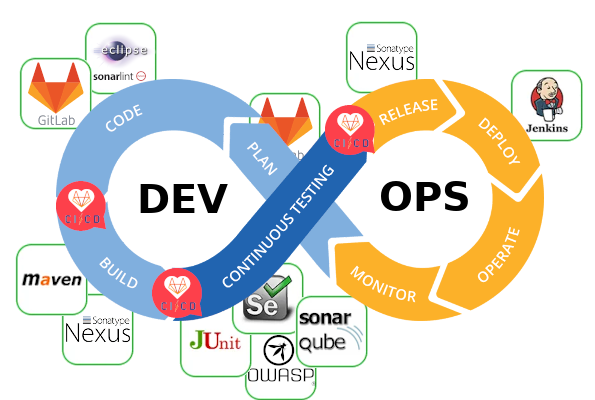
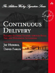
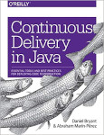
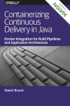

# Qué falta para terminar
> Esta guía **aún está en proceso de desarrollo**,  y todo esto es lo que le falta.


## El objetivo de la guía
El desarrollo de esta guía tiene como objetivo **elaborar una serie de recomendaciones de buenas prácticas que sirvan como marco de referencia para la gestión de proyectos software en la CARM**, al menos para aplicaciones Java, *y quién sabe si pudiera servir de inspiración a otro tipo de proyectos como Node.js, PHP,...*

Otras comunidades autónomas ya han hecho algo similar:

1. El *Gobierno de Canarias*, en su perfil del contratante tienen publicado [AGRIOTP_ManualProveedor_v1_4.pdf](http://www.gobiernodecanarias.org/perfildelcontratante/apipublica/documento.html?documento=128468&anuncio=133460)

2. El *Govern de les Illes Balears* publica también las [recomendaciones técnicas](http://governib.github.io/) a seguir en el desarrollo de aplicaciones en [GitHUB](https://github.com/GovernIB/)

3. El *Gobierno de Cantabria* tiene publicados sus [Estándares de desarrollo](https://amap.cantabria.es/amap/bin/view/Main/) en una Web propia 

4. Y, por supuesto, la Junta de Andalucía en su MArco de DEsarrollo de la Junta de Andalucía: *[MADEJA](http://www.juntadeandalucia.es/servicios/madeja/contenido)* 


En los cuatro casos encontraremos directrices comunes sobre cómo gestionar el control de versiones y organizar el código en él (ramas/trunk/ tags), cómo construir los artefactos o qué documentación se debe elaborar y se describe el marco de trabajo y las herramientas que se usarán para ello. No hay que insistir en la **necesidad e importancia de este tipo de recomendaciones** en un entorno que cada vez es más dinámico, hay más contratación externa y los equipos cuentan con una alta rotación laboral y su continuidad se limita a meses: *Es necesario definir claramente las reglas del juego para todos y difundirlas*.


Si se leen las recomendaciones de cada una de estas instituciones y se profundiza en documentos similares en Internet, se podrán detectar unos puntos comunes que son los que describe la guía:

* La elección de un Sistema de Control de Versiones,
* La gestión y organización de los proyectos en el control de versiones,
* El estilo a usar en la escritura del código fuente,
* La gestión de Tickets asociados al desarrollo y mantenimiento de aplicaciones,
* La construcción del software desde el código fuente,
* La gestión de la calidad del software,
* La gestión de la construcción y despliegue de las aplicaciones,

...y, para todo ello, se describen las herramientas que se usarán en cada una de las instituciones.

## Septiembre 2020: ¿en qué punto estamos?

Cuando comenzamos a desarrollar esta guía de buenas prácticas, nos fijamos como principal objetivo adaptar las prácticas que propone la integración y entrega continua *(CI/CD)* a la realidad del desarrollo Java en la CARM con las herramientas de las que disponíamos: Desde entonces **hemos estado trabajando en modelar el proceso**:



En **la parte de desarrollo *(dev)***, tenemos:

* Totalmente **acabada y documentada**: ```code```, ```build```. Los proyectos que la usan no reportan incidencias, son autónomos y es plenamente funcional. Apenas requiere mantenimiento.
* Por **acabar de documentar**: ```plan```. *La tenemos documentada, pero aplicada en muy pocos proyectos, y sería precipitado suponer que está acabada: Preferimos esperar a que se use en más proyectos y recibir feedback.*
* Todo **por hacer**: ```test```. *Estamos en fase de recopilación de links, lectura, compresión, pruebas en unos pocos proyectos... aún es pronto para documentar*

En **la parte de operaciones *(ops)***, disponemos:

* Totalmente **acabada y documentada**: ```release```, ```deploy```. Los proyectos que la usan no reportan incidencias, son autónomos y es plenamente funcional. El  **```deploy``` es totalmente manual**:

	* Tanto el despliegue de una aplicación en un entorno determinado
	* Como las acciones que debe realizar el equipo de operaciones para que un proyecto pueda desplegarse desde Jenkins.

En el Verano de 2020, se empieza a trabajar en:

1. **Automatizar el deploy en el entorno de pruebas** mediante GitLab-CI con ayuda de contenedores Dockers y un cluster  Swarm
2. **Cambiar la gestión de la configuración de las aplicaciones**, para usar  [Vault](https://www.vaultproject.io/).
3. **Generar automáticamente imágenes Docker** de las aplicaciones, de la misma manera que generamos ```.war```

Para todo ello, hemos estado usando como material de apoyo y referencia:

1.  El artículo *[Continuous Development: How Iterative Processes Can Improve Your Code](https://deploybot.com/blog/continuous-development)*,  a modo introductorio.

2.  El libro  [Continuous Delivery de Jez Humble y David Farley](https://www.amazon.es/Continuous-Delivery-Deployment-Automation-Addison-Wesley/dp/0321601912/)   y el [resumen que hace de él Samuel Casanova](https://samuelcasanova.com/2017/12/resumen-continuous-delivery/) .

	

3. El libro [Continuous Delivery in Java](https://www.amazon.es/Continuous-Delivery-Java-Essential-Production/dp/1491986026) de Daniel Bryant.

	

4. El libro [Containerizing Continuous Delivery in Java](https://www.nginx.com/resources/library/containerizing-continuous-delivery-java/) de Daniel Bryant.

	


## ¿Y qué le falta a la guía?

Aparte de lo que ya se ha comentado en el estado actual de la guía, sobre lo que ya tenemos implantado consideramos que aún nos faltaría:

1. Establecer **normas para Pull/Merge Request** (en el documento [Cómo deben ser los commits](Guia-Commits.md)). **Lo estamos rodando para ver qué nos puede interesar** y resultar más práctico, cómodo, rápido y venir bien a la hora de automatizar los pipelines. Tenemos localizados algunos links inspiradores:
    * https://geeks.ms/windowsplatform/2017/04/18/como-generar-mejores-pull-requests/
    * https://www.braintreepayments.com/blog/effective-pull-requests-a-guide/
    * https://blog.ploeh.dk/2015/01/15/10-tips-for-better-pull-requests/
    * https://github.com/exercism/docs/blob/master/contributing/pull-request-guidelines.md
    * https://medium.com/@hugooodias/the-anatomy-of-a-perfect-pull-request-567382bb6067https://diesdas.digital/wiki/life-as-a-developer/pull-request-guidelines 
2. **El ChangeLog**, como un registro por proyecto de los cambios que se introducen en cada versión, de manera automática. 
    * https://keepachangelog.com/es-ES/0.3.0/
    * https://danielflower.github.io/maven-gitlog-plugin/index.html
    * https://github.com/tomasbjerre/git-changelog-maven-plugin
    * https://github.com/tomasbjerre/git-changelog-lib  
3. **Oneflow automático**. Necesitamos automatizar los cambios de rama que nos impone *Oneflow*  cuando publicamos una release (integrar ```master``` en ```develop```), o integramos un *hotfix* en  ```master``` (que también se integre en ```develop```). Esto hasta ahora venimos realizándolo manualmente y nos quita tiempo.
4. **Documentación técnica y GitLab-Pages**. Para la documentación técnica de los proyectos estamos escribiendo la documentación en Markdown en una rama específica del proyecto, pero aún no está automatizado el proceso de renderizado a HTML, ni configurado GitLab para [soportar GitLab-Pages](https://docs.gitlab.com/ee/user/project/pages/).


Quizás que **lo más importante de lo que queda por hacer, es extender estas buenas prácticas a más proyectos en la CARM**: En el último año, han sido muy pocos los que se han unido, y a pesar de ello, los resultados son muy esperazandores e ilusionantes.


### ¿Cómo se desarrolla la guía?
**Se parte de un hito o una necesidad en el proceso de desarrollo**:
1. Se **recopilan links y referencias** que expliquen cómo solucionarla dentro del marco de la integración continua y de las tecnologías ágiles. 
2. Se **leen estas referencias y se comparten** entre la gente predispuesta que se haya encontrado con esa necesidad/hito, se llega a un consenso de cuál es mejor adoptar
3. Se difunde lo suficiente como para **empezar a ponerla en marcha en algún proyecto**, de forma rápida y ajustada a la realidad de las herramientas,  personal y formación del que disponemos.
4. Pasados **un par de meses** en los que la solución se haya rodado, se evalúa si la experiencia es buena, aceptada por los participantes del proyecto, no genera incidencias y la gente interioriza los cambios. Mientras no se consiga se sigue con el ciclo: leer, compartir, implantar...
5. Una vez que la solución funciona bien y nos ahorra tiempo, incidencias y problemas, es el momento en el que **ya se puede documentar y publicar en la guía**. 

Al final, **el objetivo de esta guía es el de presentar los acuerdos técnicos que hemos alcanzado en la CARM para trabajar en los proyectos de desarrollo**, y para ello es necesario enumerar en lo que nos hemos basado, qué hemos probado, y de todo ello, con qué nos quedamos. 
