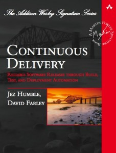

# Qué falta para terminar
> Esta guía **aún está en proceso de desarrollo**,  y todo esto es lo que le falta.


## El objetivo de la guía
El desarrollo de esta guía tiene como objetivo **elaborar una serie de recomendaciones de buenas prácticas que sirvan como marco de referencia para la gestión de proyectos software en la CARM**, al menos para aplicaciones Java, *y quién sabe si pudiera servir de inspiración a otro tipo de proyectos como Node.js, PHP,...*

Otras comunidades autónomas ya han hecho algo similar:

1. El *Gobierno de Canarias*, en su perfil del contratante tienen publicado [AGRIOTP_ManualProveedor_v1_4.pdf](http://www.gobiernodecanarias.org/perfildelcontratante/apipublica/documento.html?documento=128468&anuncio=133460)

2. El *Govern de les Illes Balears* publica también las [recomendaciones técnicas](http://governib.github.io/) a seguir en el desarrollo de aplicaciones en [GitHUB](https://github.com/GovernIB/)

3. Y, por supuesto, la Junta de Andalucía en su MArco de DEsarrollo de la Junta de Andalucía: *[MADEJA](http://www.juntadeandalucia.es/servicios/madeja/contenido)* 


En los tres casos encontraremos directrices comunes sobre cómo gestionar el control de versiones y organizar el código en él (ramas/trunk/ tags), cómo construir los artefactos o qué documentación se debe elaborar y se describe el marco de trabajo y las herramientas que se usarán para ello. No hay que insistir en la **necesidad e importancia de este tipo de recomendaciones** en un entorno que cada vez es más dinámico, hay más contratación externa y los equipos cuentan con una alta rotación laboral y su continuidad se limita a meses: *Es necesario definir claramente las reglas del juego para todos y difundirlas*.


Si se leen las recomendaciones de cada una de estas instituciones y se profundiza en documentos similares en Internet, se podrán detectar unos puntos comunes que son los que describe la guía:

* La elección de un Sistema de Control de Versiones,
* La gestión y organización de los proyectos en el control de versiones,
* El estilo a usar en la escritura del código fuente,
* La gestión de Tickets asociados al desarrollo y mantenimiento de aplicaciones,
* La construcción del software desde el código fuente,
* La gestión de la calidad del software,
* La gestión de la construcción y despliegue de las aplicaciones,

...y, para todo ello, se describen las herramientas que se usarán en cada una de las instituciones.

## Octubre 2019: ¿en qué punto estamos?
Ponernos en 2019 a elaborar una guía de buenas prácticas para el desarrollo de aplicaciones, sin tener presente la integración continua como referencia, sería perder el tiempo. En [Continuous Development: How Iterative Processes Can Improve Your Code](https://deploybot.com/blog/continuous-development) se describen las líneas generales de todo el proceso que se resume en la siguiente figura:


La parte que afecta de lleno al desarrollo de aplicaciones es la izquierda del gráfico, lo que se conoce como **integración continua (CI), que cuenta con 2 fases claramente independientes (*code* y *build*)** y otras dos compartidas con el despliegue continuo (*plan* y *testing*). En el desarrollo de la guía, nos hemos centrado deliberadamente en estas dos fases que son responsabilidad directa del equipo de desarrollo, y podríamos decir que la **tenemos acabada a un 60%**, cubriendo por completo todo el proceso de codificación y trabajando de facto en el de construcción aunque sin documentar/publicar, a falta de detalles.

Un buen libro para introducirse en todos estos términos es [Continuous Delivery de Jez Humble y David Farley](https://www.amazon.es/Continuous-Delivery-Deployment-Automation-Addison-Wesley/dp/0321601912/). El [resumen que hace de él Samuel Casanova](https://samuelcasanova.com/2017/12/resumen-continuous-delivery/) puede iniciarnos de forma rápida.



## ¿Y qué le falta a la guía?
Actualmente la guía ya cubre todo el proceso de codificación, desde cómo debe escribirse el código fuente Java, que el código se guarda en Git, qué motiva un cambio del código fuente y cómo realizar el cambio, hasta cómo debe entregarse al repositorio Git.

Aún faltan por documentar lo referente al proceso de construcción y tenemos identificados los siguientes hitos por documentar:

1. Establecer **normas para Pull/Merge Request** (en el documento [Cómo deben ser los commits](Guia-Commits.md)). **Lo estamos rodando para ver qué nos puede interesar** y resultar más práctico, cómodo, rápido y venir bien a la hora de automatizar los pipelines. Hemos localizado algunos links inspiradores:
    * https://geeks.ms/windowsplatform/2017/04/18/como-generar-mejores-pull-requests/
    * https://www.braintreepayments.com/blog/effective-pull-requests-a-guide/
    * https://blog.ploeh.dk/2015/01/15/10-tips-for-better-pull-requests/
    * https://github.com/exercism/docs/blob/master/contributing/pull-request-guidelines.md
    * https://medium.com/@hugooodias/the-anatomy-of-a-perfect-pull-request-567382bb6067https://diesdas.digital/wiki/life-as-a-developer/pull-request-guidelines 
1. **Versionado de las aplicaciones**. Actualmente trabajamos con la política habitual que se aplica a proyectos Java siguiendo [el patrón [Mayor].[Menor].[Parche]-[SNAPSHOT]](../Politicas-de-versionado.md), pero, usando Maven, se queda corta en el medio/largo plazo. Estamos investigando el [Versionado Semántico](https://semver.org/lang/es/) y cómo podríamos adaptarlo a nuestros proyectos de forma automática. 
    * https://blog.sebastian-daschner.com/entries/cd-friendly-maven-versions
    * https://axelfontaine.com/blog/dead-burried.html
    * https://github.com/qoomon/maven-git-versioning-extension
    * https://gitversion.readthedocs.io/en/latest/
1. **El ChangeLog**, como un registro por proyecto de los cambios que se introducen en cada versión, de manera automática, pero condicionado al punto anterior. 
    * https://keepachangelog.com/es-ES/0.3.0/
    * https://danielflower.github.io/maven-gitlog-plugin/index.html
    * https://github.com/tomasbjerre/git-changelog-maven-plugin
    * https://github.com/tomasbjerre/git-changelog-lib  
1. **Compilación del código fuente**. Aquí hay que hablar de Maven (de momento) y cómo configurarlo para que nos funcione con los proyectos de la CARM y, además, cómo construir y qué deben incluir los ```pom.xml``` . Actualmente funcionamos de facto *(existe un documento en versión 0.2 circulando que cubre lo inmediato)*, pero hay algunas cosas que no estamos haciendo y que luego tienen repercusión en cómo se visualiza el proyecto en la consola de [SonarQube](https://sonarqube.carm.es) o [Nexus](https://nexus.carm.es).
2. **Calidad del software**. En este apartado hay que hablar de los umbrales mínimos en [SonarQube](https://sonarqube.carm.es) que tenemos en cuenta para tirar para atrás una entrega. De momento estamos rodándolo, simplemente lo pasamos a los proyectos para empezar a llevar una idea de por dónde vamos, *aunque ya tenemos claro que si en 2019 nos llega alguien con Axis1.4 hay que mandarlo a la casilla de salida*. 
3. **Repositorio de artefactos**. Tenemos que hablar de [Nexus](https://nexus.carm.es) como repositorio de artefactos, cómo llegan aquí los productos tras la compilación, cómo debemos organizar los ```groupId``` en los proyectos y las operaciones a las que actualmente ya damos soporte.
4. **Licencias**. Es necesario establecer unas [directrices comunes parar todos los proyectos](https://www.barcelona.cat/digitalstandards/es/tech-sovereignty/0.1/public-administration/), que luego tienen repercusión en la compartición de proyectos con otras administraciones.
5. **Integración continua**. En este punto hay que describir qué hemos automatizado de toda esta guía y hablar de [Jenkins](https://jenkins.carm.es) y [GitLab-CI](https://gitlab.carm.es), que estamos poniendo en marcha desde septiembre y rodándolo.

Todo esto **son puntos que faltan por publicar en la guía y están implementados en mayor o menor medida**, pero aún es pronto para publicarlos (como documentos) porque no tenemos la suficiente experiencia para poder definir criterios que nos resulten prácticos y sean fáciles de llevar a la práctica y no estamos lo suficientemente leídos.

### ¿Cómo se desarrolla la guía?
**Se parte de un hito o una necesidad en el proceso de desarrollo**:
1. Se **recopilan links y referencias** que expliquen cómo solucionarla dentro del marco de la integración continua y de las tecnologías ágiles. 
2. Se **leen estas referencias y se comparten** entre la gente predispuesta que se haya encontrado con esa necesidad/hito, se llega a un consenso de cuál es mejor adoptar
3. Se difunde lo suficiente como para **empezar a ponerla en marcha en algún proyecto**, de forma rápida y ajustada a la realidad de las herramientas,  personal y formación del que disponemos.
4. Pasados **un par de meses** en los que la solución se haya rodado, se evalúa si la experiencia es buena, aceptada por los participantes del proyecto, no genera incidencias y la gente interioriza los cambios. Mientras no se consiga se sigue con el ciclo: leer, compartir, implantar...
5. Una vez que la solución funciona bien y nos ahorra tiempo, incidencias y problemas, es el momento en el que **ya se puede documentar y publicar en la guía**. 

Al final, **el objetivo de esta guía es el de presentar los acuerdos técnicos que hemos alcanzado en la CARM para trabajar en los proyectos de desarrollo**, y para ello es necesario enumerar en lo que nos hemos basado, qué hemos probado, y de todo ello, con qué nos quedamos. 

## ¿Qué hay más allá?
Como se ha indicado, la guía solo abarca dos puntos del ciclo de integración continua y deja fuera  **Plan** y **Testing**, este es el más allá.

Actualmente tenemos grandes dificultades para adoptar [metodologías ágiles como Scrum](https://samuelcasanova.com/category/scrum/) para la gestión de proyectos de desarrollo de aplicaciones. Los tableros de [GitLab](https://about.gitlab.com/product/issueboard/)/[GitHub](https://help.github.com/es/articles/about-project-boards) que ya tenemos a nuestra disposición podrían [ayudarnos a empezar](https://www.artansoft.com/2017/11/gestion-de-tareas-gitlab/) a gestionar proyectos de una manera ágil y diferente a como lo hemos estado haciendo hasta ahora. Esto se **refiere al  Plan**, pero no se puede ni plantear, si primero no nos hemos acostumbrado a generar Issues, etiquetarlos correctamente, vincularlos en los commits, en los pull/merge request...

Sobre el **testing**, para los pocos proyectos que tenemos monitorizados con Sonarqube, ya nos indican que el grado de cobertura de los tests está al 0%: **No tenemos cultura de desarrollo de Tests**, y cuando programamos, solo pensamos en implementar lo que se nos pide, sin comprobar siquiera si hace lo que esperaba que hiciera quien lo programó: *ya lo probarán los usuarios en producción...*. Hay que empezar a adoptar [Test-driven development (TDD)](https://es.wikipedia.org/wiki/Desarrollo_guiado_por_pruebas) en algún proyecto nuevo, para coger la experiencia suficiente que nos ayude a desarrollar una guía.

En los dos casos (*Plan* y *Testing*) **estamos en predisposición de empezar a rodar**, pero para ello hay que escoger un par de proyectos, e ir poco a poco, de manera que los seleccionados tendrán que hacer un esfuerzo extra para documentarse, aprender por su cuenta, equivocarse y sufrir en solitario ese camino que sirva de experiencia al resto. Luego, ya podrá plantearse elaborar guías.
