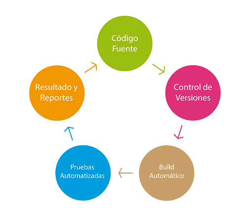
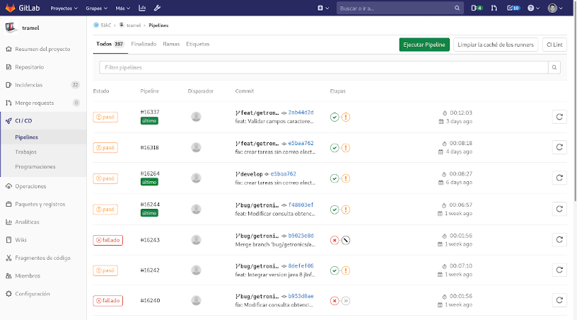
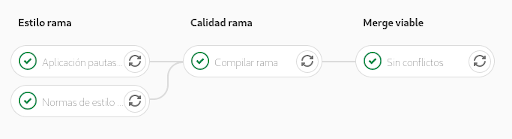
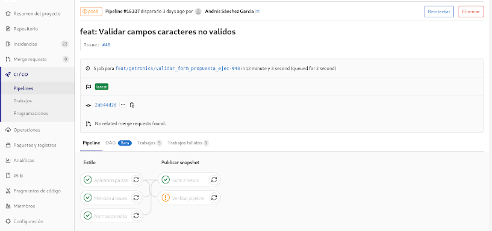
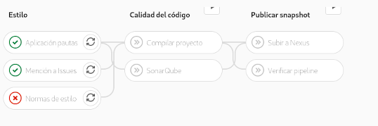

# Integración Continua *(gitlab-ci)*

La integración continua es el nombre que se le da a la 
**automatización de las tareas de compilación, test y análisis estático del código**. 
Esto se puede conseguir de muchas maneras, y podemos llamar integración continua a todo lo que hay entre un script que periódicamente ejecuta el trabajo y un servicio online que lo haga.

La integración continua *(continuous integration en inglés)* 
es un modelo informático propuesto inicialmente por 
[Martin Fowler](https://martinfowler.com/articles/continuousIntegration.html) que **consiste 
en hacer integraciones automáticas de un proyecto 
lo más a menudo posible para así poder detectar fallos cuanto antes**. 

Independientemente del sistema que utilicemos para dispararlo,
el proceso como mínimo seguirá el siguiente camino:




1. Descargar el código fuente desde el repositorio de control de versiones *(GitLab/GitHub)*
2. Compilar el código automáticamente *(Maven)*
3. Ejecutar pruebas unitarias y/o de integración *(Maven)* así como analizar el código *(Sonarqube)*
4. Publicar los resultados de modo que sea accesibles *(en Sonarqube y Nexus)*


Lo ideal, siempre será disparar el proceso
**cada vez que se añadan cambios al repositorio**.
Esto nos aporta cierta seguridad, pero podría retrasar el proceso de desarrollo y sobrecargar nuestro sistema CI.
En cambio, dispararlo con cada MergeRequest nos garantiza que todos los cambios que pretenden 
fusionarse cumplen con unos mínimos.

De esta forma se busca conseguir:

1. **Reducir riesgos y tiempos**: *Si integras cambios de los últimos 2 meses para publicar versión la semana que viene, vas a sufrir y mucho: Mejor integrar constantemente*
2. **Reducir procesos repetitivos manuales**: *Cualquier proceso manual que se realiza repetidamente, es un completa pérdida de tiempo y fuente de equivocaciones*
3. Disponer de **versiones de software fruto de un proceso conocido, confiable, probado, versionado y repetible**: *y ser capaz de ejecutarlo en cualquier momento y lugar sin depender de personas concretas*
4. **Mejorar la visibilidad** del estado del proyecto: *y tener informes frecuentemente con el estado del proyecto, y no al final, cuando sea demasiado tarde para corregir*
5. **Ganar auto-confianza y seguridad** en el equipo de desarrollo: *al estar comprobando constantemente el estado del desarrollo*


Si necesitas profundizar más en lo que es *integración continua*, puedes leer:

* Artículo original [Continuous Integration](https://martinfowler.com/articles/continuousIntegration.html) de Martin Fowler en 2006.

* Libro [Continuous Integration: Improving Software Quality and Reducing Risk](https://www.amazon.es/Continuous-Integration-Improving-Software-Signature/dp/0321336380) de Paul M. Duvall

* Guía sobre [Integración continua](https://www.atlassian.com/es/agile/software-development/continuous-integration) de Dan Radigan


## Gitlab-CI

De [entre las diferentes herramientas](https://medium.com/@ricardocastellanos_13596/mejores-herramientas-de-integraci%C3%B3n-continua-para-desarrollo-de-aplicaciones-m%C3%B3viles-46b88a52a2df)
que pueden ayudarnos a implantar Integración continua en nuestros proyectos,
**en la CARM hemos apostado por 
[hacerlo con GitLab-CI](https://docs.gitlab.com/ee/ci/) 
por los siguientes motivos**:

1. **Ya usamos GitLab** para almacenar el código fuente de nuestros proyectos.
2. El **proceso CI queda integrado con el repositorio**, junto al resto de elementos *(Issues, Milestones, Tableros, etc...)*
3. Usar otra herramienta nos obligaba a configurar nuevas **autorizaciones** y duplicar la que ya configuramos para el acceso al repositorio
4. El modelo que propone GitLab-CI es **muy flexible y NO impone restricciones** en la configuración de nuestro pipeline
5. Permite **usar contenedores Docker para implementarlo**, y así no necesitar de servidores dedicados que alguien debe instalar y configurar con las herramientas correspondientes

En general, la **principal ventaja** que encontramos es que toda la configuración y definición del pipeline de integración continua se configura en un repositorio GitLab mediante un simple fichero ```.yml```...

* a la vista de todos: **cualquiera pueda sugerir/corregir**,
* todos los proyecto pueden compartir el mismo pipeline: 
	* **al modificarlo, el cambio está disponible para todos los proyectos inmediatamente**
	* **se escribe una sola vez y en un solo lugar**
* tenemos absoluta libertad, de elegir el lenguaje de programación *(bash, perl, python..)* con el que implementar los trabajos
* somos independientes y autónomos, *no necesitamos de alguien que configure en una herramienta, a la que no tenemos acceso, los trabajos que implementan el pipeline de integración continua*



Todo esto lo **configuramos en el repositorio https://gitlab.carm.es/dockers/ci**, y para usarlo basta con **añadir en el directorio raíz de nuestro proyecto el fichero ```.gitlab-ci.yml``` con el siguiente contenido**:

```yaml
# Variables personalizables para este proyecto
variables:
  # Si la descomentamos, entonces aparecerán los logs de toda la descarga de artefactos
  # Por defecto: Solo muestra los WARN y ERROR
  # MAVEN_OPTS_EXTRA: ""
  # ---
  # Si descomentamos esta linea, forzamos una version concreta para los plugins de OWASP y SONAR
  # Por defecto: Está definida en las propiedades del Grupo "SIAC" -> CI/CD Settings
  # CALIDAD_VERSION_OWASP: "5.2.1"
  # CALIDAD_VERSION_SONAR: "3.6.0.1398"
  # ---
  # Si descomentamos esta linea, hacemos que Sonar pare el pipeline cuando encuentre errores (bugs en las librerías)
  # Por defecto: Está definida que no pare, que siga (si encuentra que la versión del common-lang tienen errores)
  # CALIDAD_STOP_ONERROR: "true"


# Plantilla del pipeline que usar
include:
  - project: 'dockers/ci'
    file: '/maven/pipelines/maven-basico-sin-changelog.yml'
```

En él se especifica el pipeline que usará nuestro proyecto y un conjunto de variables que permiten configurar el comportamiento por defecto de la ejecución del pipeline.

Dado que la configuración del pipeline está en constante evolución, se recomienda **consulte la documentación del proyecto en [https://gitlab.carm.es/dockers/ci/maven/doc/](https://gitlab.carm.es/dockers/ci/-/tree/master/maven/doc)**.

En general, para el pipeline de integración continua hemos implementado una serie de **fases o stages que variarán dependiendo de**:



* El **tipo de acción** que se realice en el repositorio: *commit+push*, *merge-request*.
* De la **rama sobre la que se realice la acción**: *develop*, *master*, *feat**, *fix**
* Del **título del mensaje de commit**,

...cuyo **objetivo final será llevar un artefacto a Nexus**, que poder desplegar en los servidores de pruebas o producción, en el mejor de los casos 


o evitar que llegue a Nexus y pueda ser desplegado, cuando no se verifiquen los requisitos que impone el pipeline de forma global para cualquier proyecto de la CARM.



Cuando esto sucede, el desarrollador que realizó el cambio en el repositorio recibirá automáticamente un correo electrónico informándole de la tarea que falló e invitándole a consultar el log para resolver el problema.
