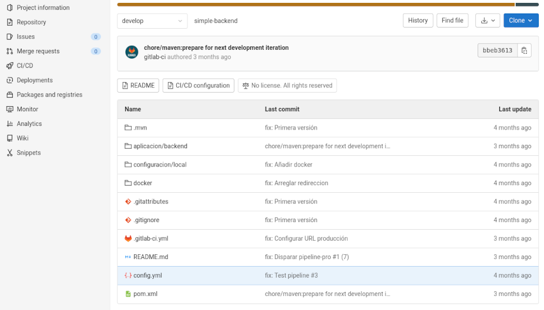
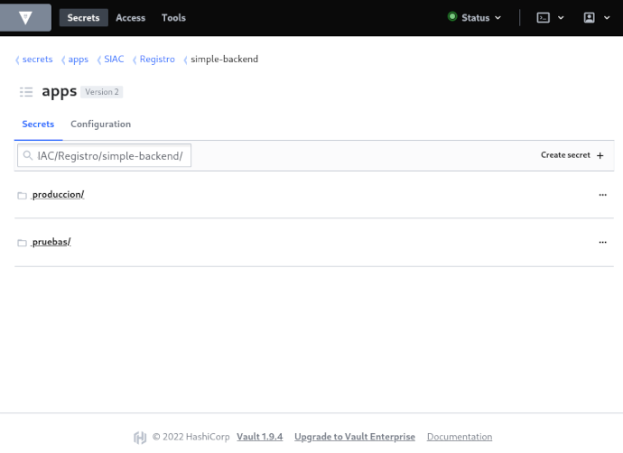
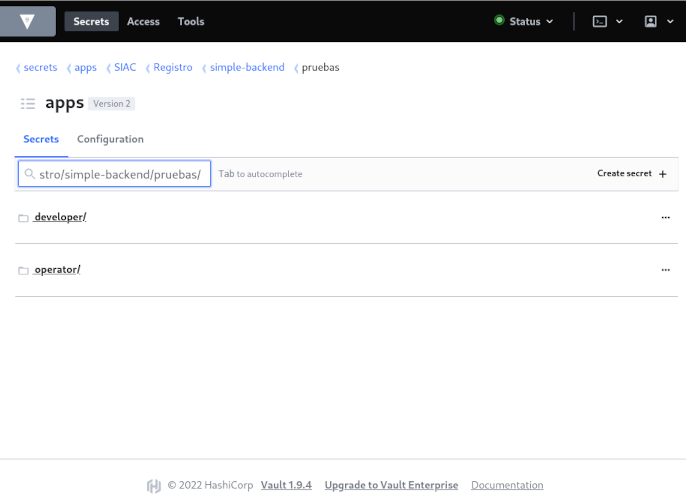
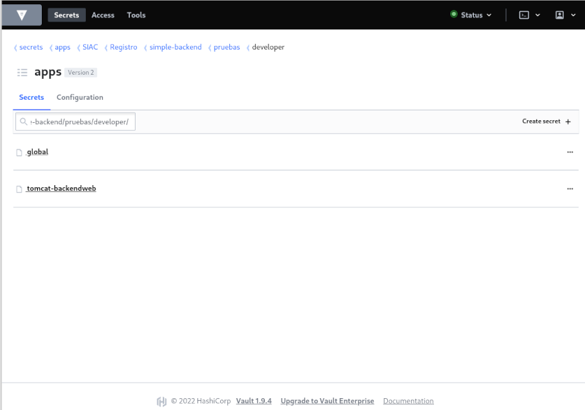
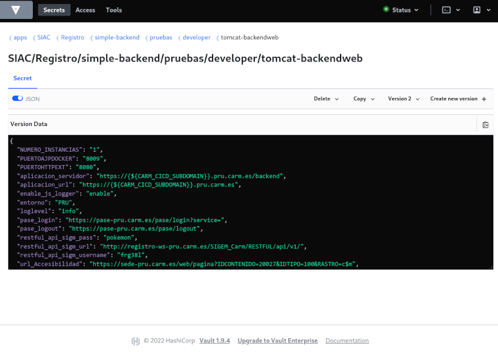
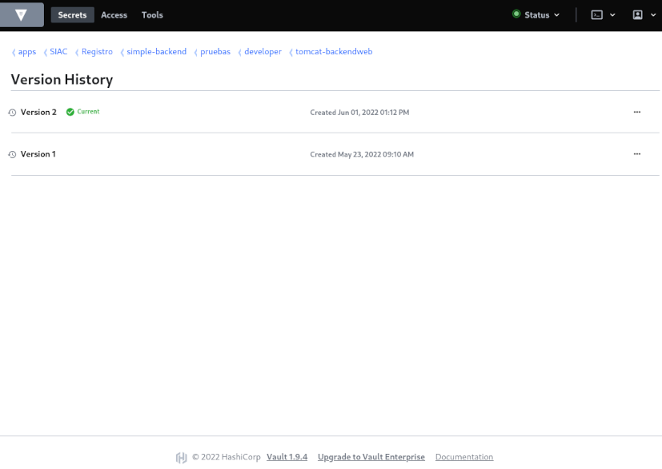

# Configuración para el despliegue con GitLab-CD

El [despliegue manual con Jenkins](Guia-Config-CI.md) se fundamenta en construir los ficheros de configuración y copiarlos a los directorios del servidor, justo en el momento del despliegue. El despliegue automático desde el pipeline-CD de GitLab, **se basa en construir el contenedor docker con los ficheros de configuración parametrizados a modo de plantilla**, en su lugar definitivo, y justo en el momento de despliegue, **consultar [https://vault-admin.carm.es](https://vault-admin.carm.es/ui/vault/secrets/apps/) para poder aplicar el valor** a estos parámetros _(plantillados)_ y a las variables de entorno que sean necesarias.

Para ello, es necesario declarar en un fichero _yaml_ `carm-contract.yml` de la raíz del proyecto en el repositorio:

* qué valores debe leer del vault
* en qué ficheros debe aplicarles el valor que leyó del `vault`
* y qué variables de entorno debe instanciar 

Este **fichero `carm-contract.yml` lo llamamos _fichero del contrato_** y permite además, indicar quién debe definir cada uno de estos parámetros en `vault`: si el equipo de desarrollo _(developer)_ o el equipo de operaciones _(operator)_. Si alguno de estos equipos se olvidó de configurar un parámetro para alguno de los entornos de ejecución, el contrato no se cumplirá y la aplicación no se desplegará en ese entorno.


Esto es aplicable a los entornos basados en _clusters docker swarm_ que gestiona el equipo de operaciones, pero **cuando se ejecuta el contenedor docker en el equipo local** _(entorno de desarrollo)_, en vez de leer el `vault` para extraer los valores de configuración, **se leerá el fichero _yaml_ `/var/tmp/parametros/parametros.cfg` que debe existir dentro del propio contenedor**. Para conseguirlo, habitualmente lo que se hace es:

1. Escribir un fichero `parametros.cfg` en el repositorio, con la configuración referida al entorno de desarrollo, además de qué ficheros revisar
2. Colocar en el directorio `configuracion/local` de las ramas habituales _(`develop`, `master`, `feat*`, `bug*`, etc)_ del repositorio, los ficheros de configuración plantillados
3. Escribir un fichero `Dockerfile` en el que se programe, además de la copia del fichero `/var/tmp/parametros/parametros.cfg`, la copia del resto de ficheros de configuración de `configuracion/local/*` dentro de los directorios del contenedor
4. Automatizar la construcción del contenedor _(`docker build`)_ con la aplicación, a partir de este `Dockerfile`.


## El fichero del contrato `carm-contract.yml`

Como ya se ha apuntado, el fichero del contrato permite **declarar qué parámetros se definen en el `vault`, sobre qué ficheros se aplicará su valor y qué variables de entorno se deben instanciar** en el despliegue.




El fichero será un _`yaml`_ con la siguiente estructura:

```yam
version: 1.0

services:

   - [SECCION]:
      type: [configuracion|container|
      [ACTOR]:
         [TYPE_ASSET]:
            - ASSET_1
            ...
            - ASSET_N
```

...donde...

* **`[SECCION]`** valdrá  `global` o bien, el nombre de un servicio declarado en el fichero `docker/docker-compose.yml` del repositorio. Cada sección permite indicar la configuración para un servicio _(ó contenedor docker)_ o, excepto _`global`_ que aplicará a todos.
* **`type`** indica el tipo de configuración que se declara y sólo podrá tomar uno de estos dos valores: 
  * `configuracion` para cuando se declaren parámetros de configuración que instanciar en el `docker-compose.yml` que finalmente se use para desplegar la aplicación, 
  * `container` cuando declare configuración que aplicar sobre el _contenedor docker_ en el momento del despliegue
* **`[ACTOR]`** informa de quién debe establecer la configuración en `vault`, y sólo podrá tomar uno de estos valores:
  * `developer` para indicar que es el equipo de desarrollo quien configura en vault
  * `operator` para indicar que la configuración en `vault` la establece el equipo de operaciones
* **`[TYPE_ASSET]`** permite especificar el tipo de configuración que aplicar:
  * `vars` para indicar qué variables deben leerse del `vault`
  * `files_config` para indicar en qué ficheros _(plantillados)_ realizaremos sustituciones
  * `files_secrets` para indicar qué crear a partir de claves del `vault`
  * `environment-config` para indicar qué variables de entorno instanciar al iniciar el contenedor
  * `environment-deploy` para indicar qué variables de entorno instanciar al iniciar el _compose_


Para ilustrarlo, supongamos que hemos desarrollado una aplicación Java llamada `Ejemplo`, que necesita acceder a https://pase.carm.es para autenticar a los usuarios y mostrará un link a https://www.carm.es. Esta aplicación se empaqueta en un _`.war`_  dentro de un contenedor docker con _Tomcat_, declarado en el fichero `docker/docker-compose.yml` del repositorio como `tomcat-ejemplo`. Además, necesitará acceder a base de datos a través de un _`DataStore`_ declarado en el `server.xml` del _Tomcat_ y para la que se tendrá diferente _nivel de log_  dependiendo del entorno.  Además, se quiere que el número de instancias de _Tomcats_ sea variable dependiendo del entorno 


Un fichero de contrato típico para esta aplicación podría ser:

```yaml
version: 1.0

services:

# CONFIGURACION GLOBAL ---------------------------
   - global:
      type: configuracion
      developer:
         vars:
            - NUMERO_INSTANCIAS

      operator:
         vars:
            - servidores
            - sshKey
            
# CONFIGURACION DEL DOCKER CON EL TOMCAT ---------
   - tomcat-ejemplo:
      type: container

      # Lo configura el desarrollador ------------
      developer:
         # Qué variables deben existir en Vault --
         vars:
            - entorno
            - loglevel
            - pase_login
            - pase_logout             
            - url_carm

         # Qué ficheros del docker cambiar -------
         files_config:
            - Aplicacion-Config.properties:
                dest: ./conf/ejemplo/Aplicacion-Config.properties
                type: docker

            - log4j2.xml:
                dest: ./conf/ejemplo/log4j2.xml
                type: docker

         # Qué variables instanciar --------------
         environment-config:
            - entorno
            - loglevel
            - pase_login
            - pase_logout             
            - url_carm

      # Lo configura el operador -----------------      
      operator:
         # Qué variables deben existir en Vault --      
         vars:
             - ENTORNOLOG
             - PUERTOAJPDOCKER
             - PUERTOHTTPEXT
             - datasources
             - tomcatPwd
             - truststore.jks
             - puertoAjp
             - puertoHttp

         # Qué ficheros con secretos crear ------
         files_secrets:
             - truststore.jks:
                 src:  vault
                 dest: ./

         # Qué ficheros del docker cambiar -------
         files_config:
             - server.xml:
                 dest: ./conf/server.xml
                 type: docker

             - logging.properties:
                 dest: ./conf/logging.properties
                 type: docker

             - tomcat-users.xml:
                 dest: ./conf/tomcat-users.xml
                 type: docker

             - setenv.sh:
                 dest: ./bin/setenv.sh
                 type: docker

         # Qué variables instanciar --------------
         environment-config:
             - datasources
             - tomcatPwd
             - truststore.jks
             - puertoAjp
             - puertoHttp

         # Qué variables inyectar en el desplieue -
         environment-deploy:
             - ENTORNOLOG
             - PUERTOAJPDOCKER
             - PUERTOHTTPEXT

```


## _`Vault`_

[Vault _(de Hashicorp)_](https://vault-admin.carm.es/ui/vault/secrets/apps/list) es una herramienta para la gestión, control de acceso y almacenamiento de secretos. Un secreto es cualquier cosa que sea sensible: un certificado, una contraseña o cualquier dato que necesitemos en una aplicación para que ésta funcione correctamente y tenga que guardarse a buen recaudo.

En la CARM organizamos los secretos a partir de la ruta `apps`, siguiendo la misma estructura de directorios que tenga nuestro repositorio en GitLab:


Luego, para cada proyecto declararemos un directorio por entorno donde se despliegue la aplicación:



Y en cada entorno, separamos por roles de gestión: `developer` y `operator`



Luego, para cada rol se crea un directorio por servicio, tal y como aparecerá en el fichero de contrato:



Y dentro de cada servicio, se crearán todos los secretos que enumera el contrato:



Cada cambio que se realicen en el valor de los secretos se almacenará como una versión.




### El fichero  `parametros.cfg`
Para facilitar el despliegue en el equipo local, donde no se tiene acceso a  `vault`, habrá que escribir todos los secretos _(los del desarrollador y del operador)_ en el fichero _`yaml`_  `/var/tmp/parametros/parametros.cfg`. Para la aplicación de ejemplo de la que hablamos en una sección anterior:

```yaml
files: 
  - /opt/bitnami/tomcat/conf/backend/Aplicacion-Config.properties
  - /opt/bitnami/tomcat/conf/backend/log4j2.xml
  - /opt/bitnami/tomcat/conf/server.xml
configs: 
  entorno: local
  loglevel: info
  pase_login: https://pase-des.carm.es/pase/login?service=
  pase_logout: https://pase-des.carm.es/pase/logout
  url_carm: https://www-pru.carm.es  
  datasources: |
      <Resource name="jdbc/dbEjemplo"  
                type="javax.sql.DataSource"  
                driverClassName="oracle.jdbc.OracleDriver"  
                maxTotal="20" maxIdle="10" maxWaitMillis="-1"  
                removeAbandonedOnBorrow="true" 
                removeAbandonedOnMaintenance="true" removeAbandonedTimeout="5"                 poolPreparedStatements="false"   
                url="jdbc:oracle:thin:@vapli-bd.carm.es:1521:DESVAPLI"  
                username="dbUser" password="pokemon" />  
```

Como se puede ver, el fichero consta de dos secciones:

* `files` donde se enumeran los ficheros que deben revisarse antes del inicio de la aplicación
* `configs` que enumera los secretos queharían referencia a parámetros de configuración para el entorno de desarrollo


## Los ficheros de configuración _(plantillados)_

Los ficheros de configuración que deban completarse con valores del `vault` durante el proceso de despliegue, deberán ubicarse en su directorio definitivo dentro del contenedor de la aplicación, y **usar `{${NOMBRE_VARIABLE}}` dentro de cada fichero, para indicar qué variable debe sustituirse** en ese punto.  

El `NOMBRE_VARIABLE` deberá **coincidir con el nombre del parámetro que se define en `vault`**.


