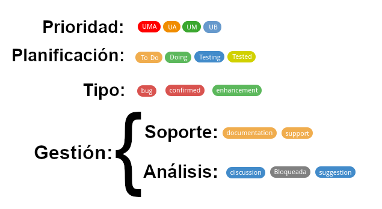

# Gestión de issues con Git

**El término Issues se traduce al castellano como Cuestiones**. Las *"cuestiones"* referidas a un proyecto de desarrollo de una aplicación pueden ser: *preguntas de los usuarios sobre cómo se hace determinada cosa, sugerencias de mejora, errores detectados, un hilo de discusión entre desarrolladores para decidir cómo, y si, implementar tal cosa o cuándo publicar la siguiente versión*. 
Registrarlas de forma centralizada para tratar de dar respuesta a todas permite:

* disponer de una base documental adicional sobre determinadas funcionalidades de la aplicación,
* poder realizar un seguimiento de las tareas de desarrollo: implementación de mejoras *(features)* y corrección de errores *(bugs)*,
* tener una perspectiva histórica de la evolución de la aplicación a lo largo del tiempo.

**El registro de todas estas cuestiones es lo que permite gestionar el proyecto** y delegar tareas. Para gestionar de manera eficiente un proyecto, cualquier actividad dentro del proyecto debe estar integrada con el resto de conceptos del proyecto, y, al hablar de proyectos de desarrollo de software, los conceptos no son sólo bugs o features, también son: preguntas de los usuarios, versiones de la aplicación, líneas paralelas de trabajo, manuales, compilación, commits, calidad del código, equipos de desarrollo o el rol de cada persona... 

Tanto [GitLab](https://gitlab.carm.es) como [GitHub](https://github.com/carm-es) ofrecen el **concepto de *"Issue"*, un registro centralizado de las cuestiones que rodean al proyecto que, como gran valor añadido, permite vincular de forma directa con un commit o una rama de desarrollo** y responder a la pregunta: *"¿Por qué se ha hecho este commit?"*, es decir: *cuál es el bug o la incidencia que está relacionado con este o estos commits, para saber el motivo por el cual se ha hecho ese cambio en el código*. **Este es el gran valor diferencial de usar Git** frente a Subversion y a otras herramientas especializadas en gestión de tareas, bugs, o incluso del propio [GLPi](https://glpi.carm.es) que usamos en la CARM para la gestión del servicio: **Poder vincular cualquier cuestión al código fuente del programa en una misma aplicación**, permite tener una trazabilidad completa de commits a un bug o incidencia concreta. [Un ejemplo en el desarrollo de Electron en GitHub](https://github.com/electron/electron/issues/19911) y [otro del desarrollo de Wget en GitLab](https://gitlab.com/gnuwget/wget2/issues).

Un issue en Git es como una conversación entre los desarrolladores (y usuarios) para definir o resolver algo relacionado con la aplicación y puede tener dos estados: abierto o cerrado. Además, permite anexar comentarios, propuestas de solución, designar a responsables de resolverlo, el tipo de solución que se aplicó y todo, llevando un seguimiento del autor y las fechas en las cuales sucede cada evento. 

Como añadido, permite **etiquetar los Issues** para indicar otros aspectos como a qué parte de la aplicación afecta, la urgencia de su resolución, si es un bug o una feature  *([ejemplo en GitHub](https://github.com/electron/electron/labels) y [en GitLab](https://gitlab.com/gnuwget/wget2/-/labels))*,  que permiten **desarrollar una planificación ágil del proyecto mediante [Kanban](https://es.wikipedia.org/wiki/Kanban_(desarrollo))** en lo que se conoce como **[proyectos en GitHub](https://github.com/electron/electron/projects/21) o [Boards en GitLab](https://gitlab.com/gitlab-org/gitlab-ce/-/boards/280883)**.

Además, **los Issues se pueden agrupar en lo que se conoce como etapas o MileStones**: los issues son metas a corto plazo y los milestones son a largo plazo, y pueden ser un lanzamiento de una nueva versión, un módulo del proyecto, una revisión, un sprint de Scrum, etc. Incluyen una descripción, una fecha tope, y las tareas que se necesitan cumplir para lograr ese objetivo. [Un ejemplo en GitHub](https://github.com/codenautas/backend-plus/milestones) y [en GitLab](https://gitlab.com/gitlab-org/gitlab-ce/-/milestones?sort=due_date_desc&state=closed)

## Normas en la gestión de issues
Como cada proyecto puede gestionar sus cambios como consideren sus responsables, es necesario establecer unos criterios comunes mínimos que todos nos comprometemos a respetar en los proyectos de desarrollo de la CARM. Tampoco es algo que solamente hagamos nosotros:

* [Maestría en Issues](https://github.com/ricval/Documentacion/blob/master/Guias/GitHub/issues.md), traducción de [de la guía de GitHub: Mastering Issues](https://guides.github.com/features/issues/)
* [Issue Tracker (& Tasks Managers)](https://sites.google.com/site/practicadesarrollosoft/temario/issue-tracker)
* [Plantilla de Issues para el desarrollo de Masive-JS](https://gitlab.com/dmfay/massive-js/blob/master/.gitlab/issue_templates/Problem.md)
* [How we organize GitHub issues: A simple styleguide for tagging](https://robinpowered.com/blog/best-practice-system-for-organizing-and-tagging-github-issues)
* [What is the Issues Label Standard (WIP)](https://github.com/moimikey/issues-label-standard/)
* [GitHub Labels and Milestones](https://docs.saltstack.com/en/latest/topics/development/labels.html)
* [About milestones](https://help.github.com/en/articles/about-milestones)

Estas normas responden a las preguntas de cuándo y cómo crear un Issue y cómo gestionarlos a través de etiquetas y milestones.

### Issues
Las normas mínimas comunes para cualquier proyecto Java serán:

1. **Los issues son gratis**: Cada cambio que se considere aplicar sobre la aplicación debe tener un Issue, no importa cuándo se vaya hacer el cambio.
2. **Cualquier issue debe tener un ÚNICO motivo**, que puede ser [una historia de usuario](https://es.wikipedia.org/wiki/Historias_de_usuario), una necesidad del proyecto, un requisito de sistemas, un bug, una excepción no controlada en los Logs... 
3. **Divide y vencerás**: Un issue NO es *"crear api-rest"*, ni *"disminuir la deuda técnica"*, eso son proyectos o milestones: El desarrollo de una nueva API conlleva muchas tareas de desarrollo, integración y documentación, al igual que la disminución de la deuda técnica se divide en tareas de actualización de librerías, refactorización de paquetes...
4. Los issues deben **explicar qué se quiere y cómo se quiere**, y, **cuando sea posible, por qué**.
5. Cada vez que salgas de **una reunión de seguimiento del proyecto** con los responsables o con los usuarios, crea **un issue de discussion** donde se recoja todo lo hablado en la reunión (a modo de acta), e **issues individuales por cada tarea** que se haya acordado realizar.
6. **En caso de bugs**:
    * **Entorno** donde se produjo el error: Sistema Operativo, Navegador, ...
    * **Resumen** del problema, donde se explique cuál es el problema y cómo reproducirlo 
    * **Resultado** final, ¿Qué paso cuando se disparó el bug?
    * Comportamiento **esperado**: ¿Qué debería pasar si ese bug no existiera?
    * y cualquier detalle relevante que pueda ayudar 

> *Considera que, con el primer issue que crees, vamos a saber cuánto has leído y cómo de en serio te tomas todo esto*

### Menciones
Usa las menciones siempre que puedas:

* Mención a **usuarios**: *Ejemplos: @login, @admin...*
* Mención a **otros issues**: *Ejemplos: #14, #45...*
* Mención a **etiquetas**: *Ejemplos: ~bug, ~documentation...*

## Etiquetado de issues
Las etiquetas en  [GitHub](https://docs.github.com/es/issues/using-labels-and-milestones-to-track-work/managing-labels)/[GitLab](https://docs.gitlab.com/ee/user/project/labels.html) son marcas que añadimos a los issues que sirven para categorizarlos y organizar su resolución.

Estas marcas contienen una o dos palabras y un color de fondo que se ajusta al siguiente  **código de colores**  propuesto por *[What is the Issues Label Standard (WIP)](https://github.com/moimikey/issues-label-standard/)*:

* **Amarillo**: Cambios sin impacto aparente
* **Naranja**: Cambios que podrían tener impacto en la aplicación, como refactorizaciones, cambios en la configuración para mejorar el rendimiento, actualizaciones de librerías... 
* **Rojo**: Errores que hacen que la aplicación no funcione como se espera
* **Violeta**: Libre para asignar a criterio del responsable
* **Azul**: Libre para asignar a criterio del responsable
* **Verde**: Mejoras que aplicar en la aplicación, nuevas funcionalidades
* **Gris**: Cambios que no tienen que ver con el código, sino con la documentación, ayuda, issues duplicados, inválidos, etc...
* **Negro**: Usar solo para los cambios de versión.

De manera predeterminada, usamos las etiquetas que GitLab genera por defecto para cada proyeto y además añadimos 4 más que nos informan de la prioridad o urgencia con la que resolver:

Todos los nuevos Issues deberán etiquetarse atendiendo a las siguientes reglas:

1. **Prioridad**: Se les etiquetará con **una o ninguna** de las 4 posibles etiquetas de prioridad.
2. **Planificación**: Siempre deberán tener una y solo una etiqueta de planificación, para  indicar el estado de su resolución. Inicialmente siempre https://github.com/carm-es/guias/labels/To%20Do, y conforme avance su desarrollo se cambiarán desde el tablero Kanban.
4. **Tipo**: Obligatoriamente **se etiquetará inicialmente como https://github.com/carm-es/guias/labels/bug** *(en caso de un error en la aplicación)* **o https://github.com/carm-es/guias/labels/enhancement** *(en caso de una nueva funcionalidad)*.  En el caso de https://github.com/carm-es/guias/labels/bug, se añadirá la etiqueta https://github.com/carm-es/guias/labels/confirmed, cuando se añada un seguimiento al Issue que explique cómo poder reproducir el error.
5. **Gestión**: No será obligatorio asignar alguna de estas etiquetas, pero en caso de hacerse serán **excluyentes con la prioridad,  la planificación y el tipo**.

Este conjunto de etiquetas se podrá ampliar cuando el responsable del proyecto lo considere oportuno.

### Prioridad

La etiqueta de prioridad, informa de la **urgencia con la que debe resolver el Issue** al que sea asocia:

* https://github.com/carm-es/guias/labels/UMA: Urgencia muy alta, se traduce con que debe resolver para la próxima RELEASE
* https://github.com/carm-es/guias/labels/UA: Urgencia alta, se traduce con que debe planificarse para la siguiente RELEASE a la que está en curso
* https://github.com/carm-es/guias/labels/UM: Urgencia media, se traduce con que debe planificarse *(cambiar la prioridad)* en los próximos 6 meses *(desde que se registró el issue)*
* https://github.com/carm-es/guias/labels/UB: Urgencia baja, se traduce con que debe planificarse en los próximos 12 meses *(desde su registro)*

No será obligatorio asignar una prioridad a todos los issues, lo que sí que no se podrá es tener dos prioridades definidas para el mismo Issue.

### Planificación

Este grupo de etiquetas nos **informan del estado de resolución del issue**, y deben actualizarse aplicando las siguientes reglas:

* https://github.com/carm-es/guias/labels/To%20Do: Indica que el Issue está por hacer. Cuando se dé de alta un nuevo Issue, habrá que asignarle siempre esta etiqueta.
* https://github.com/carm-es/guias/labels/Doing: Indica que se está trabajando en ese issue y **tiene asignado un técnico y se ha creado la rama asociada**.
* https://github.com/carm-es/guias/labels/Testing: Cuando la rama asociada al Issue se haya desplegado en el entorno de pruebas y se esté comprobando que el issue está cerrado.
* https://github.com/carm-es/guias/labels/Tested: Cuando se haya comprobado que el issue está resuelto y la rama asociada fusionada en `develop`

Los issues sólo deberán tener una de estas etiquetas de grupo y las transiciones de estado  conviene hacerlas arrastrando los issues entre los paneles del tablero Kanban principal. 

### Tipo

Este grupo de etiquetas, nos habla de la naturaleza del issue, y sólo podrán ser:

* https://github.com/carm-es/guias/labels/bug: cuando el issue se refiera a un error o mal funcionamiento de la aplicación, y su resolución dará lugar una nueva rama que empezará por `bug/` *(de acuerdo con la guía https://github.com/carm-es/guias/blob/master/java/Guia-Workflow.md)*

* https://github.com/carm-es/guias/labels/enhancement: cuando el issue se refiera a una nueva funcionalidad de la aplicación, y su resolución dará lugar una nueva rama que empezará por `feat/` *(de acuerdo con la 

El issue tendrá obligatoriamente sólo una de estas dos etiquetas, y en el caso de que se trate de un https://github.com/carm-es/guias/labels/bug y hayamos indicado en un nuevo seguimiento **cómo se reproducir el error**, le añadiremos además la etiqueta  https://github.com/carm-es/guias/labels/confirmed.

### Gestión: Soporte

Estas etiquetas se usarán en los tickets cuando:

* https://github.com/carm-es/guias/labels/documentation: cuando el issue se refiera a la documentación del proyecto.
* https://github.com/carm-es/guias/labels/support: cuando el issue esté referido a una pregunta que debe responderse sobre el proyecto.

Estas etiquetas no deberían estar asociadas a cambios en el código de la aplicación.

### Gestión: Análisis

Estas etiquetas se usarán en los tickets cuando:

* https://github.com/carm-es/guias/labels/discussion: cuando el issue se refiera a un análisis o cambio de requisitos de la aplicación.
* https://github.com/carm-es/guias/labels/suggestion: cuando recoja una sugerencia sobre la aplicación.

Estas etiquetas no son compatibles con https://github.com/carm-es/guias/labels/bug ni https://github.com/carm-es/guias/labels/enhancement *(cambios en el código de la aplicación)*: cuando se usen en un issue, a partir de él se crearán y enlazarán nuevos issues que impliquen cambios en el código.

El uso de la etiqueta https://github.com/carm-es/guias/labels/Bloqueada, se usará para indicar que un issue no se resolverá de momento en espera de que se resuelva algún tema ajeno al proyecto.

