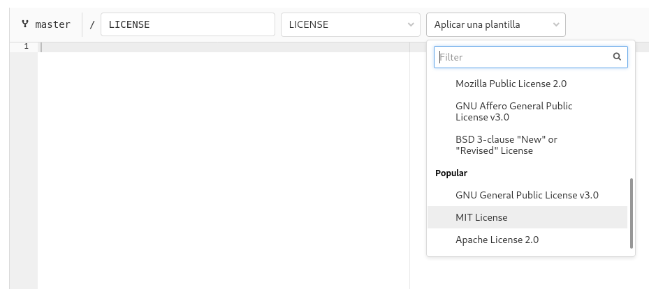

# Licencias de software

Todo software tiene siempre una **licencia de uso**, que no deja de ser 
**un contrato entre 
quien escribió el programa *(autor)* y quien decida usarlo *(usuario)***. 

Este contrato, que está
sometido a la **propiedad intelectual y derechos de su autor**, 
contiene además claúsulas orientadas a reconocer o denegar derechos al usuario y a
limitar la responsabilidad del autor. 
Estas cláusulas las elige el desarrollador, el proveedor o quien detente los derechos
de explotación y ofrecen en su conjunto una serie de libertades y restricciones 
para el usuario
a quien se distribuye el software.

Se  entiende por  **software libre y de fuentes abiertas**,
aquel que se distribuye bajo una licencia tal que permita al usuario:

* libertad de ejecución y uso donde considere,
* conocer el código fuente, 
* modificar el código fuente,
* y redistribuir copias sin autorización previa,

Desde 1985 la 
*[Free Software Foundation (FSF)](https://www.fsf.org/)* trabaja por
el beneficio de la comunidad de usuarios de software libre 
ofreciendo soporte y ayuda legal, y coordinando 
actividades organizativas y promocionales.
En 2001 se fundó la 
*[Free Software Foundation Europe (FSFE)](https://fsfe.org/)*
para trabajar en todos los aspectos relacionados con el software libre en Europa. 


## Software en la administración pública

Las **administraciones públicas actúan como productores y receptores de software**, y ello tiene **repercusión directa en**

* la defensa del interés general, 
* la transparencia, 
* la eficacia, 
* la independencia tecnológica,
* la seguridad, 
* el acceso de los ciudadanos 
* y la conservación de la información.

El uso del software en la administración pública y,
en particular, el del **software libre**, está regulado
en los artículos 157 y 158 de la [ley 40/2015, de 1 
de octubre, de Régimen Jurídico del Sector Público](https://www.boe.es/buscar/act.php?id=BOE-A-2015-10566#a157)
así como en los artículos 16 y 17 del Real Decreto 
4/2010, de 8 de enero, por el que se regula el 
[Esquema Nacional de 
Interoperabilidad en el ámbito de la Administración
Electrónica](https://www.boe.es/buscar/act.php?id=BOE-A-2010-1331#a16).

El Esquema Nacional de Interoperabilidad (ENI) se desarrolla en
diversas [normas técnicas de interoperabilidad](https://administracionelectronica.gob.es/pae_Home/pae_Estrategias/pae_Interoperabilidad_Inicio/pae_Normas_tecnicas_de_interoperabilidad.html), una de las cuales ("*Reutilización y transferencia de tecnología*") trata específicamente la reutilización de activos, para lo que recomienda el uso de la licencia [EUPL](https://joinup.ec.europa.eu/collection/eupl/eupl-text-eupl-12), Licencia Pública de la Unión Europea.

## Software libre en la CARM

Al contrario que otras administraciones públicas, 

* **[El software libre y las administraciones públicas. Una visión actualizada](https://dialnet.unirioja.es/descarga/articulo/3040676.pdf)**
de Carlos González Calderón y Oriol Ferran i Riera *(Universitat Oberta de Catalunya)*

* **[La Administración Pública española apuesta por el software libre](https://www.datacentermarket.es/mercado/noticias/1112028032609/administracion-publica-espanola-apuesta-software-libre.1.html)**

...desde la CARM no se ha desarrollado una 
estrategia pública en defensa del software libre, 
pero sí se ha adquirido el compromiso por los usuarios
de esta guía, de que **todo el software desarrollado o 
financiado con recursos públicos, deba
disponer de una licencia de Software Libre y Código Abierto:**

> *Si es dinero público también debería ser código público*.

Las motivaciones que nos llevan a adquirir este compromiso son:

1. **Ahorro de impuestos**: Aplicaciones similares no tienen que ser programadas desde cero una y otra vez.
2. **Colaboración**: Los esfuerzos en grandes proyectos se pueden compartir, con lo que se gana experiencia y se reducen costes.
3. **Accesible a todos**: Las aplicaciones pagadas por los ciudadanos deben estar disponibles para todos.
4. **Estimular la innovación**: Con procesos transparentes, los otros no tienen que reinventar la rueda.

**En GitLab**, estando en los *Detalles del repositorio*, 

1. Si nos aparece el icono ```[+] Añadir LICENSE```, significará que no se configuró ninguna licencia para el proyecto.

	
   
2. Pulsar en el icono anterior y acceder al asistente que nos permite añadir una licencia desde [una de las plantillas predeterminadas *(disponibles en https://choosealicense.com)*](https://choosealicense.com/appendix/). **Almacenar como fichero ```LICENSE```**

	

3. Pasado un tiempo los cambios aparecen reflejados en los detalles del proyecto.

	
