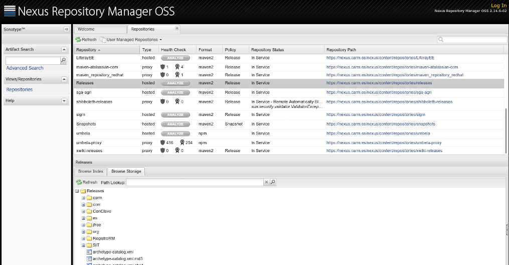
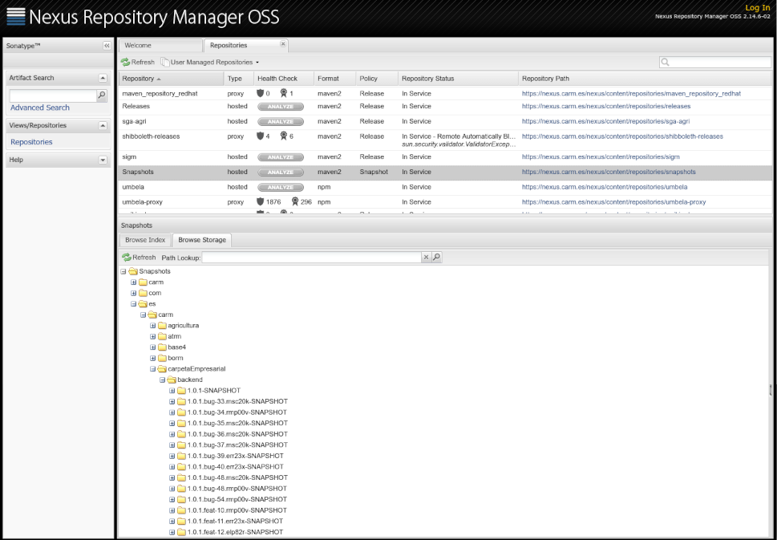
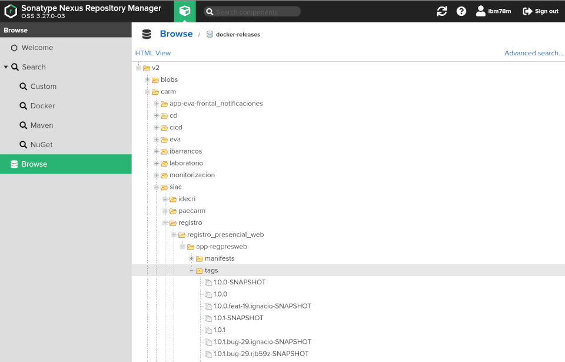
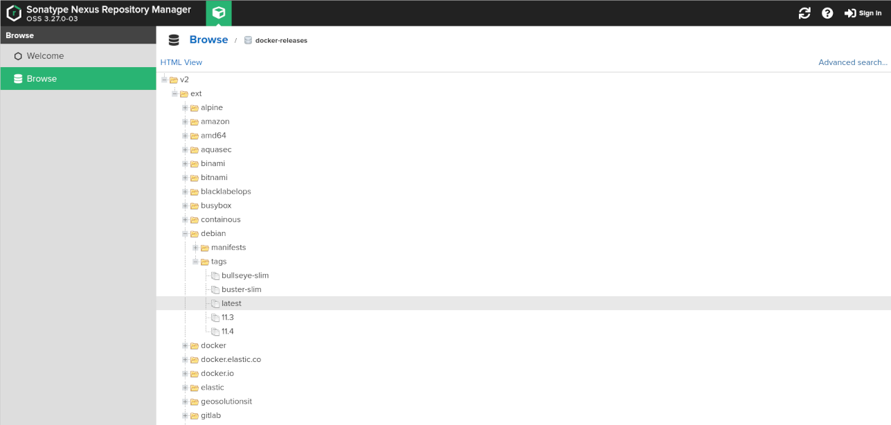

# Repositorio de artefactos

Un repositorio de artefactos es un **espacio de almacenamiento desde el que poder recuperar e instalar paquetes de software en un ordenador**.
Este espacio se estructura en **directorios que incluyen una única versión numerada** para cada paquete, fruto de la **ejecución de la tarea de despliegue** del proceso de construcción automatizada *(build)*. 

Este espacio permite almacenar además, 
aquellos **componentes de terceros *(dependencias y librerías)*
que se necesitan para construir nuestras aplicaciones**,
y, del mismo modo, **generar nuestras propias
librerías** y compartirlas desde varias aplicaciones, fomentando así la compartición de código y centralizando su implementación. 

Además, al almacenar diferentes versiones de un mismo componente, permite **volver a usar una versión anterior** en caso de que sea necesario.


Disponer de estos repositorios es **fundamental cuando 
[se trabaja con Maven](Guia-Maven.md)**.
En el fichero ```pom.xml``` del proyecto, en la sección de ```<dependencies>```, se indican las librerías que usa nuestro proyecto y que *Maven* tratará de usar al compilar el proyecto. Para ello,

* lo primero que hace *Maven* es buscar estas dependencias en el **repositorio local** (por defecto en el directorio ```~/.m2/repository/```).
* si no las encontrara, entonces las buscará en el **repositorio público [Maven Central](https://mvnrepository.com/repos/central)** en Internet, las descargará e instalará en el repositorio local.
* La siguiente vez que *Maven* compile el proyecto, repetirá el mismo proceso, pero será más rápido porque no tendrá que descargar nada.
* En caso de que no pudiera encontrar alguna dependencia, *Maven* cancelará el proceso de construcción y no se generará ningún paquete binario distribuible.

Además de estos dos repositorios (local y público) por defecto, *Maven* ofrece la posibilidad de **configurar la búsqueda de dependencias en otros repositorios**:
* en el fichero de configuración  ```$M2_HOME/conf/settings.xml```
* en el propio ```pom.xml``` del proyecto mediante el tag ```<distributionManagement>```


## Repositorios privados
Usar únicamente los repositorios por defecto de *Maven*, presenta una serie de inconvenientes para las organizaciones:

1. Por un lado, **a la hora de utilizar librerías y componentes propios**: ¿Las suben a *Maven Central* y permiten que todo el mundo las use y las vea? ¿Las cuelgan en un sitio para que cada desarrollador las instale en local?
2. Por otro lado, **no se tiene ningún control sobre el contenido de estos repositorios *(local y público)***: Si en Maven Central eliminan una librería, ¿nuestras aplicaciones dejarán de compilar? ¿y si una librería incluye un virus? ¿cómo asegurarse de que el programador ha instalado la versión correcta en su equipo?


Para superar estos inconvenientes, las organizaciones cuentan con el **uso de repositorios privados en su propia red local**, aplicaciones que implementan un gestor de repositorios de artefactos y permiten controlar las librerías que almacenan sin depender de factores externos,  encontramos:

* [Artifactory OSS](https://jfrog.com/open-source/)
* [Nexus OSS](https://www.sonatype.com/nexus-repository-oss)
* [GitLab](https://docs.gitlab.com/ee/user/packages/package_registry/)

 Estos gestores de repositorios, permiten además:
 * **Cachear** el contenido de repositorios públicos y minimizar el consumo de ancho de banda
 * **Gestionar su contenido**, para evitar que los proyectos dejen de compilarse porque determinadas librerías no se encuentren en los repositorio públicos
 * Realizar automáticamente un **inventario de aquellas librerías inseguras**
 * Mantener un registro automático del **tipo de licencias de las librerías de terceros** que usan nuestras aplicaciones
 * Aplicar **políticas para la gestión del espacio** de almacenamiento


 ## Nexus OSS en la CARM


Existen cantidad de informes que comparan Artifactory con Nexus, desde diferentes puntos de vista:

* [Maven Repository Manager: Nexus Vs. Artifactory](https://dzone.com/articles/maven-repository-manager-nexus)
* [Why Nexus is Best for DevOps Automation](https://www.sonatype.com/nexus-vs-artifactory)
* [Artifactory Vs. Nexus The Integration Matrix](https://jfrog.com/blog/artifactory-vs-nexus-integration-matrix/)
* [A comparison of binary repository management systems](https://www.praqma.com/stories/artifactory-nexus-proget/)

Habitualmente siempre gana Artifactory, sencillamente... es mejor... pero, **la versión libre de Nexus incluye todo lo que necesitamos en la CARM sin coste, al contrario que Artifactory**: Por  eso se decidió usar [Nexus](https://nexus.carm.es/).



Nexus dispone de una consola Web desde la que se pueden visualizar los repositorios que tenemos configurados. De ellos destacan:

* [3rd party](https://nexus.carm.es/nexus/content/repositories/thirdparty/): Contiene librerías que desaparecen de *Maven Central* y que se necesitan para poder compilar programas en la CARM. *La subida de artefactos a este repositorio es **manual***.
* [Snapshots](https://nexus.carm.es/nexus/content/repositories/snapshots/): Contiene todos los artefactos resultantes de ejecutar ```mvn deploy```.  *La subida de artefactos a este repositorio es **automática** (la hace Maven)*.
* [Releases](https://nexus.carm.es/nexus/content/repositories/releases/): Contiene todos los artefactos resultantes de ejecutar ```mvn release```.  *La subida de artefactos a este repositorio es **automática** (la hace Maven)*.

La administración de Nexus la realiza el *Servicio de Integración de Aplicaciones Corporativas (SIAC)* y atenderá **peticiones vía [GLPI](https://glpi.carm.es) de**:

1. **Alta/Baja de artefactos en el repositorio ```3rd party```**, para lo que será necesario facilitar: ```GroupID```, ```ArtifactID```, ```Version``` y el fichero a subir *(```.jar, .war```)*.
2. **Alta/Baja de proxys a otros repositorios externos**, para lo que será necesario facilitar la URL del repositorio externo.

...solo en **casos de extrema necesidad**, en los que haya desaparecido un artefacto de *Maven Central*, y el proyecto de la CARM que lo requiere no esté en condiciones de actualizar la versión de esa dependencia por otra más moderna.

Existen **dos *"reglas de Oro"* en el trabajo con Nexus**:

1. **Los artefactos se suben automáticamente**, señal de que todos los artefactos se suben a Nexus desde un proceso de construcción automática *(build)*
2. **Nunca se necesita añadir manualmente**, señal de que todos los proyectos de la CARM están lo suficiente actualizados, como para que las políticas de *Maven Central* no les afecten.


Como no se dispone de espacio infinito para almacenar todos los artefactos que generamos, hay configuradas **políticas de borrado automático** que se aplican según las siguientes reglas:

1. Por defecto, **sólo se conservan las cinco últimas versiones** en el repositorio `RELEASES`.
2. **Nunca se borrarán los artefactos bajo `/lib/*`** en el repositorio de `RELEASES`. Los proyectos que generen librerías deberán colocarse ahí.
3. Por defecto, **sólo se mantiene la versión más reciente** en el repositorio `SNAPSHOTS` y por **cada `SNAPSHOT` los diez** más recientes.

Sobre esta última regla, considerar como _versión más reciente_ la versión `X.Y.Z-SNAPSHOT` de la rama `develop` y todas sus variantes _(`X.Y.Z-[feat|bug]-[USER]-[ISSUE]-SNAPSHOT`)_ que se derivan de las ramas relacionadas.




###  ```mvn-repo``` del repositorio de código fuente
Dado que **[nexus.carm.es](https://nexus.carm.es) no está visible en Internet**, y la CARM dispone de [proyectos alojados en GitHub](https://github.com/carm-es/) que comparte con otras administraciones, se **requiere de un espacio donde poder almacenar las librerías no estándar de estos proyectos**, para cualquiera desde Internet pueda construir nuestros proyectos sin depender de ningún tipo de acceso a recursos de la CARM. Esto se [consigue mediante](https://gist.github.com/fernandezpablo85/03cf8b0cd2e7d8527063) la **rama ```mvn-repo``` en el repositorio de código fuente del proyecto**.

* [```mvn-repo``` en Inside](https://github.com/carm-es/inside/tree/mvn-repo)
* [```mvn-repo``` en CsvStorage](https://github.com/carm-es/csvstorage/tree/mvn-repo)

Luego se añade el tag ```<repository>``` al fichero ```pom.xml```:

```xml
<repositories>
   <repository>
      <id>private-repo</id>
      <name>Private Repository</name>
      <url>https://raw.githubusercontent.com/GITHUB_PROFILE/PROJECT/mvn-repo/</url>
      <releases>
         <enabled>true</enabled>
         <updatePolicy>never</updatePolicy>
      </releases>
      <snapshots>
         <enabled>false</enabled>
      </snapshots>
   </repository>
</repositories>
```


###  docker-registry 

La implantación del despliegue continuo en la CARM se basa en la construcción de _[contenedores dockers](https://www.javiergarzas.com/2015/07/que-es-docker-sencillo.html)_
que _"contienen y ejecutan"_ nuestra aplicación sobre [un cluster docker-swarm](https://www.makingscience.es/blog/que-es-docker-swarm/). La construcción de estos contenedores está automatizada e integrada en el _pipeline-CD_, y **genera como resultado un nuevo tipo de artefacto: _el contenedor de docker con una versión concreta_** de nuestra aplicación.

Este nuevo tipo de  artefactos se publican automáticamente en un [registro de docker](docker-registry.carm.es) implementado con **Nexus3 que podemos consultar via web en [https://docker-registry-admin.carm.es](https://docker-registry-admin.carm.es/#browse/browse)**, y al que podremos acceder usando las credenciales corporativas:




Estos contenedores se almacerán en la misma ruta que nuestro proyecto en gitlab, bajo el directorio `/v2/carm/`. Supongamos que nuestra aplicación se encontrara en la ruta https://gitlab.carm.es/DEMO/ejemplo.git y que generara un docker llamado `app-ejemplo`. Para ejecutar en cualquier equipo la última versión del contenedor de la aplicación, podría ejecutar:


1.  Autenticarse en el repositorio usando nuestras credenciales corporativas, ejecutando el siguiente comando:

	```bash
	docker login docker-registry.carm.es
	```

2. Descargar la imagen docker de Nexus a nuestro equipo, mediante:

	```bash
	docker pull "docker-registry.carm.es/carm/demo/app-ejemplo:latest"
	```

3. Lanzar el contenedor con la aplicación en nuestro equipo, de la misma forma que harán los servidores de la CARM:

	```bash
	docker run -p 8080:8080 \
	           --name test \
	           docker-registry.carm.es/carm/demo/app-ejemplo:latest
	```


La **única diferencia estará en la configuración**: Cuando el contenedor docker se ejecute en los servidores de la CARM leerá la configuración del [VAULT](https://vault-admin.carm.es/ui/vault/secrets/apps/list) según el entorno donde se despliegue, mientras que cuando lo ejecutemos en local, usará la configuración que dejamos en el directorio del repositorio `configuracion/local`.  Esto **ayudará a depurar errores del tipo _"...en mi equipo funciona!"_** cuando se despliegue nuestra aplicación en los servidores.

Obviamente, siempre podrán existir diferencias entre lo que hay en `vault` y lo que se indicó en `configuracion/local`, pero para evitar errores en el despligue por estas diferencias, existe **el fichero de contrato (`/config.yml`)**, donde se declara todo lo que se espera exista en `vault`, antes de desplegar el contenedor en los servidores.


Podría suceder que su **aplicación requiera de otros contenedores  _(mysql, redis, rabbitMQ, traefik, etc)_ declarados en el fichero `docker/docker-compose.yml`** de su repositorio. En ese caso debe **solicitar por GLPI al _grupo: S. Aplicaciones y Soft. Base_  que importen** el docker a Nexus, para que su aplicación no use contenedores alojados directamente en Internet si no, contenedores alojados en `docker-registry` que previamente se hayan revisado, configurado y securizado para poder ejecutarse en la CARM.





Así, las referencias a estos contenedores importados quedarían como:

```bash
docker pull "docker-registry.carm.es/ext/debian:11.4"
```


