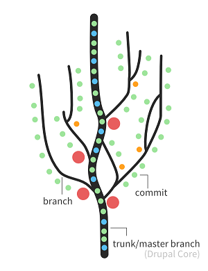
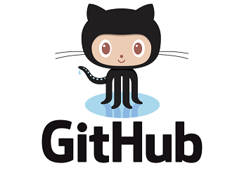
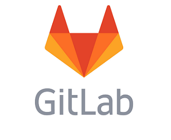

# Uso del Control de Versiones (SCM)

Conforme crece el número de cambios en el código fuente de un programa y el número de personas que intervienen en ellos, se hace más difícil saber cuál es la última versión buena y de quién. Un sistema de control de versiones es una herramienta que nos ayuda con esto: **facilita la administración de las distintas versiones y modificaciones del código de un programa y de sus ficheros de configuración** *(del inglés Source Code Management)*, en lo que se conoce como repositorio.
La herramienta se encarga de registrar todos los cambios del repositorio, para poder consultarlos posteriormente o revertirlos, evitándonos tener que hacer copias de seguridad de nuestros cambios.

Durante el desarrollo de un proyecto, lo habitual es que cada programador realice cambios en el código fuente para acometer la tarea que se le ha encargado. Una vez que acaba, los entrega al repositorio de control de versiones (**commit**), de manera que el resto de programadores puedan disponer de ellos, si lo requieren sus correspondientes tareas. Pero podría darse el caso de que **varios programadores trabajen sobre el mismo fichero (o ficheros), en cuyo caso el SCM lo detectará, y actuará** para evitar el conflicto. Además, 

1. permite volver a cualquier punto del desarrollo para ver qué aspecto tenía un determinado fichero de código, o volver a una versión donde todo funcionaba,
2. posibilita que se pueda echar un vistazo para ver quién realizó un determinado cambio, y cuándo lo hizo,
3. facilita poder trabajar en distintas características o resolución de bugs de forma simultánea, guardando los cambios en cada una de ellas, y uniéndolos al desarrollo principal cuando estén listas, mediante lo que **se conoce como ramas o branch**

Estas distintas ramas de trabajo hacen que **veamos el repositorio de código como un árbol**, donde cada una de las ramas representan experimentos, características y correcciones a bugs que se van desarrollando, y que luego vuelven a unirse al tronco principal, que se supone que es la versión que pretende instalarse en producción.
   



Existen multitud de implementaciones de sistemas de control de versiones:
* [CVS](https://www.nongnu.org/cvs/)
* [Subversion](http://svnbook.red-bean.com/)
* [Mercurial](https://www.mercurial-scm.org/)
* [Bazaar](https://bazaar.canonical.com/en/)
* [Git](https://git-scm.com/)

Todos tienen sus características propias, ventajas e inconvenientes, pero **para el desarrollo de proyectos escritos en Java apostamos por Git** frente a [Subversion en la CARM](https://vcs.carm.es), por las razones que a continuación se verán.

## Git
[Git](https://es.wikipedia.org/wiki/Git), es un software de control de versiones  de código abierto creado por Linus Torvalds, pensando en la eficiencia y la confiabilidad del mantenimiento de versiones de una aplicación, cuando éstas tienen un gran número de archivos, precisamente porque lo necesitaba para gestionar el [desarrollo del kernel de Linux](https://github.com/torvalds/linux).

Con la proliferación del uso de Git, comenzaron a surgir los primeros servicios de alojamiento que, además de ofrecer un servicio web basado en Git, ofrecían un conjunto de **herramientas online que facilitaban la gestión del proyecto de forma colaborativa**: Wiki, seguimiento de errores, planificación y publicación de versiones, todas integradas con el repositorio de código fuente. De ellas, las más famosas son:

* [GitHub](https://es.wikipedia.org/wiki/GitHub), propietaria, aunque gratuita para repositorios públicos alojados en Internet
* [GitLab](https://es.wikipedia.org/wiki/GitLab), open source que podemos instalar en nuestro servidor o usar desde Internet

El hecho de que estas aplicaciones integren herramientas para la gestión de proyectos de desarrollo colaborativo junto al propio repositorio, sin requerir de la intervención del administrador, es el principal **motivo por el que se escogió Git frente a Subversion** para el desarrollo de proyectos Java.


### GitHub


**Usamos [https://github.com/carm-es](https://github.com/carm-es) para aquellos proyectos Java en los que**:
1. la licencia abierta nos lo permite,
2. tenemos la necesidad de compartir con otras administraciones públicas,
3. o bien, que adoptamos de la comunidad de código abierto, y sobre los que aplicamos nuestros propios desarrollos personalizados, que luego podríamos revertir a la comunidad.

Para participar en alguno de estos proyectos tendrás que **usar tu propia cuenta de GitHub, o [crearte una](https://github.com/join) si no tienes**, [hacer un fork](http://aprendegit.com/fork-de-repositorios-para-que-sirve/) de alguno de [nuestros proyectos](https://github.com/carm-es)  y realizar [un ```Pull Request```](https://styde.net/pull-request-en-github/) para enviarnos tus cambios.

### GitLab


**Usamos [https://gitlab.carm.es/](https://gitlab.carm.es/) para aquellos proyectos Java en los que**:
1. la licencia no nos permite hacerlos públicos,
2. pueden comprometer la seguridad de nuestros sistemas,
3. gestionan información sensible de los ciudadanos o de la propia administración,
4. o bien, cuando el uso de servicios y herramientas en los procesos de integración continua del proyecto, está limitado o es de pago en GitHub, mientras que en GitLab es gratuito

Para poder acceder al servidor,
1. Asegúrate de tener [cuenta corporativa en IDECRI](https://idecri.carm.es) 
2. Accede con tus credencias corporativas a [GitLab](https://gitlab.carm.es)

Todos los usuarios corporativos adscritos al CRI tienen acceso a GitLab con su contraseña corporativa por defecto, pero si no pudieras acceder a GitLab y sí a IDECRI, tendrás que [poner un ticket en GLPi](https://glpi.carm.es) para que se revise la configuración de tu cuenta: **Hasta que no hayas accedido al menos una vez a GitLab, no podremos configurarte los accesos a ningún repositorio**.


### Clientes Git
Para poder entregar tus cambios al repositorio de código fuente necesitarás instalar un cliente Git en tu equipo.

Si instalaste *Eclipse IDE for Enterprise Java Developers* **ya integra un cliente Git**: Si quieres saber cómo [sacarle el máximo provecho, no dejes de leer este link](https://wiki.eclipse.org/Es:EGit/Es:User_Guide).

Si usas Windows y quieres integrar el Explorador de Windows con Git deberás:
1. **[Instalar TortoiseGit](https://tortoisegit.org/download/)**
2. y el **correspondiente Language Pack** del Castellano
3. y por último, tras la instalación tendrás que **[instalar el cliente Git de consola](https://github.com/git-for-windows/git/releases)**

Si necesitas ayuda para dar tus primeros pasos con TortoiseGit [no dejes sin leer este otro link](https://carmoreno.com.co/tutoriales/2016/04/14/TortoiseGit-Instalacion-y-uso/
), donde, además de explicar cómo puedes instalarlo, hace una pequeña introducción a su manejo.

## Uso básico de Git
Esta guía no pretende ser un manual de Git, sino presentar lo mínimo necesario para poder trabajar correctamente en los proyectos Java de la CARM así que, si no tienes experiencia con Git deberás leer los siguientes links, que sí explican con mayor profundidad la mayoría de comandos que puedes necesitar:

1. [Tutorial de Git. Manual básico con ejemplos](https://www.diegocmartin.com/tutorial-git/): Explica con detalle y ejemplos cómo empezar a trabajar con Git y los comandos más habituales
2. [Tutorial de Git – Aprende Git y GitHub/GitLab de manera fácil, rápida y sencilla](https://reviblog.net/2018/03/29/tutorial-de-git-aprende-git-y-github-gitlab-de-manera-facil-rapida-y-sencilla-parte-1/): En la línea del anterior pero algo más extenso *(el tutorial son dos partes)*
3. [Comandos básicos de Git](https://www.hostinger.es/tutoriales/comandos-de-git): Un resumen de 6 minutos que explica para qué sirve cada comando
4. [Git - la guía sencilla](https://rogerdudler.github.io/git-guide/index.es.html) Chuleta con los comandos que más usarás en el día a día: **Imprescindible**
5. [Git para usuarios de SVN](https://blog.openalfa.com/git-para-usuarios-de-svn): Si te manejas bien con Subversion, esta guía te traduce lo que solías hacer con SVN a cómo se hace con Git *(un pelín breve, pero muy útil para empezar)**
6. [El libro oficial](https://git-scm.com/book/es/v2): Para convertirse en maestro de Git.
7. [learngitbranching.js.org](https://learngitbranching.js.org/?locale=es_ES): Tutorial interactivo para aprender Git jugando.

Una vez se conoce la herramienta que usaremos para gestionar todo el código fuente del proyecto en el que trabajaremos, el flujo de trabajo de nuestro día a día, será el siguiente:

#### 1) Descargar el proyecto a nuestro equipo
Lo primero que hay que hacer es **descargar una copia de todo el proyecto** en el que vamos a trabajar a un directorio de nuestro disco duro, con el comando **```git clone ```**

Esto solo será necesario la primera vez que empezamos a trabajar con un proyecto: mientras que no eliminemos el directorio donde lo descargamos, no será necesario volverlo a hacer.

#### 2) Comprobar la rama en la que estamos 
Una vez en el directorio del proyecto donde hicimos el clone, cuando **queramos saber en qué rama estamos localizados** ejecutaremos  **```git status```**:

* En la primera línea de la salida del comando, nos lo indicará: ```On branch XXXXX```
* La segunda línea, nos informará si tenemos cambios pendientes de entregar. Si no tuviéramos nos dirá ```No commits yet```
* Y las siguientes (si hubieran) nos informarán de los ficheros que han sido modificados en local con respecto a la última versión de la rama (deberíamos añadirlos y entregarlos).  Para descartar todos estos cambios (y perderlos para siempre) y volver a la última versión de la rama podremos ejecutar: ```git reset --hard HEAD```

El comando  ```git status``` es el que más vamos a usar sin ninguna duda.

#### 3) Crear una rama local para empezar a trabajar

Por defecto, la primera vez que clonamos un repositorio a nuestro equipo estamos ubicados en la rama ```master```, que será el *tronco de nuestro árbol*, nuestra referencia de comienzo en limpio (la versión que hay en los servidores de producción).

**Para empezar a trabajar, nos moveremos a la rama ```develop```**, que es la rama más importante después del ```master```, la que tiene la versión del código de la aplicación que está en los servidores de desarrollo y de pruebas, sobre la que hacemos los cambios para días o semanas después fusionarlos en ```master``` y de ahí a los servidores de producción.

Ubicados en la rama ```develop```, **creamos una nueva rama con el nombre de lo que vamos hacer:  ```git checkout -b  issue-25```**  *(el  ```-b``` le dice a Git que la rama es nueva, e ```issue-25``` es el nombre de la nueva rama)*.

> Existe una serie de **recomendaciones para ponerle nombre a las ramas**, que más adelante se verán.

#### 4) Desarrollo y entrega de cambios

Una vez en la rama en la que vamos a trabajar, **abrimos nuestro Eclipse y comenzamos a trabajar con el código fuente**, implementar clases, corregir errores, hacer pruebas, compilar, jugar con el Tomcat del Eclipse, poner breakpoints, etc...

Cuando tengamos algo (o todo) que funcione correctamente, si ejecutamos ```git status``` nos informará de todos los ficheros que han cambiado con respecto al momento inicial en el que creamos la rama (en el paso 3). Los **marcaremos para entregar con el comando ```git add ```**, y cuando lo hayamos hecho ejecutaremos el comando **```git commit ```  para consolidar estos cambios en la rama**.

> También hay una **guía de cómo deben ser los mensajes de los commits**, que más adelante se verán.

En este punto, tendremos una nueva rama que contiene todos los cambios que hemos realizado, pero sólo está en nuestro equipo, el resto de compañeros no saben nada de lo que estamos haciendo ni lo que llevamos hecho: Habrá que **publicar esta nueva rama en el servidor mediante ```git push origin issue-15```**.  A partir de ese momento ya todos pueden ver en qué estamos trabajando y el avance que llevamos.

Ahora podríamos cambiarnos a otra rama mediante ```git checkout``` y ponernos con otra cosa, o sencillamente seguir avanzando con la tarea repitiendo todo el proceso:  Modificación del código fuente,  ```git add ``` ,  ```git commit ``` , pero una vez publicada la rama la primera vez en el servidor, **bastará con ejecutar ```git push``` para enviar los nuevos cambios a nuestra rama**.

Puede suceder que tengamos que ausentarnos del trabajo unos días, y un compañero nuestro retome nuestro trabajo, siguiendo la secuencia de pasos:
1. ```git clone```
2. ```git checkout issue-15```
3. Desarrollo con Eclipse, ```git add ``` ,  ```git commit ``` y  ```git push```, y vuelta a empezar

Pasados los días cuando retomemos nuestro trabajo por donde lo dejamos, lo primero que tendremos que hacer es ejecutar ```git pull``` para traernos a nuestro directorio local los cambios que ha estado haciendo nuestro compañero, y ya seguir con la rueda de siempre: Desarrollo con Eclipse, ```git add ``` ,  ```git commit ``` y  ```git push```, y vuelta a empezar.  En general  ```git pull``` lo usaremos cuando queramos sincronizar nuestra copia local con el trabajo de otros.

Y así seguirá la rueda, hasta que acabemos el desarrollo...

### 5) Fusión de nuestra rama a ```develop```
Una vez hemos finalizado el desarrollo de la rama ```issue-15``` que habíamos creado, habrá que fusionar estos cambios con la rama ```develop``` de la que partimos, por lo que desde la [Web de GitLab](https://gitlab.carm.es) realizaremos una solicitud de ```Merge Request``` *(o ```Pull Request``` si el proyecto está en [GitHub](https://github.com/carm-es))*

En [Gitlab Merge Requests Easily Explained](https://www.sgalinski.de/en/typo3-agency/technology/gitlab-merge-requests-easily-explained/) y [Learning GitLab - Merge Requests](https://www.tutorialspoint.com/gitlab/gitlab_merge_requests.htm) explican cómo se hace para GitLab, y en [Tutorial simple para hacer tu primer PR (Pull Request)](https://blog.desdelinux.net/tutorial-simple-primer-pr-pull-request/) para GitHub.

> Lo que escribas en el texto del ```merge request``` también se rige por la **guía de cómo deben ser los mensajes de los commits**, que más adelante se verán.

Después de esto, habrá que esperar que los responsables del proyecto revisen tus cambios y, si no hubiera problema, **los aceptarán y fusionarán en ```develop```, lo que provocará que se borre la rama que creaste**, de manera que cuando retomes el trabajo tendrás que refrescar tu copia local:

1. ```git checkout develop```
2. ```git pull```

## Reglas de uso del control de versiones
Conforme vamos trabajando día a día con el control de versiones, realizamos tareas periódicas que se convierten en rutinarias y con el tiempo dejamos de prestarles atención. Hay que tener siempre presente que **nuestra participación en un proyecto es efímera en relación  con la vida que pueda tener el programa que estamos escribiendo**, y tan solo somos una persona más de las muchas que interactuarán con él: *lo modificarán, lo adaptarán a los nuevos tiempos y a las nuevas tecnologías, lo migrarán varias veces de servidores, lo configurarán aún más veces, lo parchearán, lo revisarán una y otra vez...*,  y por ello es **muy importante respetar unas reglas mínimas comúnmente aceptadas** que garantizarán la buena salud y calidad de nuestro repositorio de código fuente:

* [4 reglas para tu proceso de control de versiones](http://codicesoftware-es.blogspot.com/2008/08/4-reglas-para-tu-proceso-de-control-de.html)
* [Los 10 mandamientos del control de código fuente](https://www.campusmvp.es/recursos/post/los-10-mandamientos-del-control-de-codigo-fuente.aspx)
* [5 cosas que no debes hacer con Git](https://somostechies.com/05-cosas-que-no-debes-hacer-con-git/)
* [Git Best Practices](https://sethrobertson.github.io/GitBestPractices/)

Y que de forma resumida son:

1. **JAMÁS hagas un ```commit``` al  ```master```**
2. **JAMÁS hagas un ```commit``` sin comentario**, y asegúrate de que valen para algo
3. Antes de ejecutar ```git commit``` revisa bien lo que hará
4. Ejecuta ```git fetch``` antes de un ```git commit```
5. Ejecuta ```git commit``` con frecuencia
6. Antes de irte a casa haz ```commit  y push``` 
7. Nunca subas **ficheros binarios, ni librerías, ni compilados** al repositorio
8. Nunca subas los **ficheros que genera tu IDE**  como el ```.project```, ```.settings```, ```.classpath``` ...

Recuerda que el control de versiones no es un servidor de backup, es una herramienta para administrar e inventariar los cambios que vamos haciendo en un programa a lo largo de su vida. 

> *Considera que con el primer ```commit``` que hagas, vamos a descubrir cuánto de en serio te tomas todo esto...*

Si en algún momento te despistaste con estas reglas y quieres enmendar tu error, te puede servir: [6 errores comunes al utilizar git y cómo solucionarlos](
https://victorhckinthefreeworld.com/2018/08/09/6-errores-comunes-al-utilizar-git-y-como-solucionarlos/).
