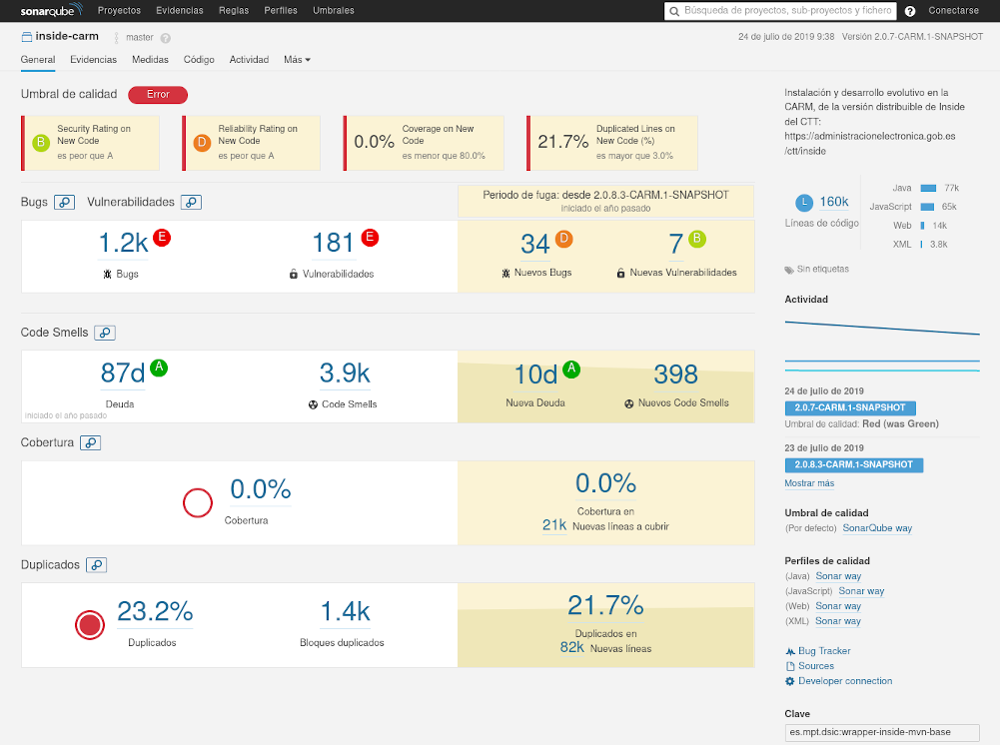
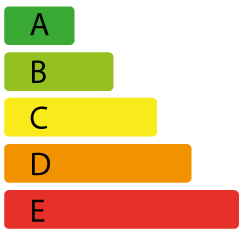
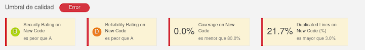

# Calidad del software

Escribir código en un lenguaje de programación, es una actividad creativa cuyo 
resultado depende en gran medida de la formación y experiencia de la persona que la realiza.
Para poder asegurar que el resultado de esta creación es el esperado, se necesita poder **analizar o 
revisar el código fuente escrito, evaluando un conjunto de métricas que nos ayuden
a determinar su calidad**.

Este análisis de código se puede realizar de dos maneras: 

* **Análisis estático**, que se realiza sin ejecutar el código de la aplicación, por lo que no necesita que la aplicación completa funcione y por tanto se puede realizar desde las primeras fases del desarrollo.
* **Análisis dinámico**, que se realiza con la aplicación en ejecución.


Realizar un análisis estático del código ayuda a:

1. Poner de manifiesto los problemas no funcionales del aplicativo *(estilo del código, complejidad ciclomática...)*
2. Evidenciar problemas potenciales en etapas tempranas *(bugs, excepciones no capturadas...)*
3. Prevenir problemas potenciales de forma prematura *(dependencias vulnerables, deuda técnica...)*
4. Ahorrar costes, al evitar el coste de reparación de los defectos siempre que se detecten pronto 

En general, hay que tener siempre en cuenta que **cuanto más tarde se descubra un defecto en un programa, 
más caro resultará resolverlo**: según el estudio, se habla de
[30 veces](https://deepsource.io/blog/exponential-cost-of-fixing-bugs/)
hasta
[100 veces](https://www.celerity.com/the-true-cost-of-a-software-bug) más
cuando lo descubrimos en producción.

El análisis pretende evaluar la calidad del código de un programa, analizando cuatro características:

* **Confiabilidad** *(...que haga lo que se espera...)*, para evitar comportamientos inesperados: controlar todos los casos posibles contemplados y eliminar aquellas operaciones con resultados indeterminados.

* **Rendimiento** *(...que haga un uso eficiente de los recursos...)*, porque los recursos nunca son ilimitados. 

* **Seguridad** *(...que sea lo menos vulnerable posible...)*, porque un solo ataque puede bloquear toda la aplicación y provocar una fuga de información.

* **Mantenibilidad** *(...que sea fácil de mantener...)*, porque siempre habrá que añadir, modificar o eliminar funcionalidades del programa sin romper lo que funciona.

Las tres primeras características buscan minimizar los riesgos de encontrar errores en producción, mientras que la última nos informa del **coste de propiedad de una aplicación**.

En general, cuando las carencias técnicas de una aplicación se llevan al plano financiero, [se habla de **deuda técnica**](https://martinfowler.com/bliki/TechnicalDebt.html), como el **coste del desarrollo para eliminar los riesgos debidos a la calidad del código** en un entorno productivo. 

Si deseas profundizar más en estos conceptos puedes leer:

 * [Análisis estático de código fuente](https://www.redisybd.unam.mx/redisybd/pluginfile.php/1314/mod_resource/content/1/AECF.pdf)
 * [Análisis estático: por qué se usa (tan poco)](http://informatica.blogs.uoc.edu/2015/10/19/analisis-estatico-por-que-se-usa-tan-poco/)
 * [Why You Should Care About Static Code Analysis](https://medium.com/@alexwking/why-you-should-care-about-static-code-analysis-633fe1075fa0)
 * [Why Static Code Analysis is Important?](https://javarevisited.blogspot.com/2014/02/why-static-code-analysis-is-important.html)
 * [5 Reasons Why Every Business Needs Static Code Analysis](https://www.appknox.com/blog/static-code-analysis)
 * [Technical debt 101](https://medium.com/@joaomilho/festina-lente-e29070811b84)


##  Sonarqube


Las buenas prácticas y particularidades de cada lenguaje de programación
*(no es lo mismo analizar código PHP que Java o PL/SQL)*, 
se traducen en reglas y se catalogan según su característica 
*(confiabilidad, rendimiento, seguridad, mantenibilidad)*. 
Como ello necesita de un conocimiento profundo de cada lenguaje y de sus buenas prácticas,
[existen herramientas software](https://en.wikipedia.org/wiki/List_of_tools_for_static_code_analysis)
que implementan estas reglas para automatizar el análisis estático del código fuente de una aplicación. 


De entre todas estas herramientas, 
[en la CARM **hemos decidido usar SonarQube**](https://sonarqube.carm.es/) en su **edición Community LTS**.

SonarQube es una **herramienta de código abierto** que permite 
implementar **controles de calidad centralizados**
para **más de [20 lenguajes](https://www.sonarqube.org/features/multi-languages/)** de programación, recopilar y publicar el resultado en un servidor Web y ofrecernos un resumen ejecutivo a modo de cuadro de mandos.



El cuadro de mandos agrupa las métricas en 4 grupos:

* **Bugs y Vulnerabilidades**: Muestra errores potenciales y fallos de seguridad, bien en el código fuente o en las librerías de terceros que use.

* **Code Smells** *(el código huele...)*: Nos informa de la calidad del código fuente, atendiendo fundamentalmente a su deuda técnica y a no implementar buenas prácticas (lo que incluye la complejidad ciclomática).

* **Cobertura**: Qué tanto por ciento del código ha sido comprobado por tests.

* **Duplicados**: Considera una duplicidad de código cuando 10 líneas sucesivas de código se encuentran duplicadas.

Y todo está estrechamente relacionado:

1. Mucho código duplicado nos habla de mucho uso de Copy&Paste, y poca reutilización de código, e incluso errores de diseño de la arquitectura de la aplicación.
2. Cuanto mayor sea la complejidad ciclomática y la duplicidad de código, más difícil será de mantener.
3. A menor cobertura, más difícil será realizar un cambio en el código fuente sin saber si rompemos algo.
4. A mayor número de Bugs y Vulnerabilidades, más tiempo será necesario invertir en solucionarlo, y por tanto mayor deuda técnica

En la práctica, 
**estas métricas giran en torno al cálculo de la *"Deuda técnica"* del proyecto, 
y cuánto menor sea, mejor salud tendrá**. 
Para medirla usa un valor temporal con el poder hacerse una idea del...

* por qué se tarda tanto en incluir ciertos cambios en un proyecto,
* por qué necesitamos asignar más recursos al proyecto si se quiere amortizar la deuda,
* por qué es necesario dedicar un tiempo a refactorizar


Con cada análisis se evalúan el conjunto de reglas y se obtiene el [**SQALE Rating** *(Software Quality Assessment based on Lifecycle Expectations)*](www.sqale.org):
Un método que tiene por objetivo asegurar la calidad del código fuente.
Sonarqube se ayuda de una escala de letras y colores *(similar a la de la eficiencia energética)*, donde el color nos habla de lo bien construido que está el proyecto y el tamaño de la barra el esfuerzo que habría que hacer para llevarlo a una zona más confortable.




* **A**: *Ratio de Deuda Técnica menor al 10%*. El proyecto está sano, y no necesita hacerle nada especial.
* **B**: *Ratio de Deuda Técnica entre el 10% y el 20%*. Podemos considerarlo en un estado aceptable, pero atentos a que no empeore. 
* **C**: *Ratio de Deuda Técnica entre el 21% y el 50%*. El proyecto no tiene buena salud, hay que empezar a tomar medidas correctivas. 
* **D**: *Ratio de Deuda Técnica entre el 51% y el 100%*. Es urgente tomar acometer medidas que lleven de vuelta el proyecto a zonas más saludables.
* **E**: *Ratio de Deuda Técnica superior al 100%*. Hay que tomar una decisión: O se arregla y se dedica esfuerzo (tiempo y dinero), o bien se busca otra aplicación, esta no es mantenible.

Para conocer mejor cómo funciona SonarQube, cómo configurarlo o cómo se calculan los ratios de todas este métricas, puedes leer:

* [Documentación oficial](https://docs.sonarqube.org/latest/), que diferencia el rol: Administrador, programador, etc.

* [Manual en castellano](https://www.sonarqubehispano.org/display/DOC/Manual+de+usuario+de+SonarQube), algo anticuado.

* [¡Colega! ¿dónde están mis métricas?](https://www.adictosaltrabajo.com/2015/03/03/sonarqube-4-5-2/), analiza la versión 5.X de SonarQube, pero tiene explicaciones que ayudan a entender muy bien el funcionamiento. **Imprescindible**.

* [Evalúa la calidad de tu código con Sonarqube](https://www.paradigmadigital.com/dev/evalua-la-calidad-de-tu-codigo-con-sonarqube/), hace un repaso a la interfaz de SonarQube y a los conceptos que maneja. **Necesario**.

* [Controla la calidad del código con SonarQube](http://joseantoniosaiz.com/tag/sonarqube/), introduce de forma rápida el funcionamiento y cómo se calculan algunos valores. **Recomendable**.


### Umbrales SQALE en la CARM
De **forma anual** el *Servicio de Integración de Aplicaciones Corporativas de la CARM*, revisa el estado global de todos sus proyectos y ajusta los *umbrales SQALE* permitidos por Sonarqube y que **consideramos mínimos a cumplir en cualquier entrega de código**:


Se definen un conjunto de umbrales, en base a dos escenarios:

* **Umbral mínimo**: valores mínimos de cada métrica que el código fuente debe cumplir.
* **Umbral de confianza**: valores que consideramos adecuados para todo desarrollo software.

Teniendo en cuenta la definición de estos umbrales, se establecen los siguientes valores de las métricas:


|Métrica|Operador|Nivel de confianza|Umbral mínimo|
|-------|:------:|:----------------:|:-----------:|
|Nueva cobertura|es menor que|25|15|
|Nuevas evidencias bloqueantes|es mayor que|0|0|
|Nuevas evidencias críticas|es mayor que|0|0|
|Nuevas evidencias mayores|es mayor que|0|
|Maintainability Rating on New Code|es peor que|A|B|
|Reliability Rating on New Code|es peor que|A|B|
|Security Rating on New Code|es peor que|A|B|
|Ratio Deuda Técnica en código nuevo (%)|es mayor que|3|5|
|Duplicated Lines on New Code (%)|es menor que|5|10|


En función de los valores obtenidos en cada métrica, Sonarqube marcará cada ejecución con una etiqueta de calidad *(Quality Gate o Umbral de calidad)*:



* **<span style="background-color: red; color: white">FAILED / ERROR</span>**: Alguno de los valores de las métricas no supera el umbral mínimo.
* **<span style="background-color: orange; color: white">WARNING</span>**: Alguno de los valores de las métricas no supera el umbral de confianza.
* **<span style="background-color: green; color: white">PASSED</span>**: Todos los valores de las métricas superan los umbrales de calidad, tanto mínimos como de confianza.
 
En caso de que el resultado del **análisis obtenga *FAILED*,  NO se considerará el código fuente con la calidad suficiente y se evitará que se integre en producción**.


### Ejecución manual del análisis
Si tienes curiosidad por saber qué calidad tiene tu proyecto, puedes ejecutar el análisis de tu proyecto con ayuda de Maven, estando ubicado en el directorio donde tengas el ```pom.xml```:

```bash
mvn clean \
    -DfailOnError=true \
    -Dformats="XML,HTML" \
    verify \
    org.jacoco:jacoco-maven-plugin:prepare-agent \
    org.owasp:dependency-check-maven:5.3.2:aggregate \
    org.sonarsource.scanner.maven:sonar-maven-plugin:3.7.0.1746:sonar \
    -Dsonar.dependencyCheck.summarize=true \
    -Dsonar.dependencyCheck.reportPath=target/dependency-check-report.xml \
    -Dsonar.dependencyCheck.htmlReportPath=target/dependency-check-report.html \
    -Dsonar.host.url=https://sonarqube-pru.carm.es \
    -Dsonar.jacoco.reportPaths=target/jacoco.exec \
    -Dsonar.verbose=true
```

Si no  usas Maven para tu proyecto, siempre [puedes **ejecutar el escáner de Sonarqube**](https://docs.sonarqube.org/latest/analysis/scan/sonarscanner/), previa instalación en tu equipo.
