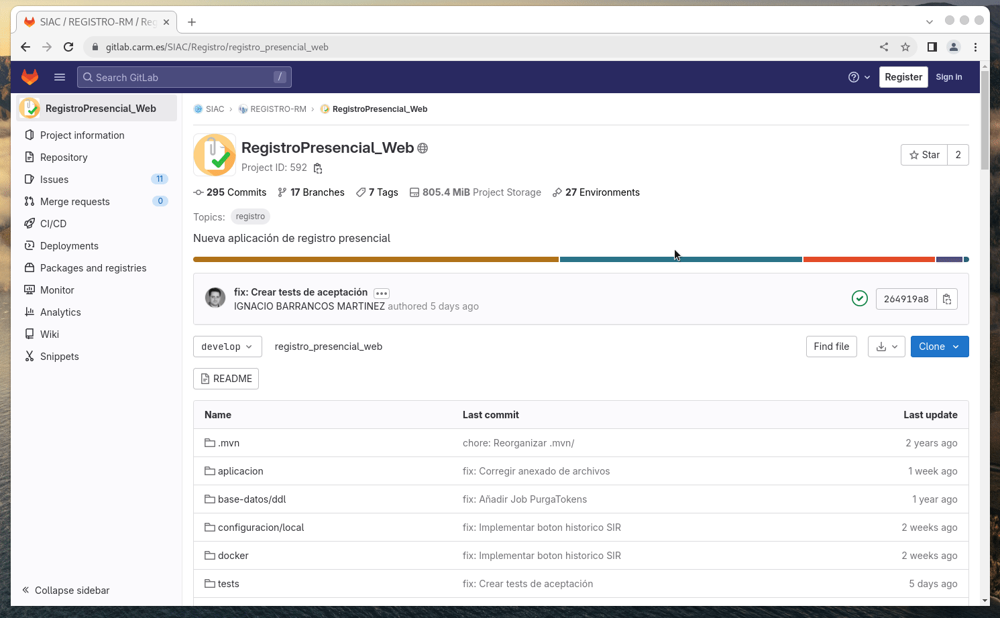

# Escribir los tests


Las **pruebas o tests de software** son una serie de procesos que buscan evaluar y verificar que un programa informático cumpla con los requisitos y expectativas establecidas, en definitiva, _establece la confianza de que un programa hace lo que se supone que debe hacer_. 

Para ello, existen dos enfoques: probar el programa para demostrar que funciona, o por el contrario, asumir que tiene errores y probarlo para descubrirlos, trabajar en demostrar que tiene errores. Con el primer enfoque se da por sentado que un programa que hace lo que se supone debe hacer, centramos nuestra meta en seleccionar los casos de prueba en los que el programa se comporta como se espera pero, **el hecho de que el programa realice su función no garantiza que esté libre de errores**.

Los **casos de prueba** describen una serie de escenarios o situaciones específicas donde se detallan las condiciones iniciales, las acciones a realizar y los resultados esperados que cubren diferentes aspectos, destinados a poder evaluar una funcionalidad o característica particular de un programa. 


Por tanto, las pruebas o _tests_ verificarán el comportamiento de un programa sobre un conjunto de casos de prueba diseñados para encontrar errores. Para encontrar estos errores **existen dos técnicas de diseño** principalmente:

* **Diseño de caja negra**, que consiste en ver el programa a testear como una caja negra, despreocupándonos del comportamiento
interno y concentrando el esfuerzo en encontrar el comportamiento incorrecto, de acuerdo a las especificaciones, teniendo sólo en cuenta las entradas y salidas de dicho programa.

* **Diseño de caja blanca**, por el contrario, persiguen verificar la estructura interna de un programa: línea a línea, bucles, llamadas a funciones, argumentos, etc...


### Tipos de pruebas 

Las pruebas de software se pueden clasificar **atendiendo al aspecto del programa que buscan probar**:


* **Pruebas funcionales**, que prueban las funcionalidades de la especificación de requisitos, es decir, lo que hace el sistema, y suelen estar asociadas a las técnicas de diseño de pruebas de caja negra


* **Pruebas no funcionales**, que prueban el comportamiento externo del programa, cómo funciona el sistema a modo de caja negra, y tienen en cuenta las siguientes características no funcionales en las pruebas:
	* Pruebas **de carga**: miden del comportamiento del sistema para [aumentar la carga del mismo](https://geekflare.com/es/essential-tools-to-perform-stress-test-online/) _(nº de peticiones, nº de usuarios simultáneos, etc)_
	* Pruebas **de rendimiento**: miden la [velocidad de procesamiento y el tiempo de respuesta](https://geekflare.com/es/web-performance-benchmark/)
	* Pruebas **de volumen**: miden la capacidad del sistema para procesar gran cantidad de datos, como procesar archivos con tamaños muy grandes.
	* Pruebas **de esfuerzo**: pruebas donde se [sobrecarga el sistema](https://geekflare.com/es/best-cpu-stress-test-software/) y se analiza la capacidad de recuperación
	* Pruebas **de seguridad**: realizan diferentes pruebas de accesos no autorizados, ataque de denegación de servicio, etc.
	* Pruebas **de estabilidad, eficiencia, robustez**: se realiza una medición de la respuesta del sistema a los errores de funcionamiento (_[chaos monkey](http://www.asuntosoftware.com/2020/02/que-es-el-chaos-monkey.html)_) 
	* Pruebas **de compatibilidad**: comprueban el funcionamiento en diferentes sistemas operativos, plataformas hardware, etc.
	* Pruebas **de usabilidad**: miden la [facilidad de uso](https://www.thebridge.tech/blog/pruebas-de-usabilidad)


* **Pruebas estructurales**, evalúan el tipo de estructura interna del programa, y aplican las técnicas de diseño de caja blanca


Además, las pruebas se pueden ejecutar mediante **diferentes técnicas**:

* **Técnicas estáticas**, que no ejecutan la aplicación, no ejecutan código aunque sí lo analizan
* **Técnicas dinámicas**, al contrario que las anteriores, necesitan que la aplicación esté ejecutándose 
* **Técnicas basadas en la experiencia**, en las que las pruebas se derivan de la habilidad e intuición del probador y de su experiencia con aplicaciones y tecnologías similares


### Estrategias de prueba

Las diferentes estrategias de prueba responden a la pregunta de cuándo o en qué momento del ciclo de vida del programa o **en qué fase de desarrollo del programa,  se deben ejecutar las pruebas**. Obviamente, ello dependerá de la metodología de desarrollo que se aplique en cada proyecto. En metodologías clásicas, las pruebas se ejecutan al final del proyecto, mientras que metodologías ágiles se ejecutan en las diferentes etapas o niveles de desarrollo, y hablamos de:

1. **Pruebas unitarias**, que se ejecutan en el primer nivel y consisten en verificar cada unidad software de forma aislada, es decir,
probar el correcto funcionamiento de una unidad de código, separada de las demás unidades de código. 

2. **Pruebas de integración**, en el segundo nivel, verifican las interacciones entre las diferentes unidades de código funcionan juntos correctamente en grupo, como un todo, centradas en verificar la comunicación entre componentes.

3. **Pruebas de sistema**, en el tercer nivel, verifican si el sistema cumple sus requisitos funcionales y no-funcionales evaluando el rendimiento desde la perspectiva del usuario pero a cargo del desarrollador

4. **Pruebas de aceptación**, en el último nivel, verifican si el programa satisface las expectativas del cliente o usuario.


## Tests software en la CARM


En la CARM, nos enfrentamos a **una situación heredada en la que la mayoría de aplicaciones carecen de tests de cualquier tipo**. Somos conscientes de las ventajas que nos ofrece disponer de ellos, como la posibilidad de realizar modificaciones en el código con la tranquilidad de no afectar el funcionamiento de las aplicaciones: _No romper nada cuando tocamos_. Sin embargo, dado el tiempo y los recursos limitados, no podemos abordar la creación de pruebas para todas las aplicaciones de manera inmediata.

Por ello, consideramos estratégico para disponer de tests en las aplicaciones, **comenzar escribiendo tests de aceptación de manera incremental** que verifiquen los diferentes casos de uso de cada aplicación y nos permita abordar su mantenimiento y evolución futuras con seguridad y de manera confiable, **sin renunciar a los tests unitarios para el desarrollo de nuevos componentes**.


Así, el desarrollo de tests para las aplicaciones Java, dependerá del tipo de pipeline que se use en el proyecto.


###  Aplicaciones con `pipeline-CI`

Estas aplicaciones **sólo podrán ejecutar tests unitarios automáticamente**, antes de construir el artefacto final: En caso de algún test falle, no se generará el artefacto y por tanto no se llevará a NEXUS, y en consecuencia no se podrá desplegar esa versión de la aplicación. 

Los tests unitarios son ejecutados por maven y realizan el análisis estático del código gracias a las herramientas integradas en Sonarqube _(PMD, CheckStyle, FindBugs, etc)_, que además se encarga de contabilizar el grado de cobertura, referido como el tanto por ciento de líneas de programa que han sido ejecutadas y evaluadas durante las pruebas automatizadas. 

El **código fuente de estos tests estará en el subdirectorio `src/tests` dentro del directorio de código fuente de cada módulo de la aplicación**. El pipeline los ejecutará [en la fase `test` del ciclo de vida maven](https://www.arquitecturajava.com/que-es-un-maven-lifecycle-y-como-funciona/).   


### Aplicaciones con `pipeline-CD`

Estas aplicaciones podrán ejecutar **además de los tests unitarios propios del pipeline-CI**, tests funcionales y no-funcionales basados en el diseño de caja negra contra la aplicación ejecutándose en un contenedor docker dentro del cluster _Docker-Swarm_, pudiendo ser **pruebas de integración, de sistema y/o de aceptación**.

El **código fuente de todas estas pruebas estará en directorio `tests` de la raíz del proyecto**. El contenido de este directorio podrá organizarse como se desee, en varios sub-directorios uno por cada tipo de test o todos los tests en uno sólo, a criterio del jefe de proyecto. Para ejecutar estos tests, el pipeline lanzará los siguientes comandos:

```bash
cd tests
mvn clean test -DAppURL=XXXXX -DAppVersion=YYY
```

...donde...

* `XXXXX` será la URL donde se está ejecutando esa versión de la aplicación en el cluster docker-swarm, _ejemplo: `https://2-3-43-bug-fic54d.portafirmas.pru.carm.es/`_

* `YYY` será la versión de la aplicación, _ejemplo: `2.3.43-SNAPSHOT`_


Después de ejecutar estos el `pipeline-CD` se encargará de publicar en GitLab el resultado de todos los ficheros `TEST-*.xml` que encuentre bajo cualquier subdirectorio `surfire-reports` _(reports de Junit)_ para que queden integrados en el proyecto:


...y publicar los vídeos que pudieran haberse generado durante los tests, a modo de **artefactos de GitLab**:



Para ayudar al desarrollo de este tipo de tests se ofrece [un proyecto de prueba](./demo-tests/) que contempla diferentes casos de uso genéricos. Estos ejemplos están basados en el uso de TestContainers.


### TestContainers

[TestContainers](https://java.testcontainers.org/) es una herramienta de código abierto que facilita la creación y administración de contenedores Docker durante las pruebas de integración de software. Esto permite al desarrollador configurar y utilizar contenedores Docker para crear ambientes aislados de prueba realistas y reproducibles.

Imaginar que se quieren ejecutar tests para comprobar que la aplicación es capaz de guardar y recuperar información de una base de datos: _¿a qué base de datos conectamos nuestra aplicación? ¿a la del entorno de desarrollo? ¿a la del entorno de pruebas? ¿tendremos  conectividad? ¿qué pasa si la base de datos no tiene un juego de datos compatible contra el que poder lanzar los tests? ¿y qué pasa si somos varios desarrolladores los que al mismo tiempo estamos lanzando los mismos tests contra la misma base de datos, uno borra una fila que otro tests necesita que exista?_

TestContainers ofrece la posibilidad de levantar un contenedor docker con una base de datos ya preparada a la que se conectaría nuestra aplicación, aislado de la ejecución de tests de otros desarrolladores concurrentes y que una vez ejecutados, se detenga y desaparezca.

Ello puede llevarse al uso de [WebDriver Selenium](https://www.selenium.dev/documentation/webdriver/) para elaborar tests de aceptación que verifiquen el correcto funcionamiento de aplicaciones Web, tal y como se [muestra en la demo](./demo-tests/) , sin requerir de infraestructura adicional como [Selenium Grid](https://www.selenium.dev/documentation/grid/) ni equivalentes. 

De la misma forma, esto está abierto a poder usarse para ejecutar otros tipos de tests como de carga, o de rendimiento.    