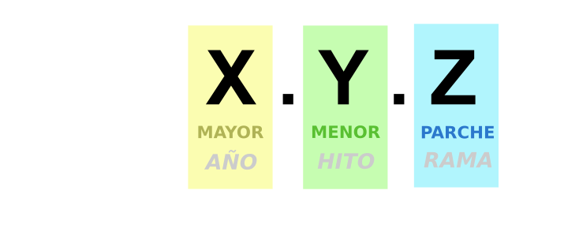
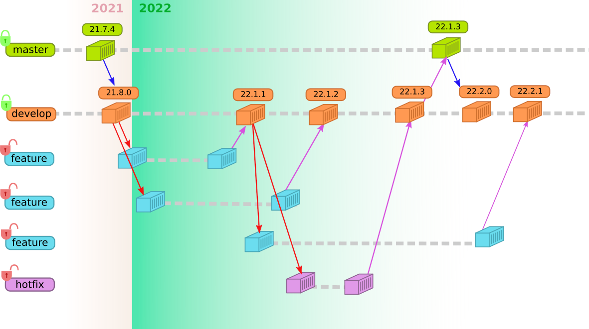
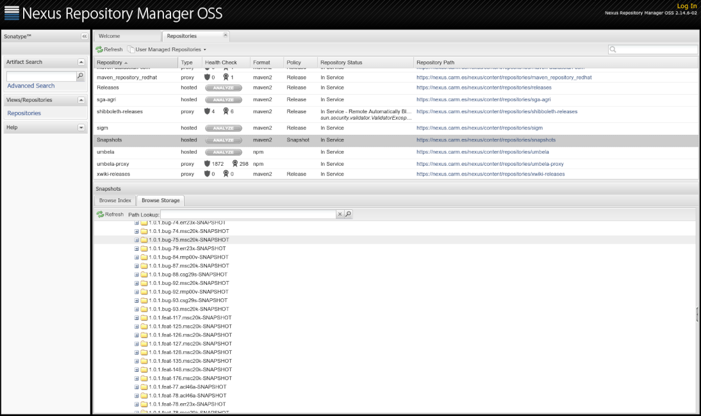

# Números de versión

Cuando se trabaja en el desarrollo de una aplicación, constantemente se está modificando su código fuente para
añadir una nueva función *(feature)* o corregir un error *(bugfix)* en una característica. Este proceso incremental continuo
no está exento de errores y necesitamos un mecanismo que nos permita volver a un punto anterior sin errores y 
nos asegure la trazabilidad de la entrega de cambios.
Esto se consigue etiquetando con un número distinto cada cambio *(sea feature o bugfix)* acabado y
entregado al repositorio: Este número es lo que llamamos número de versión o simplemente versión de una aplicación.

La estructura de este número y el cuándo y cómo se incrementa es lo que se conoce como política de versionado de una aplicación.


## Política de versionado en la CARM

Para las aplicaciones Java desarrolladas en la CARM hemos decido usar el siguiente formato
 [compatible con Maven](https://github.com/kosme10/standards/wiki/Politicas-de-versionado):



...donde...

* **```X```**,**```Y```** y **```Z```**, son números enteros que responden a la expresión regular: ```[0-9]+```

* **```[Mayor]```** se corresponderá con los dos últimos dígitos del año en el que se publica la versión

* **```[Menor]```**, indicará el número de hito o milestone de la aplicación para ese año, que coincidirá con el número de versiones publicadas durante el año  `X`

* **```[Parche]```**, nos habla del número de rama, ya se de funcionalidad _(feature)_ o parche _(bugfix)_ que se ha aplicado e integrado sobre la versión `X.Y`.

* De acuerdo con la [guía Maven](Guia-Maven.md), la versión configurada en **el ```pom.xml``` siempre incluirá el sufijo ```-SNAPSHOT```**


Esta nomenclatura permite hacerse una idea,  simplemente viendo el número de versión, de:

1. **Cuánto de actualizado** está un proyecto: *Un número de versión que empiece por 12, ya nos está indicando que desde el año 2012 no hay nuevas versiones de ese artefacto*
2. **Cuán vivo está el desarrollo** observando el `Y`: *A mayor número, mayor número de hitos planificados para ese año, lo que se puede interpretar como un desarrollo más activo*
3. **La madurez del proyecto** observando el `Z`: *Cuánto mayor sea, será porque cada hito integra más bugfixes/features, señal de que el proyecto aún integra muchas ramas en cada hito*


Repasando [el flujo de trabajo](Guia-Workflow.md) y recordando la estrategia *OneFlow con la variante ```develop + master```*, 
el flujo de versiones que podrían sucederse para publicar release del primer sprint del año 2022, quedaría 
representado en el siguiente dibujo:



En el diagrama, 

* A la izquierda se enumeran las ramas definidas por la estrategia *Oneflow*, clasificadas en dos tipos: protegidas (candado cerrado) y no-protegidas (candado abierto). Una rama protegida obliga a escribir en ella siempre a través de *```Pull/Merge-Request```*.

* Cada cajita representa un ```commit+push``` en la rama.

* Las líneas horizontales de puntos suspensivos representan la vida de la rama: Si acaban en una cajita indica que la rama muere ahí.

* Las flechas violeta representan *MergeRequests validados*.

* Las flechas azules representan *MergeRequests automáticos* realizados por el _pipeline-CI_

* Las flechas rojas representan ramas que crea el desarrollador a partir de otra *(```git checkout -b XXX```)*.

Como se puede ver en el esquema, los **incrementos de la versión se producen cuando 
se apruebas _MergeRequests_ en las ramas protegidas**.


De acuerdo con la [guía que describe el flujo de trabajo con las ramas](Guia-Workflow.md), las ramas deberán nombrarse como `{tipo}/{usuario o grupo}/{2-3 palabras resumen}-{mención al issue}` y ello se aprovechará para **renombrar las versiones de desarrollo**: 


* **`T`**, será el **`{tipo}` de  rama** que se creó: _`{feat}`ó `{bug}`_
* **`N`**, será el **número de issue** al que hace mención el nombre de la rama,
* **`L`**, será el **login del desarrollador** que realizó el `commit+push` a la rama



 


## Planificación de versiones *(sprints)*

El **equipo de desarrollo de una aplicación estará formado al menos**, por los siguientes actores:

* Un **responsable funcional** o más. Será la persona que conoce el negocio funcional que modela la aplicación y sirve como interlocutor y canalizador de las demandas de los usuarios.

* Un **responsable tecnológico**, encargado de coordinar el equipo de desarrollo: Hablar con el responsable funcional, canalizar incidencias, participar de la planificación, etiquetar issues, etcétera.

* Un **desarrollador** o más, que será quien escriba el código fuente para implementar *features* o corregir *bugfixes*.

En función de las características de la aplicación y el tamaño del equipo algunos de estos roles pueden coincidir en la misma persona (por ejemplo, el responsable tecnológico podría ser también un desarrollador).

De forma periódica, los responsables se reunirán y partiendo de [la lista de issues abiertos](Guia-Issues.md) para el proyecto:

1. Crearán **un nuevo [Hito/Milestone en GitLab](https://docs.gitlab.com/ee/user/project/milestones/)** con:
	* la **versión** que se pretende publicar, 
	* y la **fecha comprometida** para publicarla.
	
	

2. Después de discutir qué issues abiertos formarán parte de la siguiente versión...
	* Les **asignarán a todos el Hito/Milestone recién creado**
	* Les **añadirán la etiqueta https://github.com/carm-es/guias/labels/To%20Do**
	
3. Se creará **un nuevo [tablero en GitLab](https://about.gitlab.com/stages-devops-lifecycle/issueboard/)** llamado **Próxima versión** que contenga los issues marcados como: 
	* https://github.com/carm-es/guias/labels/To%20Do. De tipo Planificación: Aún no se ha empezado con ello.
	* https://github.com/carm-es/guias/labels/Doing. De tipo Planificación: Se está trabajando en ello *(hay un desarrollador trabajando en ello)*
	* https://github.com/carm-es/guias/labels/Testing. De tipo Planificación: Instalado en pruebas a falta de validar
	* https://github.com/carm-es/guias/labels/Tested. De tipo Planificación: Validado.

	

Esta reunión marcará el comienzo de un nuevo ciclo de desarrollo o *sprint*, para la publicación de nueva versión de la aplicación, 
en nuestro intento de [adoptar metodologías ágiles](https://samuelcasanova.com/category/scrum/) 
y forzará el **incremento del ```Minor/Menor``` según nuestra política de versiones**. El ciclo acabará cuando todos los issues que 
forman parte del Hito estén cerrados.

4. Cuando **un issue sea asignado a un desarrollador**, este deberá eliminar la etiqueta https://github.com/carm-es/guias/labels/To%20Do del issue y añadir https://github.com/carm-es/guias/labels/Doing

5. Cuando el desarrollador acabe de resolver el issue, instalará su versión en el entorno de pruebas, y entonces deberá eliminar la etiqueta https://github.com/carm-es/guias/labels/Doing del issue y añadir https://github.com/carm-es/guias/labels/Testing.

6. Cuando un responsable **verifique que la funcionalidad ha sido completada**, actualizará el issue indicando que valida el issue con sus comentarios.

7. El desarrollador eliminará la etiqueta https://github.com/carm-es/guias/labels/Testing del issue y añadirá https://github.com/carm-es/guias/labels/Tested, y después solicitará un `MergeRequest` a `develop`.
	
8. Una vez aprobado el `MergeRequest a develop` del issue, deberá **desplegarse en el entorno de pruebas, y deberá volver a validarse, antes de poder cerrar el issue**.


Esta planificación persigue entregar software constantemente de forma iterativa y poder anticipar fechas periódicas de entrega, tratando
de minimizar las urgencias y que el equipo de desarrollo esté constantemente *apagando incendios*. 

Usar la [Gestión de tareas de Gitlab](https://artansoft.com/2017/11/gestion-de-tareas-gitlab/)
nos permite dar visibilidad a la gestión del proyecto de forma transparente, y poder intercambiar roles: *Si todos los proyectos
se gestionan igual, cualquier desarrollador puede participar en cualquier proyecto*.
