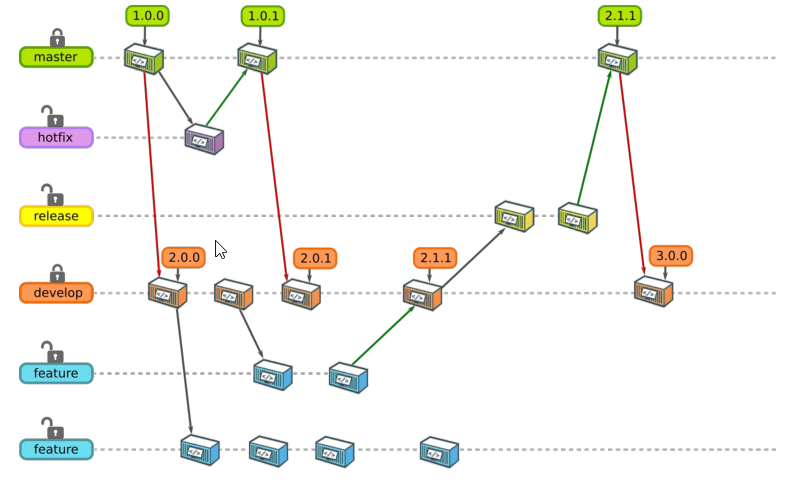
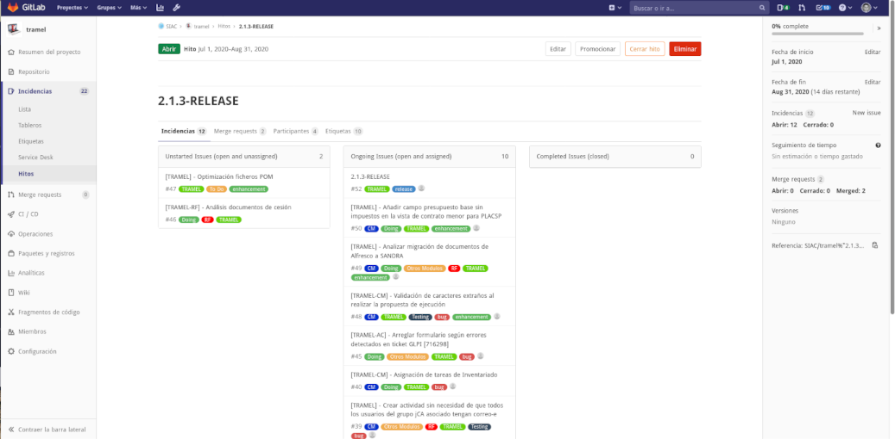
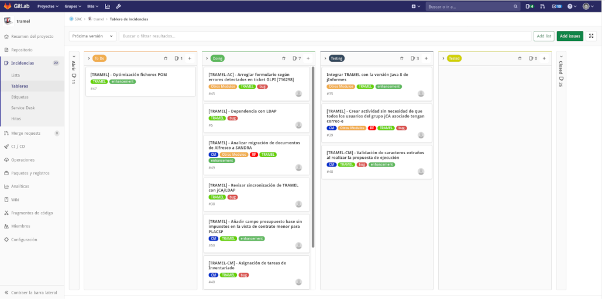

# Números de versión

Cuando se trabaja en el desarrollo de una aplicación, constantemente se está modificando su código fuente para
añadir una nueva función *(feature)* o corregir un error *(bugfix)* en una característica. Este proceso incremental continuo
no está exento de errores y necesitamos un mecanismo que nos permita volver a un punto anterior sin errores y 
nos asegure la trazabilidad de la entrega de cambios.
Esto se consigue etiquetando con un número distinto cada cambio *(sea feature o bugfix)* acabado y
entregado al repositorio: Este número es lo que llamamos número de versión o simplemente versión de una aplicación.

La estructura de este número y el cuándo y cómo se incrementa es lo que se conoce como política de versionado de una aplicación.


## Política de versionado en la CARM

Para las aplicaciones Java desarrolladas en la CARM hemos decido usar el siguiente formato
*(de acuerdo con el [Versionado Semántico](https://semver.org/lang/es/) y a la vez [compatible con Maven](https://github.com/kosme10/standards/wiki/Politicas-de-versionado))*:

<h2 style="center"><code>[X=Major] . [Y=Minor] . [Z=Patch]</code></h2>

...donde...

* **```X```**,**```Y```** y **```Z```**, son números enteros que responden a la expresión regular: ```[0-9]+```
 
* **```[Patch]```**, nos habla del número de parche o bugfix que se ha aplicado sobre la versión ```X.Y```.

	* ```X.Y.1``` es el primero parche realizado a la versión ```X.Y```
	* ```1.4.19``` es el parche nº 19 realizado a la versión ```1.4```
	
* **```[Minor]```**, nos habla del número de funcionalidad, nueva característica o feature añadida a la versión ```X```.

	* ```X.2``` es la segunda feature aplicada a la versión ```X```
	* ```4.5``` es la quinta feature integrada en la versión ```4```

* **```[Major]```**, nos informe del sprint o número de ciclo de desarrollo planificado para publicar una nueva versión, y dependerá de cada proyecto: 2 sprints al año, 1 sprint al mes, etc...

* Se usará la versión **```0.Y.Z```** mientras la aplicación **NO esté desplegada en producción**

* La **primera versión que se despliegue en producción** será siempre **```1.0.0```**

* Con el **incremento del ```Major```** de nuestro proyecto *(en cada sprint/ciclo)*, se actualizarán las versiones de todas **las dependencias al ```Minor``` superior**.

	* Si nuestro proyecto en la versión ```2.X.Y``` usa ```xml-3.3.5```, cuando se empiece el desarrollo de nuestra versión ```3.0.0```, se deberá actualizar la dependencia de ```xml-3.X.Y``` a la más moderna que haya disponible.


* De acuerdo con la [guía Maven](Guia-Maven.md), la versión configurada en **el ```pom.xml``` siempre incluirá el sufijo ```-SNAPSHOT```**


Repasando [el flujo de trabajo](Guia-Workflow.md) y recordando la estrategia *OneFlow con la variante ```develop + master```*, 
el flujo de versiones que podrían sucederse en el sprint para publicar la versión 3.0.0 de nuestra aplicación, quedaría 
representado en el siguiente dibujo:



En el diagrama, 

* A la izquierda se enumeran las ramas definidas por la estrategia *Oneflow*, clasificadas en dos tipos: protegidas (candado cerrado) y no-protegidas (candado abierto). Una rama protegida obliga a escribir en ella siempre a través de *```Pull/Merge-Request```*.

* Cada cajita representa un ```commit+push``` en la rama.

* Las líneas horizontales de puntos suspensivos representan la vida de la rama: Si acaban en una cajita indica que la rama muere ahí.

* Las flechas verdes representan *MergeRequests validados*.

* Las flechas grises representan ramas que crea el desarrollador a partir de otra *(```git checkout -b XXX```)*.


Como se puede ver en el esquema, los **incrementos de la versión se producen cuando 
se integran hotfixes y features en las ramas protegidas**.


## Planificación de versiones *(sprints)*

El **equipo de desarrollo de una aplicación estará formado al menos**, por los siguientes actores:

* Un **responsable funcional** o más. Será la persona que conoce el negocio funcional que modela la aplicación y sirve como interlocutor y canalizador de las demandas de los usuarios.

* Un **responsable tecnológico**, encargado de coordinar el equipo de desarrollo: Hablar con el responsable funcional, canalizar incidencias, participar de la planificación, etiquetar issues, etcétera.

* Un **desarrollador** o más, que será quien escriba el código fuente para implementar *features* o corregir *bugfixes*.

En función de las características de la aplicación y el tamaño del equipo algunos de estos roles pueden coincidir en la misma persona (por ejemplo, el responsable tecnológico podría ser también un desarrollador).

De forma periódica, los responsables se reunirán y partiendo de [la lista de issues abiertos](Guia-Issues.md) para el proyecto:

1. Crearán **un nuevo [Hito/Milestone en GitLab](https://docs.gitlab.com/ee/user/project/milestones/)** con:
	* la **versión** que se pretende publicar, 
	* y la **fecha comprometida** para publicarla.
	
	

2. Después de discutir qué issues abiertos formarán parte de la siguiente versión...
	* Les **asignarán a todos el Hito/Milestone recién creado**
	* Les **añadirán la etiqueta ```To Do```**
	
3. Se creará **un nuevo [tablero en GitLab](https://about.gitlab.com/stages-devops-lifecycle/issueboard/)** llamado **Próxima versión** que contenga los issues marcados como: 
	* ```To Do```. De tipo Planificación: Aún no se ha empezado con ello.
	* ```Doing```. De tipo Planificación: Se está trabajando en ello *(hay un desarrollador trabajando en ello)*
	* ```Testing```. De tipo Planificación: Instalado en pruebas a falta de validar
	* ```Tested```. De tipo Planificación: Validado.

	

Esta reunión marcará el comienzo de un nuevo ciclo de desarrollo o *sprint*, para la publicación de nueva versión de la aplicación, 
en nuestro intento de [adoptar metodologías ágiles](https://samuelcasanova.com/category/scrum/) 
y forzará el **incremento del ```Major``` según nuestra política de versiones**. El ciclo acabará cuando todos los issues que 
forman parte del Hito estén cerrados.

4. Cuando **un issue sea asignado a un desarrollador**, este deberá eliminar la etiqueta ```To Do``` del issue y añadir ```Doing```

5. Cuando el desarrollador acabe de resolver el issue, instalará su versión en el entorno de pruebas, y entonces deberá eliminar la etiqueta ```Doing``` del issue y añadir ```Testing```.

6. Cuando un responsable **verifique que la funcionalidad ha sido completada**, actualizará el issue indicando que valida el issue con sus comentarios.

7. El desarrollador eliminará la etiqueta ```Testing``` del issue y añadirá ```Tested```, y después solicitará un ```MergeRequest``` a ```develop```.
	
8. Una vez aprobado el ```MergeRequest a develop``` del issue, deberá **desplegarse en el entorno de pruebas, y deberá volver a validarse, antes de poder cerrar el issue**.


Esta planificación persigue entregar software constantemente de forma iterativa y poder anticipar fechas periódicas de entrega, tratando
de minimizar las urgencias y que el equipo de desarrollo esté constantemente *apagando incendios*. 

Usar la [Gestión de tareas de Gitlab](https://artansoft.com/2017/11/gestion-de-tareas-gitlab/)
nos permite dar visibilidad a la gestión del proyecto de forma transparente, y poder intercambiar roles: *Si todos los proyectos
se gestionan igual, cualquier desarrollador puede participar en cualquier proyecto*.
