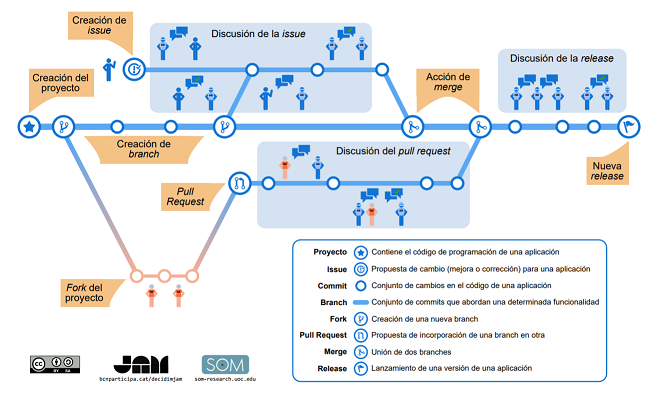

# El flujo de trabajo

Esta imagen del artículo [Proceso de desarrollo con GitHub (Infográfico)](https://ingenieriadesoftware.es/proceso-desarrollo-github-infografico/) vale más que mil palabras:



Como resume el diagrama, lo que sucede entre una versión de una aplicación Java y la siguiente versión, son **una serie de ramas de desarrollo motivadas por Issues que finalmente acaban fusionándose** en la rama principal. 
La discusión está en la rama desde la que se parte y a la que se fusionan, y qué nombre se le ponen  a las ramas:

* [¿Qué estrategia de control de versiones seguir en un equipo Scrum?](https://www.javiergarzas.com/2014/05/control-versiones-scrum.html)
* [Git: Trabajando con ramas](https://www.nocountryforgeeks.com/tutorial-git-flow/)
* [5 types of Git workflow that will help you deliver better code](https://buddy.works/blog/5-types-of-git-workflows)
* [A successful Git branching model](https://nvie.com/posts/a-successful-git-branching-model/)
* [OneFlow - a Git branching model and workflow](https://www.endoflineblog.com/oneflow-a-git-branching-model-and-workflow)

Para el desarrollo de proyectos Java en CARM apostamos por la **estrategia [OneFlow](https://www.endoflineblog.com/oneflow-a-git-branching-model-and-workflow) con la variante ```develop + master ```**, que establece:

1. La rama ```master``` contiene el código estable instalado en los servidores de producción
2. La rama  ```develop```, parte de  ```master``` y se convierte en su siguiente versión/release mediante Pull/Merge Request del resto de ramas.
3. A partir de un Issue, se crea una rama para el desarrollo de una nueva funcionalidad o corrección de un bug, partiendo de ```develop```.
4. Mientras la rama de desarrollo no se fusione en  ```develop```, cualquier sugerencia, corrección, decisión, anotación se realizará a través del Issue asociado.


## Nombre de las ramas
Está claro que para empezar a realizar cambios en el código fuente de un proyecto Java, **lo primero que se necesita es un Issue asignado que implementar**, y con él, crear una nueva rama que parta de  ```develop```, que  necesariamente le pondremos un **nombre que deberá ceñirse a unas reglas** y como para esto también parece haber bastantes gustos:

* [Git naming conventions and best practices](https://github.com/andela/asgard-rc/wiki/Git-naming-conventions-and-best-practices#branch-naming)
* [What are some examples of commonly used practices for naming git branches?](https://stackoverflow.com/questions/273695/what-are-some-examples-of-commonly-used-practices-for-naming-git-branches)
* [Branching](https://gist.github.com/digitaljhelms/4287848#branching)

Unificamos el criterio que deberá ceñirse al siguiente esquema:

```
{tipo}/{usuario o grupo}/{2-3 palabras resumen}-{mención al issue}
```

Donde,

* ```{tipo}```, es alguno de los siguientes, que nos hablan de la naturaleza de los cambios que implementará la rama:
	* ```feat```, cuando se refiera a la implementación de una nueva funcionalidad
	* ```bug```, cuando se refiera a la corrección de bugs
	* ```junk```, cuando se trate de un experimento
	* ```chore```, cuando se trate de faenas de mantenimiento que no modifican código de la aplicación sino documentación, configuración, test...
* ```{usuario o grupo}```, es **opcional** y permiten distinguir el desarrollador o grupo que ha creado la rama. El uso de slash *('/')*, permite hacer búsquedas desde la consola ```git branch --list "bug/*"```, ```git branch --list "*/miguel"```
* ```{2-3 palabras resumen}```, como indica dos o tres palabras separadas por *('-')* que expliquen de qué se trata: *Ejemplos: nuevas-opciones-menu, error-css-chrome, flag-archivos-remotos*
* ```{mención al issue}```, será obligatorio ```#NºIssue```, excepto en los de tipo  ```junk```

No hay problema en crear  varias ramas para un mismo Issue *(divide y vencerás)*,  **lo importante es conseguir entregar código fiable de forma rápida**, para:

1. dar visibilidad del proceso y mejorar la comunicación (saber que estás trabajando y cómo lo llevas), 
2. mejorar el feedback y detectar errores cuanto antes, 
3. poder entregar software funcionando en cualquier momento a los usuarios.

Lo ideal es que **las ramas no vivan más de 2 semanas**... son dos semanas sin saber de tí, sin saber que estás haciendo y nos da mucho miedo que vengas al cabo de dos meses con 1GB de código fuente que tengamos que revisar, y comprobar 300 funcionalidades, el estilo del fuente Java de 30000 ficheros... Mejor divide, entrega pronto y así podremos rectificar cosas desde el principio.

> *Como siempre, ten en cuenta que en la primera rama en la que te pongas a trabajar, vamos a saber cuánto has leído sobre todo esto, y cómo de en serio te lo tomas*
