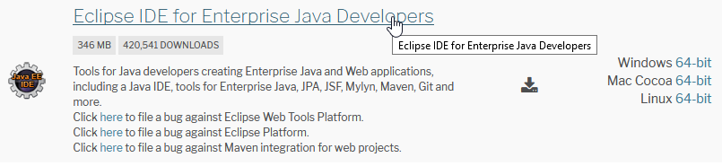

# Guía de estilo para código Java

Una guía de estilo es un conjunto de normas que aplicar a la hora de escribir código fuente en el lenguaje de programación al que van dirigidas. Su objetivo es crear estructuras de código fáciles de entender, no sólo para sí mismo sino también para cualquier programador, hacer más eficiente el proceso de desarrollo y conseguir que los programas sean más robustos y fáciles de mantener.

Durante la fase de codificación de un programa, el uso de una guía de código nos evitará tener problemas en:

1. **La calidad del programa**: Un programa mal escrito obliga a invertir mucho tiempo en descubrir qué es lo que está pasando y darle solución: Usar un estilo facilitará la lectura y la corrección rápida de errores.
2. **Mantenimiento del programa**: En las tareas de mantenimiento, la mayor parte del tiempo se pierde en leer y comprender el código existente, algo que parecía obvio en el momento de escribirse, pero que tiende a ser confuso cuando se vuelve a revisar, y aún más cuando el código lo escribió otra persona. Usar guías de código asegura que los programas sean más comprensibles.
3. **Comunicación entre programadores**: Dentro de un equipo de desarrollo es necesario utilizar un estilo común en el código que escriban, para mantener la homogeneidad y garantizar la comunicación entre sus miembros.

Como cada programador tenemos nuestro propio estilo, es necesario establecer unos criterios comunes mínimos en los proyectos de desarrollo de la CARM que todos nos comprometemos a respetar, y no es algo que hagamos nosotros solamente:

* [Mozilla](https://www.mozilla.org/es-ES/) tiene su *[
Coding style for developers](https://developer.mozilla.org/en-US/docs/Mozilla/Developer_guide/Coding_Style)*
* [GNU](http://www.gnu.org/) actualiza continuamente sus *[Coding standards](http://www.gnu.org/prep/standards/)*
* Hasta [Google](https://www.google.es/) tiene sus propias *[Google Style Guides](https://google.github.io/styleguide/javaguide.html)*

Como todas están en inglés, puedes leer un resumen en castellano en *[Buenas Prácticas de codificación](Buenas-Practicas-de-codificacion.md)*, y en el artículo *[¿Qué es una guía de código?](https://codigofacilito.com/articulos/guia_codigo)*, donde explican en detalle el por qué de muchas de estas normas.


## El resumen del resumen

Si no tuvieras tanto tiempo para leer, procura no dejar [de ojear este extracto en inglés](https://github.com/thoughtbot/guides/tree/master/style), pero si es que no tuvieras tanta paciencia y estás deseando empezar a escribir líneas de código, ten siempre presente las siguientes reglas de oro, a modo *resumen del resumen del extracto*

>*Considera que en la primera entrega de código que hagas, **vamos a descubrir hasta dónde habías leído**...*

### Formato de los ficheros
Sobre el formato de los ficheros que escribas:

1. Evita los **comentarios en línea (```//```)** en medio de los métodos, de las clases... *no es necesario que expliques en detalle tus ideas, prográmalas para que las entienda cualquiera*
2. **Líneas** de no más de **100 caracteres**, *para que podamos leer tu código los carcas que aún usamos el vi*.
3. Evita los **espacios al final de las líneas**, *se ven muy mal luego en git, afean tu trabajo*
4. Procura **escribir bien**, sin faltas de ortografía, *no hablan bien de ti*
5. Usa **una línea en blanco** para separar bloques de código, *a los que tenemos presbicia y usamos vi, se nos amontona todo en pantalla*
6. Usa **espacios en blanco entre los operadores** lógicos en la condiciones, excepto en los operadores unarios, *la presbicia...tú ya sabes...*
7. Usa el **fin de línea *Unix-style* (```\n```)**, *los carcas seguimos usando el linux de cuando estábamos en la facultad... nos hace sentir modernos*

Comprueba si tu proyecto tiene un directorio ```.mvn/``` con la definición del
estilo en *.XML* e impórtala en tu IDE.


### Poniendo nombres
A la hora de poner nombre a las clases, métodos, variables... que escribas:

1. **NO uses abreviaturas** para nombrar nada
2. No pongas **el tipo en el nombre** *(```user_array, email_method CalculatorClass, ReportModule```)*
3. Para nombrar una clase **elige antes conceptos del dominio que indicar el patrón implementado** *( ```Guest vs NullUser, CachedRequest vs RequestDecorator```)*
4. Nombra los **miembros de una colección siempre en singular**
5. Procura que el nombre de la clase, variable o método **revele para qué sirve o qué hace**
6. Trata los **acrónimos** como palabras independientes *(```XmlHttpRequest``` y NO ```XMLHTTPRequest```)*

### Organización
Al escribir los métodos de las clases, trata de ser organizado, teniendo en cuenta:

1. Ordena los métodos de manera que **los que son llamados estén antes que los realizan las llamadas**
2. Ordena los métodos para que **el que es llamado y el que llama estén lo más cerca posible**.

### Y, en general,
1. Complejidad ciclomática: <8 a 12.
2. Paquetes : <20 clases.
3. Clases: <500 a 200 líneas, <20 métodos.
4. Métodos: <3 a 5 parámetros, <15 líneas.
5. Elimina redundancias, *(copy & paste)*.
6. Eliminar el código muerto, que nunca se ejecuta.
7. Haz un tratamiento de errores *(try - catch - finally)*
8. Cobertura de test unitarios: >80%.


## Conoce tu IDE
Un Entorno de Desarrollo Integrado *(IDE en inglés)*, es  un  programa  diseñado  específicamente  para  facilitar  el  diseño  y  creación  de nuevo software. Para ello, integran distintas herramientas y funcionalidades en un único entorno, siendo la más importante el editor de código fuente, herramientas de construcción automáticas, un depurador y hasta de un completado inteligente de código, y todo para **optimizar y maximizar la productividad del programador en cada ciclo del desarrollo**.

[Eclipse](https://www.eclipse.org/downloads/) es uno de estos IDE, desarrollado originalmente por IBM que después liberó y ahora es mantenido por la [Eclipse Foundation](https://www.eclipse.org/membership/), una fundación independiente sin ánimo de lucro que fomenta la comunidad de código abierto. 

Además de ser Open Source, *Eclipse* es multiplataforma, orientado a otros lenguajes de programación *(C, C++, PHP, etc)*, se utiliza en otros proyectos como interfaz base y dispone de un gran ecosistema de complementos y extensiones totalmente personalizables, y *¡gratis!*.

Para el desarrollo de aplicaciones Java es recomendable **instalar la versión [Eclipse IDE for Enterprise Java Developers](https://www.eclipse.org/downloads/packages/)**, que ya incluirá todos los plugins que necesitará *(maven, git, svn, sonarlint, etc)*




### Configura tu IDE
Todas estas normas de estilo para código Java se pueden **descargar** en un único [fichero .xml](https://github.com/google/styleguide/blob/gh-pages/eclipse-java-google-style.xml) **e [instalar en Eclipse](http://www.practicesofmastery.com/post/eclipse-google-java-style-guide/)**, de manera que se apliquen cada vez que guardes un fichero y así despreocuparte...

Además, asegúrate de que tienes **instalado [el plugin SonarLint](https://www.sonarlint.org/eclipse/)** y si no, [en este post](https://www.adictosaltrabajo.com/2014/10/08/eclipse-sonar-qube/) explican cómo poder hacerlo.

> *Tendrás que **habilitar la plantilla de estilo y el plugin SonarLint, después de haber importado cada proyecto** de la CARM*
