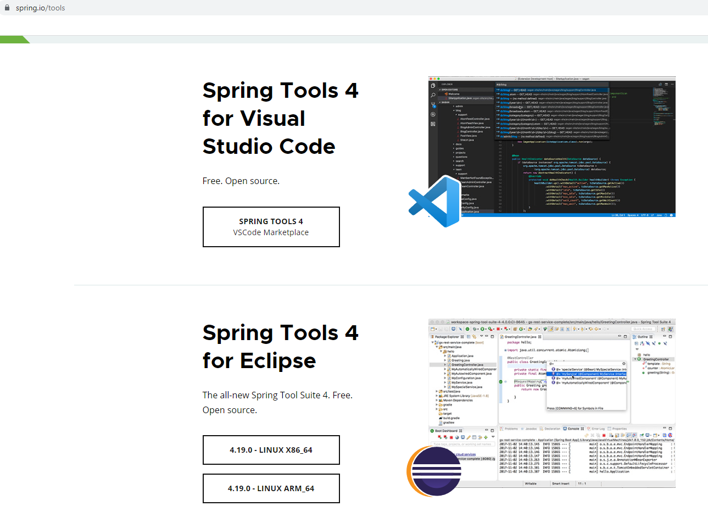
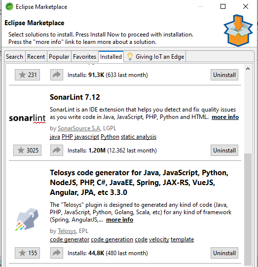
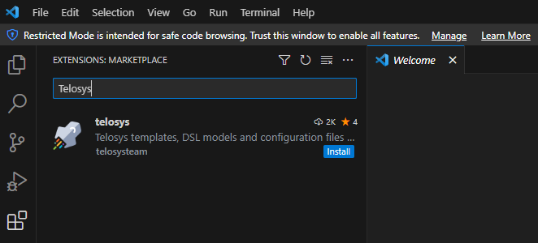

# Marco de trabajo para aplicaciones web
En los siguientes apartados intentaremos explicar el por qué se han escogido las tecnologías **Angular y Spring Boot** para conformar el marco de trabajo para el desarrollo de aplicaciones web. Además, encontrarás una breve comparación con otros marcos tecnológicos así como las herramientas y utilidades se utilizan.

Hemos estudiado las tendencias del mercado y analizado cuáles son las tecnologías más populares, comprobando que las tecnologías escogidas siguen estando entre las más populares y si siguen estando de actualidad, lo cual facilitará el mantenimiento futuro de las apliaciones, siendo fácil encontrar técnicos cualificados tanto dentro de la organización como fuera de ella.

Para la elección de las tecnologías hemos tenido en cuenta que dentro de los distintos departamentos de informática de la CARM se han llevado a cabo multitud de proyectos en java por lo que muchos de los técnicos tanto de la CARM como de las empresas que han trabajado para la CARM tienen formación en dicho lenguaje y se sienten cómodos con él.

## ¿Por qué utilizar Angular/Spring Boot?
En este [artículo](razonamientofrmw.md) podrás encontrar algunas de las razones por las que hemos escogido utilizar Angular/Spring Boot.

## ¿Cómo empezar con Angular/Spring Boot ?
Para comenzar lo primero que tenemos que hacer es crear un proyecto, podríamos crear el proyecto o bien directamente desde la página online de Spring [https://start.spring.io/](https://start.spring.io/) y ya trabajar con la herramienta que a cada uno le guste o bien otra opción y para nosotros la más interesante es instalarse Spring Tool que no es más que un plugin que se instala en el IDE, existe tanto para eclipse como para Visual Studio Code.

Para instalarse Spring Tool hay que ir a la web [https://spring.io/tools](https://spring.io/tools) y descargarse la versión adecuada tanto para el IDE como para el sistema operativo que cada uno tenga.

### Recursos de Angular
Antes de empezar con Angular, échale un vistazo a los siguientes recursos:
1.  [Documentación de Angular](https://angular.io/docs)
2.	[Tutoriales para aprender angular](https://angular.io/tutorial)
3.	[Documentación del Angular CLI](https://angular.io/cli)
4.	Documentación sobre librerías de componentes:
    - [PrimeNG](https://primeng.org/)
    - [Angular Material](https://material.angular.io/)
5.  Blog de Angular (https://blog.angular.io/)
6.  [Herramientas para desarrolladores Angular](https://angular.io/guide/devtools) entre las que podrás encontrar un plugin para instalarlo en el Navegador.

### Recursos de Spring Boot
1. [Documentación de Springboot](https://spring.io/projects/spring-boot)
2. [Documentación de Spring Security](https://spring.io/projects/spring-security)
    - [Documentación sobre la autenticación CAS en Spring Security](https://docs.spring.io/spring-security/reference/servlet/authentication/cas.html)
4. [Documentación de Spring Session](https://spring.io/projects/spring-session)
     - [Spring Session con Redis](https://docs.spring.io/spring-session/reference/getting-started/using-redis.html)
     - [Spring Session con jdbc](https://docs.spring.io/spring-session/reference/getting-started/using-jdbc.html)

## ¿Se podría utilizar algún Asistente RAD?
Pues SI!. Hemos visto varios proyectos para generar código a partir de la Base de Datos o de Modelos de Datos como g9 Database Import, hibernate tools (Indigo), jHipster pero esos no nos han convencido. Sin embargo, nos ha gustado mucho Telosys Code Generator, creemos que sería una buena herramienta para agilizar el desarrollo de aplicaciones.

**Telosys Code Generator**

Telosys [https://www.telosys.org/](https://www.telosys.org/) utiliza plantillas velocity para generar código. Hemos encontrado varios proyectos en gitHub.com donde se pueden encontrar plantillas para generar código:

- **springBoot** [https://github.com/anicetkeric/spring-boot-telosys-template](https://github.com/anicetkeric/spring-boot-telosys-template): **Nos ha gustado tanto que hemos creado un fork de este proyecto y lo hemos modificado para Spring Boot 3.1.0** puedes descargarte las plantillas de **[https://github.com/carm-es/spring-boot-telosys-template](https://github.com/carm-es/spring-boot-telosys-template)**

  En el siguiente artículo [https://boottechnologies-ci.medium.com/quick-spring-boot-microservice-api-using-telosys-generator-bc29327c06ab](https://boottechnologies-ci.medium.com/quick-spring-boot-microservice-api-using-telosys-generator-bc29327c06ab) encontramos un tutorial para generar código a partir de los objetos de la base de datos utilizando las plantillas telosys.

- **Angular** (https://github.com/telosys-templates-v3/angular4-rest-frontend).

Telosys tiene plugin tanto para eclipse como para visual studio code

En eclipse (Spring Tool Suite):

En Visual Studio Code:

## Plugin recomendados para los IDE

### Visual Studio Code

- [Angular Language Service (Extensión de VSCode)](https://marketplace.visualstudio.com/items?itemName=Angular.ng-template)     

### Spring tool Suite

- SonarLint 7.12
- Telosys code generator

