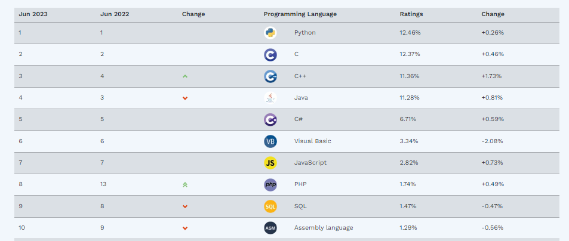
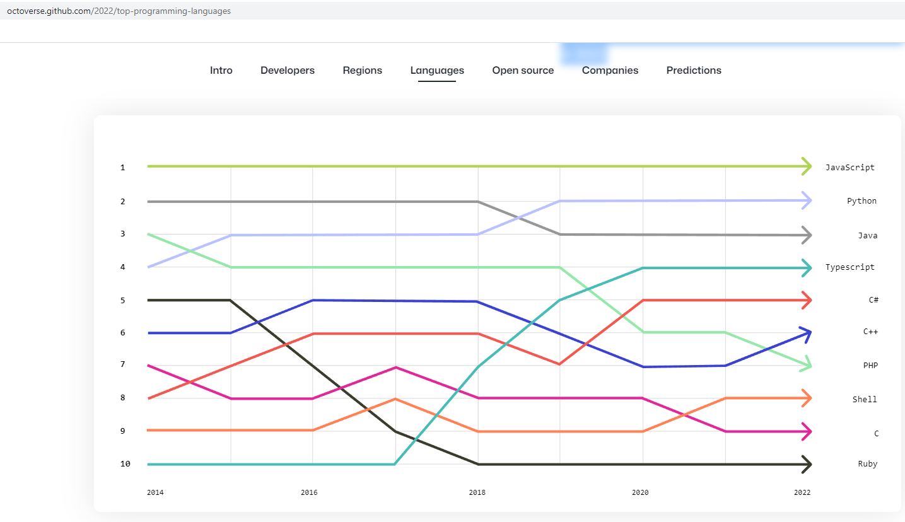
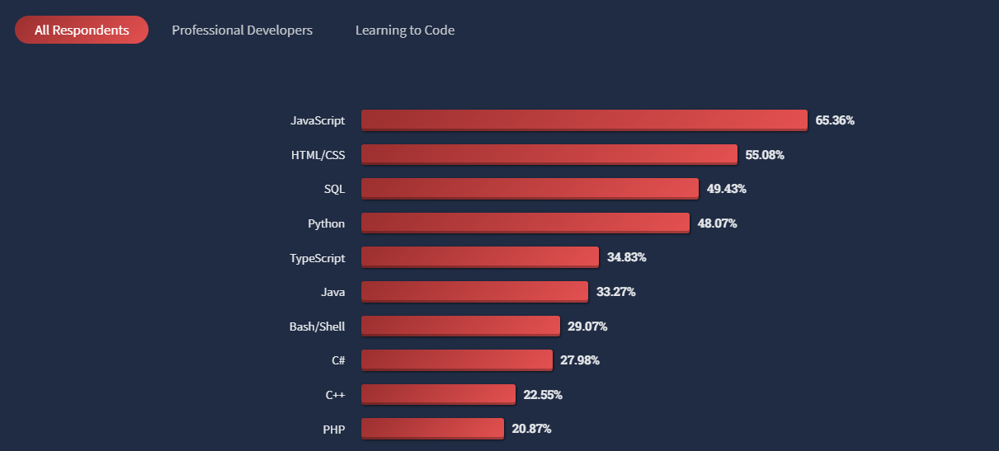
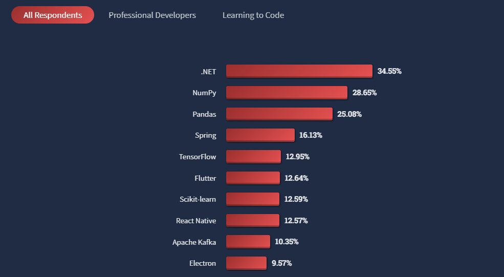
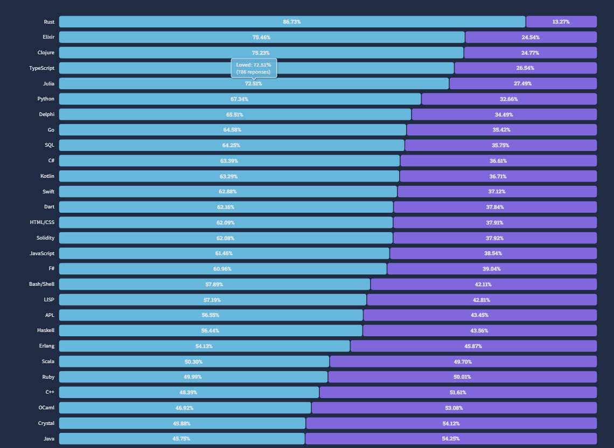

# Tecnologías del marco de trabajo para aplicaciones web
En los siguientes apartados intentaremos explicar el por qué se han escogido las tecnologías **Angular y SpringBoot** para conformar el marco de trabajo para el desarrollo de aplicaciones web.

## ¿Por qué utilizar SpringBoot?
En este [artículo](https://www.arteco-consulting.com/post/por-que-debes-usar-spring-boot) podrás encontrar algunas de las razones por las que utilizar SpringBoot:
1. SpringBoot es gratis
2. SpringBoot funciona sobre la JVM
3. SpringBoot permite hacer Webs y Microservicios
4. SpringBoot es rápido
5. SpringBoot tiene un gran ecosistema
6. SpringBoot tiene un gran número de programadores
7. Spring Boot viene con baterías incluidas
8. SpringBoot es políglota
9. SpringBoot tiene soporte de las principales empresas
10. SpringBoot está en continua evolución

## ¿Por qué utilizar Angular?
En este  [artículo](https://cynoteck.com/es/blog-post/reasons-to-use-angular-for-your-web-app/) podrás encontrar algunas de las razones por las que utilizar Angular:
1. Angular tiene estructura basada en componentes por lo que facilita la coherencia y reutilización del código.
2. Fácil de aprender, usar y probar
3. Soporte de Google y excelente soporte de la comunidad
4. Funciones orientadas a SPA
5. Enlace de datos bidireccional
6. IU declarativa
7. Integración perfecta y productividad de gama alta

## ¿Qué dice el índice TIOBE?
Para hacerse una idea de como está la popularidad de los lenguajes de programación es interesante ver el índice Tiobe.

Según wikipedia: *"El índice TIOBE o índice de la comunidad de programación TIOBE (en inglés: TIOBE programming community index) mide la popularidad de los lenguajes de programación. El índice fue creado por la compañía TIOBE, con sede en Eindhoven, Países Bajos. El índice se calcula a partir del número de resultados del motor de búsquedas para consultas que contienen el nombre de un lenguaje de programación. El índice cubre búsquedas en Google, Google Blogs, MSN, Yahoo!, Baidu, Wikipedia y YouTube.*

*El índice se actualiza una vez al mes. La consulta del índice es gratuita, pero los datos históricos están a la venta. Los autores del índice consideran que este puede ser valioso para tomar decisiones estratégicas."*

Según el indice TIOBE este sería el Top-ten de los lenguajes más populares a junio de 2023:

Como podemos ver en la imagen java sigue en el top-5 de lenguajes de programación con un ratio muy cercano a los lenguajes de programación que le preceden y distanciado de c# el cual incluso tiene un crecimiento inferior, por encima a su vez y bastante distanciado con respecto a javascript.

## ¿Qué refleja el informe de Github.com?
Es interesante también ver el informe que hace Github.com sobre los desarrollo en sus repositorios:

[https://octoverse.github.com/2022/top-programming-languages](https://octoverse.github.com/2022/top-programming-languages)

En la anterior imagen vemos que java se mantiene en el Top-3 de los lenguajes de programación.

Es interesante que en el inicio de esta página aparece el siguiente texto (lo hemos traducido del ingles): *"Después de casi 30 años de Java, es de esperar que el lenguaje muestre algunos signos de desgaste, pero nada más lejos de la realidad."* y enlazan al siguiente artículo en el que se justifica que java tendrá vida durante muchos:

[https://github.com/readme/featured/java-programming-language?utm_source=github&utm_medium=referral&utm_campaign=&scid=&utm_content=octoverse](https://github.com/readme/featured/java-programming-language?utm_source=github&utm_medium=referral&utm_campaign=&scid=&utm_content=octoverse)

## ¿Qué refleja el informe de stackoverflow?
Otra fuente de información interesante a la hora de ver como está el panorama tecnológico es la web de stackoverflow, en la siguiente ruta podemos ver las tecnologías más populares:

[https://survey.stackoverflow.co/2022/#most-popular-technologies-language](https://survey.stackoverflow.co/2022/#most-popular-technologies-language)

En concreto en el apartado de "Programming, scripting, and markup languages":

En el apartado "Web frameworks and technologies":

Y en el apartado "Other frameworks and libraries":

Vemos que entre los primeros java y Spring siguen destacando junto con Javascript, Typescript, Angular, Node.js y Python.

Es muy interesante también el aparado de esta web que habla de amores y desamores con las tecnologías:

[https://survey.stackoverflow.co/2022/#technology-most-loved-dreaded-and-wanted](https://survey.stackoverflow.co/2022/#technology-most-loved-dreaded-and-wanted)

Es cierto que en este caso Java no aparece entre los diez primeros, aunque es posible que sea debido a que al ser java un lenguaje con muchos años (fue comercializada por primera vez en 1995 por Sun Microsystems) y enseñado ampliamente en el entorno académico no despierte tanto interés como los lenguajes que ahora están de moda (Rust, Python, etc...). Esa creemos que sería la razón para entender que kotlin esté por encima también de java en estas gráficas. Habrá que hacer un seguimiento en el futuro para ver si esta gráfica tiene impacto en las anteriores y en ese caso habría que reevaluar la decisión. Nosotros de momento pensamos como Mike Melanson en el artículo enlazado en github.com comentado anteriormente en el que indicaba que *"LEJOS DE MUERTE, EL LENGUAJE PERPETUAMENTE POPULAR ESTÁ A LA VELOCIDAD Y PREPARADO PARA EL FUTURO"*.

## Comparación Node.js vs SpringBoot
Las siguientes opciones están altamente extendidas y están dentro de los lenguajes de programación y framework más utilizados:

- Angular / Nestjs / Node.js --> Es el framework utilizado por ejemplo en el marco de trabajo "Umbela" dentro de la CARM.

- Angular / SpringBoot desplegado en un Tomcat --> Es el framework que se propone en este apartado.

En ambos marcos de trabajo se utiliza Angular como frontal, por lo que aunque como hemos visto hay otros marcos de trabajo Javascripts ampliamente utilizados como react, vue.js, next.js, etc... su nivel de popularidad, soporte y potencia son similares a Angular y de este último en la CARM ya hay bastantes desarrollos, se ha dado formación al personal de IT y no se ha encontrado ninguna limitación importante que haga que nos replanteemos el uso de otro framework. 

En el siguiente [artículo](https://medium.com/@ktufernando/node-js-vs-spring-boot-cu%C3%A1l-elegir-5a687cd1abae) podemos encontrar información sobre ambos marcos tecnológicos así como las ventajas e inconvenientes generales de cada uno de los marcos de trabajo (hay muchas páginas similares en internet que vienen a decir lo mismo).

**Tanto Node.js como Springboot han sido utilizado por importantes empresas:**

Node.js:  Medium, Netflix, Uber, Linkedin, Paypal, Ebay, NASA.

Springboot: Google, Microsoft, Accenture, Amazon, Intuit, JPMorgan Chase & Co, Capital One

**Pros y contras de Node.js:**

*Pros*

1. Comunidad de Javascript: Creciendo rápidamente.
2. Ligero, rápido
3. Single-threaded — baja utilización de memoria
4. Genial para tareas de I/O
5. Npm está en constante crecimiento

*Contras*

1. No soporta múltiples threads. <-- No es exactamente cierto, pero por defecto es así y configurar otro modo es complicado.
2. La falta de verificación de tipos estricta puede provocar problemas de tiempo de ejecución.
3. No es lo mejor para el cómputo pesado: cuellos de botella en el rendimiento.
4. “Callback hell”: resultado de demasiadas funciones asincrónicas encadenadas.

**Pros y contras de Springboot:**

*Pros*

1. Comunidad Java: madura y próspera.
2. Java es tipado (Chequeo en tiempo de compilación)
3. Soporte y mantenibilidad a largo plazo.
4. Soporte para múltiples threads.
5. Facilidad para usar muchas dependencias.

*Contras*

1. Alta utilización de memoria
2. Java is verbose
3. Gran cantidad de código repetitivo: dificulta el debugging
4. Puede incluir dependencias no utilizadas: gran tamaño de archivos binarios de despliegue

