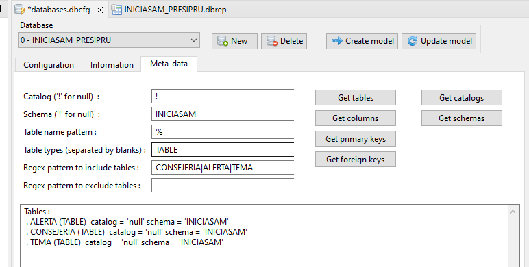

#Telosys Code Generator

Telosys [https://www.telosys.org/](https://www.telosys.org/) utiliza plantillas velocity para generar código. Hemos encontrado varios proyectos en gitHub.com donde se pueden encontrar plantillas para generar código:

- **springBoot** [https://github.com/anicetkeric/spring-boot-telosys-template](https://github.com/anicetkeric/spring-boot-telosys-template): **Nos ha gustado tanto que hemos creado un fork de este proyecto y lo hemos modificado para Spring Boot 3.1.0** puedes descargarte las plantillas de **[https://github.com/carm-es/spring-boot-telosys-template](https://github.com/carm-es/spring-boot-telosys-template)**

  En el siguiente artículo [https://boottechnologies-ci.medium.com/quick-spring-boot-microservice-api-using-telosys-generator-bc29327c06ab](https://boottechnologies-ci.medium.com/quick-spring-boot-microservice-api-using-telosys-generator-bc29327c06ab) encontramos un tutorial para generar código a partir de los objetos de la base de datos utilizando las plantillas telosys.

- **Angular** (https://github.com/telosys-templates-v3/angular4-rest-frontend).

Telosys tiene plugin tanto para eclipse como para visual studio code

En eclipse (Spring Tool Suite):

En Visual Studio Code:

En Visual Studio Code sólo se utiliza el plugin para autocompletar los ficheros, si queremos hacer generación de código tendremos que utilizar [Telosys-CLI](https://www.telosys.org/cli.html).

A la hora de crear el modelo de Telosys (ficheros .dbrep) a partir de la conexión de la base de datos una forma de poder incluir el modelo de varias tablas sería la siguiente:

