# Migración de Subversion a GitLab

En este documento se describe el proceso para **migrar un repositorio Subversion a GitLab**.   Para ilustrar el proceso describiremos todos los pasos que se realizaron para migrar el repositorio [https://vcs.carm.es/svn/expepatri/](https://vcs.carm.es/websvn/wsvn.php/grupo_PLATAFORMAS_JAVATO.expepatri/)  *(Expedientes de Patrimonio)*

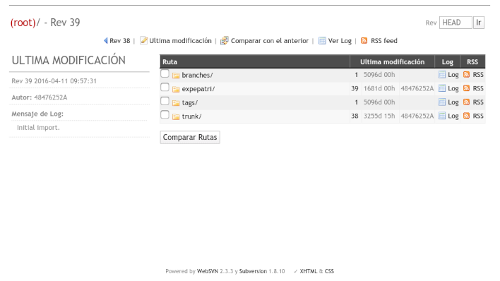

El proceso que llamamos de migración consiste en, además de coger un repositorio X en Subversion y llevarlo a GitLab, **realizar toda esta serie de tareas adicionales** que permiten adecuar el proyecto [al proceso de desarrollo e integración continua](../java/README.md) de la CARM: 

1. **Conservar la mayor cantidad de historia** de los fuentes de la aplicación
2. Minimizar el tamaño del repositorio en GitLab y **evitar subir ficheros binarios** *(.jar, .doc, .war, ...etc)*, para lo que será necesario:
	* **Mavenizar** el proyecto
	* Convertir **documentación a Markdown** 
3. **Formatear el código** fuente y convertir los fuentes de charset y CRLF
4. Escribir un **README.md** que describa brevemente el proyecto
5. Añadir el **pipeline GitLab-CI** para que el proyecto se construya automáticamente con cada commit
6. Añadir al proyecto la **configuración de cada entorno**, e identificar los secretos compartidos 
7. Gestionar la migración de la **tarea de despliegue desde  Jenkins**
8. Conseguir que la aplicación se ejecute en **un docker**.
9. Gestionar la **baja del repositorio** Subversion


## Antes de empezar

Antes de ponerse manos a la obra, **convendría que curiosearas el repositorio Subversion** y navegaras por él para **hacerte una idea de**:

1. dónde está el código fuente,
2. cuántos desarrolladores participaron del desarrollo 
3. si hay muchos commits o pocos
4. si sigue los estándares habituales (```trunk/tags/branches```) o por el contrario se organiza de otra forma
5. si hay ramas en desarrollo activas
6. cuándo se realizó el último commit

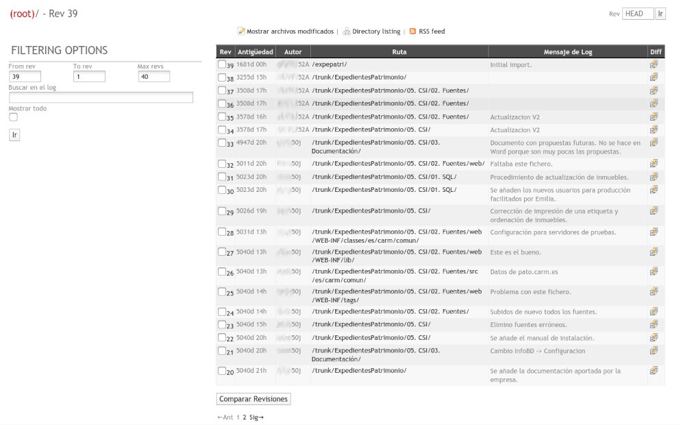

El primer paso de la migración consiste en llevar el directorio donde está el código fuente de la aplicación y toda su historia de Subversion *(svn)* a  GitLab *(git)*. Es por ello que deberíamos invertir tiempo en conocer la historia del proyecto para **localizar nuestro objetivo**:

> Identificar **el directorio con código fuente de la aplicación** que se ejecuta en nuestros servidores, con **el máximo de historia**


Los proyectos deberían tener el código fuente de una única aplicación bajo el directorio ```trunk/``` , pero esto no siempre se cumple:

* Habrá repositorios que no tengan la estructura básica: ```tags/branches/trunk```
* Repositorios con más de una aplicación,
* En el directorio ```tags/``` deberíamos poder encontrar las versiones que se instalaron en los servidores, siendo la más reciente la que actualmente hay desplegada, pero les faltará toda la historia a cada uno de estos tags, o quizás el directorio esté vacío
* Las ramas suelen tener historia, pero suele ser corta.
* Puede que la versión desplegada en los servidores desde hace años sea la de una rama
* Puede que el repositorio provenga de una migración desde CVS e incluya cantidad de ficheros binarios

También es recomendable que **preguntes a la gente por el proyecto** *(a sistemas, a los desarrolladores que la mantuvieron,...)*, que **investigues la historia** no escrita (en commits) del proyecto, **conoce su reputación**, descubre quién sabe de él, a quién puedes preguntar las dudas... *investiga como si fueras un detective que hace arqueología del código*. El resultado de todas estas investigaciones te permitirá:

1. Identificar mejor el directorio donde están los fuentes y el grueso de la historia
2. Tener material para **poder escribir el README.md** en la raíz del proyecto GitLab.


Es importante localizar *"el directorio"*, porque si se migrara el repositorio completo de SVN a GIT desde la raíz, se estaría multiplicando el espacio en Git innecesariamente: En SVN las ramas y los tags son copias, que aunque sean referencias en la base de datos de Subversion, al llevarlas a GIT se expandirán y ocuparán el espacio real que requieren.


En el ejemplo que nos ocupa y que sirve de hilo conductor para el relato de este documento, descubrimos que:

* El repositorio origen está en https://vcs.carm.es/svn/expepatri/ 
* El código fuente de la aplicación está en el directorio ```/trunk/ExpedientesPatrimonio/``` **(<<< nuestro objetivo!)**
* Se trata de una aplicación antigua que permite llevar la gestión de *Expedientes de patrimonio* y que aún hoy día usan en la *Dirección general de Patrimonio*
* Antonio Bravo sabe manejarse con la aplicación.
* La aplicación se ejecuta en Tomcat 5.5 con Java 5.
* No se hace un cambio en el código desde casi 9 años
* Se migró a Subversion desde CVS hace casi 14 años, y probablemente se perdió toda la historia de los fuentes en la migración, porque sólo se existen 39 commits en el repositorio
* No está mavenizado e incluye todas las librerías *.jar* del proyecto 
* La documentación está en formato *.doc* siguiendo el esquema de métrica: Muchas plantillas vacías *(.dot)* y pocos documentos desarrollados


### Requisitos y herramientas

Para poder realizar todo este trabajo necesitarás tener instalado en tu equipo:

1. Un cliente Subversion
2. Un cliente Git
3. Las utilidades git-svn, que permiten realizar la conversión entre repositorios
4. Maven 3.5 o superior
5. Java SDK 1.7 o superior
6. Docker

Para poder ilustrar cada uno de los comandos que habrá que ir ejecutando, vamos a **suponer que todo el proceso se realiza sobre un equipo Linux con Debian 10**, que si siempre podrás instalar en una máquina virtual en tu equipo o usar a [través de WSL](https://docs.microsoft.com/es-es/windows/wsl/install-win10).


Por tanto, para preparar tu equipo a poder realizar este proceso, tendrás que ejecutar:

```bash
sudo apt-get update
sudo apt-get install -y subversion git maven git-svn tree dos2unix pandoc
```

Instalar docker siguiendo la guía oficial https://docs.docker.com/engine/install/debian/

## La migración del repositorio

Una vez tenemos claro qué debemos migrar, comenzaremos con el proceso...


### Extraer los autores de los commits
Para conservar la historia del código fuente necesitaremos identificar todos los autores registrados en Subversion y convertirlos al formato que requiere GitLab. 

Aplicado al ejemplo de ```expepatri```, el primer paso será ejecutar el comando que nos **extrae todos los autores** y volcarlos a un fichero de texto mediante:

```bash
svn log -q -r 1:HEAD https://vcs.carm.es/svn/expepatri/ \
 | grep '^r' | awk -F'|' '!x[$2]++{print$2}' \
 | sort -u > ~/autores-expepatri.txt
```

El fichero ```~/autores-expepatri.txt``` tendrá una pinta similar a:

```txt
*****52A 
***50j 
root 
(sin autor) 
```

Ahora, este fichero habrá que convertirlo a otro   ```~/autores-expepatri-transformado.txt``` con **líneas clave=valor**, que nos servirá para indicarle al proceso qué usuario de Subversion se corresponde con qué usuario de GitLab, similar al siguiente:

```txt
*****52A = David Gil Galván <dx**@indra.es>
***50j = Máximo Conesa <m**@carm.es>
root = jenkins <jenkins**@carm.es>
(sin autor) = gitlab-ci <git**@listas.carm.es>
```

Lo más práctico y rápido será que **pida a los responsables de IDECRI que le generen este nuevo fichero**, apartir de ```~/autores-expepatri.txt```, que deberá facilitarles.


### Crear el repositorio GitLab	
Cree un **nuevo repositorio personal en GitLab** al que se llevar todos los fuentes migrados.  Al crearlo en el área personal, tendrá total libertad para trabajar con el repositorio sin depender de otras personas y todos los permisos.


Esto nos servirá para obtener la URL inicial en la que importar el proyecto:

> https://gitlab.carm.es/ibarrancos/ExpedientesPatrimonio

El repositorio de momento **quedará vacío, sin archivos**.


### Migrar los fuentes con la historia
Este es el momento en el que llevamos el directorio que habíamos localizado con los fuentes de la aplicación a Git, arrastrando su historia. 

Para el ejemplo de ```expepatri```  teníamos que:

1. El directorio que había que llevarse a Git era ```trunk/ExpedientesPatrimonio/```
2. La conversión de los autores la teníamos en ```~/autores-expepatri-transformado.txt```
3. La URL de Git a la que llevar la aplicación era ```https://gitlab.carm.es/ibarrancos/ExpedientesPatrimonio```

Antes de comenzar el proceso, crearemos un directorio temporal que usaremos para la descarga y carga de fuentes:

```bash
rm  -fr ~/Migracion-svn2git
mkdir ~/Migracion-svn2git
```

Ahora, descargaremos los fuentes desde Subversion:

```bash
cd  ~/Migracion-svn2git
git svn clone https://vcs.carm.es/svn/expepatri/trunk/ExpedientesPatrimonio/ \
    --no-minimize-url \
    --no-metadata \
    -A ~/autores-expepatri-transformado.txt \
    descargados
```

Y después de unos minutos, tendremos en el directorio ```~/Migracion-svn2git/descargados``` todo preparado para subir a GitLab.


### Eliminar binarios
Antes de hacer una primera subida a GitLab, convendrá borrar todo **rastro de los ficheros binarios que no deberían formar parte del respositorio**: Para localizarlos y saber en qué directorios mirar, podría ejecutar los comandos:

```bash
cd ~/Migracion-svn2git/descargados
du -sh * .git
```

Este comando nos indicará qué directorios ocupan más tamaño:

```txt
128K   02. EVS
4,6M   03. ASI
4,7M   04. DSI
51M    05. CSI
52K    06. IAS
92K    07. MSI
364K   08. GESTIÓN PROYECTO
172K   09. CALIDAD
168K   10. GESTIÓN CONFIGURACIÓN
51M    .git
```

Podemos intuir que el directorio ```05. CSI```  con ```51MB``` es candidato a tener ficheros binarios.  Que el directorio ```.git``` ocupe ```51MB``` antes de subir nada a GitLab, nos permite hacernos una idea de que el repositorio ocupará entorno a los 50MB. 


También podremos **hacernos una idea de la variedad de extensiones que hay que en el repositorio y lo que ocupan**, ejecutando el comando:

```bash
cd ~/Migracion-svn2git/descargados
find * -name '?*.*' -type f -print0 |
  perl -0ne '
    if (@s = stat$_){
      ($ext = $_) =~ s/.*\.//s;
      $s{$ext} += $s[12];
      $n{$ext}++;
    }
    END {
      for (sort{$s{$a} <=> $s{$b}} keys %s) {
        printf "%15d %4d %s\n",  $s{$_}<<9, $n{$_}, $_;
      }
    }'
```

El resultado estará en bytes y mostrará además de cada extensión, el número de archivos que hay de cada extensión:

```txt
      4096    1 MF
      4096    1 mex
      4096    1 properties_desarrollo
      4096    1 properties_pruebas
      4096    1 bat
      4096    1 ctl
      8192    1 dat
      8192    2 prefs
     12288    1 vm
     12288    2 tag
     12288    3 jpg
     12288    1 ftl
     16384    4 txt
     28672    7 sql
     28672    1 css
     32768    7 properties
     32768    2 dtd
     49152    3 jrxml
     65536   16 gif
     77824    3 jasper
    122880   28 jsp
    139264   14 tld
    225280   30 xml
    454656  106 class
    524288  105 java
   1380352   19 dot
  14647296   12 doc
  44978176   94 jar
```

Ya podemos identificar que en el repositorio encontramos:

* 106 ficheros ```.class```  (que no deberíamos subir) que ocupan 400KB  (cuando sólo hay 105 ficheros ```.java```)
* 94 ficheros  ```.jar```  (que no deberíamos subir) que ocupan 44MB
* 19 ficheros ```.dot```  (que no deberíamos subir) que ocupan 1,3MB

En general, todas aquellas **extensiones que estén enumeradas en el fichero [.gitignore](https://gitlab.carm.es/SIAC/tramel/-/blob/master/.gitignore) de otro proyecto integrado en CI-CARM debería evitar añadirlas** al repositorio: Identifique los directorios que contienen el despilfarro de archivos y elimínelos junto a su historia, antes de entregar a GitLab.

En nuestro ejemplo, decidimos excluir:

1. El directorio ```05. CSI/02. Fuentes/web/WEB-INF/classes``` que tenía todos los ficheros ```.class``` resultado de compilaciones del proyecto
2. El directorio ```05. CSI/02. Fuentes/web/WEB-INF/lib``` que tenía todos los ficheros ```.jar```  con las dependencias
3. y todos los ficheros ```.dot``` *(plantillas del Word)*.


Para eliminar sin dejar rastro el directorio ```05. CSI/02. Fuentes/web/WEB-INF/classes```, ejecutaremos:

```bash
git filter-branch \
    --force \
    --index-filter \
    'git rm -r --cached --ignore-unmatch "05. CSI/02. Fuentes/web/WEB-INF/classes"' \
    --prune-empty --tag-name-filter cat -- --all
```

Y para el resto...

```bash
git filter-branch --force --index-filter 'git rm -r --cached --ignore-unmatch "05. CSI/02. Fuentes/web/WEB-INF/lib"' --prune-empty --tag-name-filter cat -- --all

git filter-branch --force --index-filter 'git rm -r --cached --ignore-unmatch "02. EVS/Plantilla EVS (1.0).dot"' --prune-empty --tag-name-filter cat -- --all
git filter-branch --force --index-filter 'git rm -r --cached --ignore-unmatch "03. ASI/Plantilla ASI (1.0).dot"' --prune-empty --tag-name-filter cat -- --all
git filter-branch --force --index-filter 'git rm -r --cached --ignore-unmatch "03. ASI/Plantilla ASI (1.1).dot"' --prune-empty --tag-name-filter cat -- --all
git filter-branch --force --index-filter 'git rm -r --cached --ignore-unmatch "04. DSI/Plantilla DSI (1.0).dot"' --prune-empty --tag-name-filter cat -- --all
git filter-branch --force --index-filter 'git rm -r --cached --ignore-unmatch "05. CSI/Plantilla Manual Usuario (1.0).dot"' --prune-empty --tag-name-filter cat -- --all
git filter-branch --force --index-filter 'git rm -r --cached --ignore-unmatch "05. CSI/Plantilla Manual Tecnico proyecto (1.0).dot"' --prune-empty --tag-name-filter cat -- --all
git filter-branch --force --index-filter 'git rm -r --cached --ignore-unmatch "05. CSI/Plantilla CSI (1.0).dot"' --prune-empty --tag-name-filter cat -- --all
git filter-branch --force --index-filter 'git rm -r --cached --ignore-unmatch "06. IAS/Plantilla IAS (1.0).dot"' --prune-empty --tag-name-filter cat -- --all
git filter-branch --force --index-filter 'git rm -r --cached --ignore-unmatch "07. MSI/Plantilla MSI (1.0).dot"' --prune-empty --tag-name-filter cat -- --all
git filter-branch --force --index-filter 'git rm -r --cached --ignore-unmatch "08. GESTIÓN PROYECTO/Plantilla acta reunión proyecto anomesdia (1.1).dot"' --prune-empty --tag-name-filter cat -- --all
git filter-branch --force --index-filter 'git rm -r --cached --ignore-unmatch "08. GESTIÓN PROYECTO/Plantilla convocatoria reunión proyecto anomesdia (1.0).dot"' --prune-empty --tag-name-filter cat -- --all
git filter-branch --force --index-filter 'git rm -r --cached --ignore-unmatch "08. GESTIÓN PROYECTO/Plantilla seguimiento proyecto anomesdia (1.0).dot"' --prune-empty --tag-name-filter cat -- --all
git filter-branch --force --index-filter 'git rm -r --cached --ignore-unmatch "08. GESTIÓN PROYECTO/Plantilla acta reunión proyecto anomesdia (1.0).dot"' --prune-empty --tag-name-filter cat -- --all
git filter-branch --force --index-filter 'git rm -r --cached --ignore-unmatch "08. GESTIÓN PROYECTO/Plantilla cierre proyecto (1.0).dot"' --prune-empty --tag-name-filter cat -- --all
git filter-branch --force --index-filter 'git rm -r --cached --ignore-unmatch "08. GESTIÓN PROYECTO/Plantilla GP (1.0).dot"' --prune-empty --tag-name-filter cat -- --all
git filter-branch --force --index-filter 'git rm -r --cached --ignore-unmatch "09. CALIDAD/Plantilla Aceptaciones calidad proyecto (1.0).dot"' --prune-empty --tag-name-filter cat -- --all
git filter-branch --force --index-filter 'git rm -r --cached --ignore-unmatch "09. CALIDAD/Plantilla aseguramiento calidad proyecto (1.0).dot"' --prune-empty --tag-name-filter cat -- --all
git filter-branch --force --index-filter 'git rm -r --cached --ignore-unmatch "10. GESTIÓN CONFIGURACIÓN/Plantilla Gestion Configuracion Javato (1.0).dot"' --prune-empty --tag-name-filter cat -- --all
git filter-branch --force --index-filter 'git rm -r --cached --ignore-unmatch "10. GESTIÓN CONFIGURACIÓN/Plantilla Gestion Configuracion proyecto (1.0).dot"' --prune-empty --tag-name-filter cat -- --all
```

Ahora, si volvemos a ejecutar el comando anterior que mostraba la *variedad de extensiones que hay que en el repositorio y lo que ocupan*, veremos cómo han desaparecido ya algunas de ellas...

La reducción y optimización del tamaño del repositorio es muy importante porque para los procesos de integración continua exigen continuamente descargar el repositorio completo, y nunca será igual de rápido hacerlo con repositorios de 50 o 100 MB que hacerlo con uno de 5MB.


### Subir a GitLab
Una vez están preparados los fuentes y se han limpiado los directorios con binarios, ya estaremos en disposición de subir el repositorio a GitLab, mediante los comandos:

```bash
cd ~/Migracion-svn2git/descargados
git remote add origin https://gitlab.carm.es/ibarrancos/ExpedientesPatrimonio.git
git push origin master
```

A partir de este momento ya tendremos el repositorio migrado a GitLab:
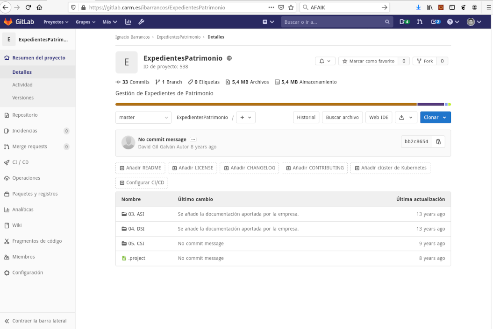

y si pinchamos en el enlace *Commits* podremos verificar cómo se conserva la historia de todos los cambios realizados en el repositorio:


## Mavenización del proyecto

De acuerdo a la [guia Java](../java/README.md), el proyecto debe poderse [construir con Maven](../java/Guia-Maven.md). En este punto, hay que asegurar que el proyecto dispone de **un fichero ```pom.xml``` con el que ```maven``` sea capaz de construir el mismo fichero ```.war``` que hay desplegado en los servidores**. 

La construcción de este fichero ```pom.xml``` es un proceso artesano, pesado y lento, que depende en gran medida de la experiencia de quien lo lleva a cabo y de la cantidad de librerías que tenga el proyecto. 

* [¿Qué significa "Mavenizar un proyecto?](https://stackoverrun.com/es/q/760337)
* [Mavenización de proyectos legacy](https://www.adictosaltrabajo.com/2016/11/15/mavenizacion-de-proyectos-legacy/)
* [Guía de migración de proyectos Java a Maven](https://www.viafirma.com/blog-xnoccio/es/guia-de-migracion-de-proyectos-java-a-maven/)
* [Mavenizar un proyecto Web existente usando project-mavenizer](http://jesfre.blogspot.com/2014/07/mavenizar-un-proyecto-web-existente.html)


### Crear el primer issue
Tal y como [recoge la guía Java](../java/Guia-Issues.md), cualquier cambio que se realice en el código fuente de una aplicación, debe quedar recogido en un Issue. Como nos disponemos a mavenizar el proyecto, lo primero que se debe hacer es *crear el correspondiente Issue*:

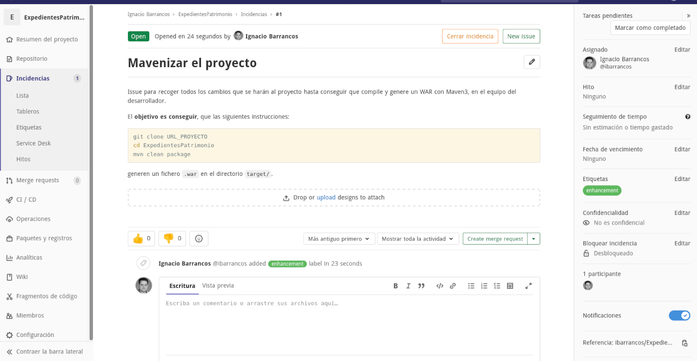

Asegúrese de  **etiquetarlo y asignárselo**.


### Estructura de directorios
Los proyectos Java de la CARM se espera que tengan los siguientes directorios:

* **```aplicacion/```**, con el código fuente de la aplicación y de sus módulos
* **```base-datos/```**, con todos los scripts SQL  DML y DDL que requiera el proyecto 
* **```docker/```**, con todo lo que se necesita para crear un docker con la aplicación
* **```configuracion/```**, con la configuración de la aplicación para cada entorno.

En este punto, se deberán **mover todos los directorios de código fuente de la aplicación para hacerlos coincidir con esta estructura**.  Siguiendo con el ejemplo que nos ocupa, lo primero será clonar a nuestro equipo el repositorio Git, que migramos en la fase anterior:

```bash
cd ~/Migracion-svn2git
git clone https://gitlab.carm.es/ibarrancos/ExpedientesPatrimonio.git
tree -d 
```

Después de curiosear el contenido de los diferentes directorios, localizamos los movimientos que deben hacerse para **reorganizar el código de la aplicación**:

```bash
cd  ~/Migracion-svn2git/ExpedientesPatrimonio

mkdir aplicacion/src/main/java -p
git mv "05. CSI/02. Fuentes/src/es" aplicacion/src/main/java/
git mv "05. CSI/02. Fuentes/src/Test"  aplicacion/src/main/java/

mkdir aplicacion/src/main/resources
git mv "05. CSI/02. Fuentes/src"/log4j.*  aplicacion/src/main/resources/

git mv "05. CSI/02. Fuentes/web"  aplicacion/src/main/webapp
```

... también los scripts SQL:

```bash
cd  ~/Migracion-svn2git/ExpedientesPatrimonio

git mv "05. CSI/01. SQL"  base-datos 
```

...limpiar los directorios que ya no tienen nada aprovechable...

```bash
cd  ~/Migracion-svn2git/ExpedientesPatrimonio

git rm -fr "05. CSI/02. Fuentes"
```

...y por último, **entregar al repositorio**:

```bash
git commit -m 'fix: Reorganización de directorios

Reorganizo el contenido del código fuente del proyecto, siguiendo las
recomendaciones CARM.

Issue: #1'
```

Es muy importante que en **el mensaje de cada commit de todo este proceso, añadamos siempre ```Issue: #1```** y así queden asociados todos los cambios que tengan que ver con la mavenización del proyecto en el issue.

### Crear pom.xml a la aplicación
El siguiente pasa será **crear el fichero ```aplicacion/pom.xml```  capaz de generar el War con la aplicación**.  Para ello, tendrás que:

1. Crear un ```pom.xml``` base, capaz de generar un fichero ```.war```
2. Añadir las dependencias del proyecto a este fichero ```pom.xml``` 
3. Ejecutar ```mvn clean package```: Si no se genera un ```.war``` volver al paso 2.
4. Comparar el  ```.war``` que se generado con el fichero  ```.war``` que hay desplegado en los servidores de producción.
5. Si hay diferencias, volver al paso 2 si no, habremos acabado y se podrán entregar los cambios al repositorio.


Para el ```pom.xml``` inicial puedes usar la plantilla  [```templates/pom.xml```](templates/pom.xml), y personalizar todas las ocurrencias de ```XX-LO-QUE-SEA-XX``` por lo que corresponda al proyecto que estás mavenizando. También puedes inspirarte en otros proyectos para comprobar cómo realizar estas sustituciones.

A partir de él, tendrás que ir añadiendo dependencias hasta que compile el proyecto y genere un ```.war``` con la aplicación. Para este proceso iterativo, necesitarás armarte de paciencia para adivinar todas las dependencias del proyecto. Existen varias formas de *"adivinar las dependencias"*, partiendo del listado de ficheros ```.jar``` que se incluyen dentro del War en ```WEB-INF/lib```:

* Buscar en Google el nombre del fichero ```.jar``` seguido de la palabra ```maven```
* Descomprimir el fichero ```.jar``` y comprobar el contenido del directorio ```META-INF/``` a ver si encontramos una pista...
* Buscar nombres significativos de las clases que se incluyen en el ```.jar```

Cuando todo lo anterior falla, habrá que subir el fichero  ```.jar``` a [Nexus de la CARM](https://nexus.carm.es) como dependencia de terceros.

En vez de intentar encontrar y añadir la dependencia asociada a cada fichero  ```.jar```, es mucho más rápido y eficiente empezar por las que se necesitan para compilar el proyecto y generar el  ```.war```. Identifícalas mediante:

```bash
mvn clean package 2>&1 \
  | grep ERROR \
  | grep package \
  | awk -F ' package ' '{print $2}' \
  | sort -u
```

Añade primero estas, porque maven ya se encargará de descargar las librerías que dependen de estas de forma recursiva. En el [primer Issue del proyecto ```arp43b/perfil```](https://gitlab.carm.es/arp43b/perfil/-/issues/1) encontrarás cómo se realizó todo este proceso *commit a commit*.

Para poder compilar el proyecto, también necesitará que los ficheros ```.java``` con expresiones _**NO-UTF8** (en Strings, nombres de Constantes, etc)_, se conviertan a UTF8 y así no falle la compilación:

```bash
cd src/main/java

for i in $(find -type f -exec file -i {} \; | grep iso-8859 | grep 'text/x-java' | awk -F ': ' '{print $1}' | sort -u  )
do
   iconv -f iso8859-1 -t utf8 $i > /tmp/a
   mv /tmp/a $i 
done

cd -
```


### Afinar pom.xml para igual el war
Con el paso anterior se habrá conseguido generar un fichero ```.war``` con la aplicación, pero **probablemente no desplegará en un Tomcat** por:

1. Faltarán archivos en su lugar correcto:  ```.properties```, ```.hbm.xml```, etc...
2. Faltarán o sobrarán ficheros  ```.jar```

En este punto del proceso, se **deberá modificar el proyecto hasta conseguir que el ```war``` que generan maven sea prácticamente el mismo que el original**. Esto dependerá de la experiencia de la persona que lo lleve a cabo, y para ayudarle se han preparado algunos shell scripts que le servirán en la tarea. 

El primer script [Paso1-Comparador-Wars.sh](scripts/mvn/Paso1-Comparador-Wars.sh) permite tener una **primera aproximación a los ficheros en los que difieren los _Wars_**, indicando como primer argumento el  _.war original_ y como segundo, el _.war que construye Maven_ a partir del ```pom.xml``` que generamos :

```bash
bash Paso1-Comparador-Wars.sh Original-App.war  aplicacion/target/App.war
```

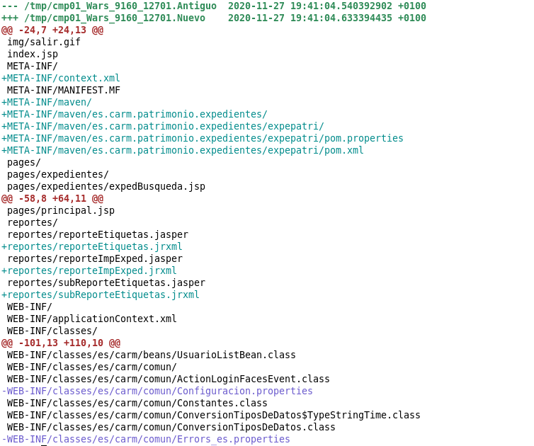

Todas las **líneas que empiecen por el signo ```+```** son ficheros que están en el _.war de maven_ y no estaban en el original. Lo habitual será encontrar ```META-INF/maven/``` (que lo añade Maven al construir el paquete) y  ```META-INF/context.xml```  con el contexto de la aplicación. 

Todas las **líneas que empiecen por el signo ```-```** son ficheros que estaban el _war original_ y ya no están en el _.war que genera maven_.

Habrá revisar cada una de estas diferencias, o porque falte o sobre el archivo, y limitar las diferencias sólo al directorio ```WEB-INF/lib/``` y ```META-INF/```. En nuestro ejemplo, nosotros observamos que:

1. Los ficheros ```.hbm.xml``` debían estar en el WAR, por lo que los movimos al directorio ```aplicacion/src/main/resources/es/carm/modelo/```
2. Los ficheros ```.jrxml``` son el fuente de los informes ```.jasper``` (binario compilado). En principio los dejamos en el WAR.
3. El fichero  ```.faces-config.mex```  sobraba del WAR, ya lo excluía el ```build.xml``` que usaba ANT.
4. Los ficheros ```.properties``` debían estar en el WAR, por lo que los movimos al directorio ```aplicacion/src/main/resources/es/carm/comun/```


El segundo script [Paso2-Comparador-Wars.sh](scripts/mvn/Paso2-Comparador-Wars.sh) permite obtener una **mejor aproximación a los JARS en los que difieren los _Wars_**, indicando como argumentos con su ruta absoluta el  _.war original_ y  _.war que construye Maven_ :

```bash
bash Paso2-Comparador-Wars.sh Original-App.war  aplicacion/target/App.war
```

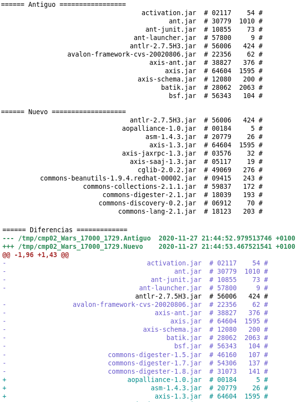

Este script ejecuta un ```sum``` de todos los ficheros ```WEB-INF/lib/*.jar```  que hay en los _Wars_, y muestra tres secciones:

1. La lista de ficheros y sus correspondientes ```sum``` del  ```.war``` original.
2. La lista de ficheros y sus correspondientes ```sum``` del  ```.war``` que genera Maven.
3. Las diferencias entre las dos listas...

Como antes, habrá que determinar qué ficheros faltan y/o sobran en el _.war de Maven_. La ventaja de usar ```sum``` es que obtiene la huella digital de cada archivo, y esta será la misma aunque el fichero tenga un nombre diferente:

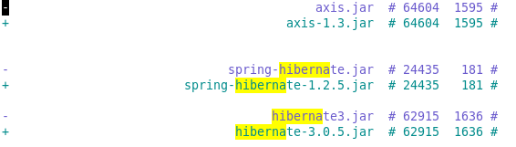


También descubrirá librerías duplicadas en el _war original_ , que maven simplifica y sólo incluirá una de ellas y siempre la más reciente.

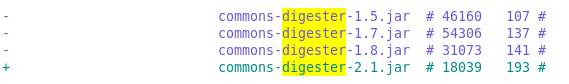

...y al revés: Librerías que maven determina una versión (por dependencias heredadas) y sin embargo el _war original_ tiene más actualizadas:

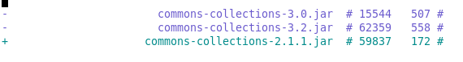

Con todo esto, habrá que modificar el  ```pom.xml``` hasta conseguir minimizar las diferencias, **que despliegue en Tomcat y que funcione como lo hacía la aplicación original**.


## Conversión de la documentación

**PENDIENTE** de acabar

- [ ] Explicar cómo crear una nueva rama ```documentacion``` (sin código)
- [ ] Explicar cómo organizar la documentación *¿usuario, desarrollo, administrador?*
- [ ] Explicar cómo convertir de Word a Markdown


## Configuración

Siguiendo con la [guia Java](../guias/java/Guia-Configuracion.md), el proyecto deberá recoger la configuración de la aplicación en los diferentes entornos de la siguiente manera:

1. Un directorio ```configuracion/local/``` en la rama ```master``` con toda la configuración que necesita el docker con la aplicación para arrancar.
2. Una rama  ```config``` que tenga a su vez un directorio ```configuracion/```, con un subdirectorio por entorno CARM en el que desplegarla: ```des/``` , ```pru/```, ```pro/```.

Los ficheros de todos estos directorios asumimos que el despliegue los dejará en el directorio ```$CATALINA_HOME/conf/XXXX```, donde ```XXXX``` será el nombre de nuestra aplicación, que para nuestro ejemplo se convertirá en ```$CATALINA_HOME/conf/ExpedientesPatrimonio```

La labor en esta fase consiste en localizar los ficheros de configuración para cada entorno y llevarlos a esta estructura.


### Repositorio SIN configuración

Al migrar el repositorio desde Sbuversion a GitLab nos **encontramos que no existe  el directorio ```configuracion/``` en la rama ```trunk```**,  tendremos que pedir a sistemas la configuración de la aplicación para cada uno de los entornos, y si no, habbrá que investigar en el código fuente y la documentación para crearla.

El primer paso será **crear la estructura de directorios en nuestra rama ```master```**:

```bash
for i in local pro pru
do
   mkdir -p configuracion/$i
done
```

Luego habrá que **copiar en cada directorios los ficheros correspondientes a ese entorno**, y por último entregar a git.

```bash
git add configuracion

git commit -m "chore: Añadir configuración
Añado al proyecto la semilla de configuración.
Issue: #1"

git push
```

### Repositorio CON configuración

En caso de que nos **encontremos que el repositorio ya tiene el directorio ```configuracion/``` en la rama ```trunk```**,  o bien vengamos del paso anterior, deberań realizarse los siguientes pasos:

En primer lugar **crear una nueva rama ```config``` y borrar todo su contenido excepto el directorio ```configuracion/```**:

```bash
# Crear la rama...
git checkout -b config

# Borrar todo excepto configuracion...

# Generar un fichero con los candidatos a borrar
ls -1a | grep -v '\.$' \
| grep -v '\.git$' \
| grep -v 'configuracion' \
> /tmp/lista

# Recorrer el fichero y borrarlos del git...
exec 7< /tmp/lista
while read -u 7 linea
do
   git rm -fr "$linea"
done
exec 7<&-

# Borrar el fichero temporal
rm -f /tmp/lista
```

Luego **eliminar el directorio ```configuracion/local```**  si existiera,

```bash
git rm -fr configuracion/local
```

Y después **publicar la rama ```config``` en el repositorio**:
```bash
git commit -m "chore: Crear rama de configuración

Se lleva toda la configuración a una rama independiente.
Issue: #1"

git push --set-upstream origin config
```

Ahora, volver a la rama ```develop``` o ```master```, en la que estuviéramos para **borrar del git la configuración que no sea ```local```**:

```bash
# Volver a la en la que estábamos...
git checkout develop

# Borrar toda la configuracion, excepto local/
cd configuracion/
for i in $(ls -1 | grep -v local)
do
    git rm -fr "$i"
done
```

Y ya por último, **entregar a GitLab**:

```bash
git commit -m "chore: Eliminar configuración no-local

Elimino los directorios con configuración que no aplica a local
Issue: #1"

git push
```


## Integración continua
En el siguiente paso, se modificará el proyecto que migramos desde Subversion, para adecuarlo a los requisitos que nos impone la integración continua de la CARM: 

* Código Java formateado según la guía de estilo de Google
* Charsets UTF8 para evitar Warnings y Errores en los procesos automatizados 
* Retornos de carro al estilo Unix
* Evitar binarios, configuraciones de IDEs

Los procesos automatizados que implementan la integración continua se basan en sistemas GNU/Linux, de ahí algunos de estos requisitos, que buscan evitar sorpresas cuando el programador desarrolla desde Microsoft Windows.

Como es habitual en todo este proceso, deberá **crearse un nuevo Issue** para reunir todos los cambios que se hagan en el código fuente para este fin de adecuar el proyecto a IC, etiquetarlo y asignarlo.

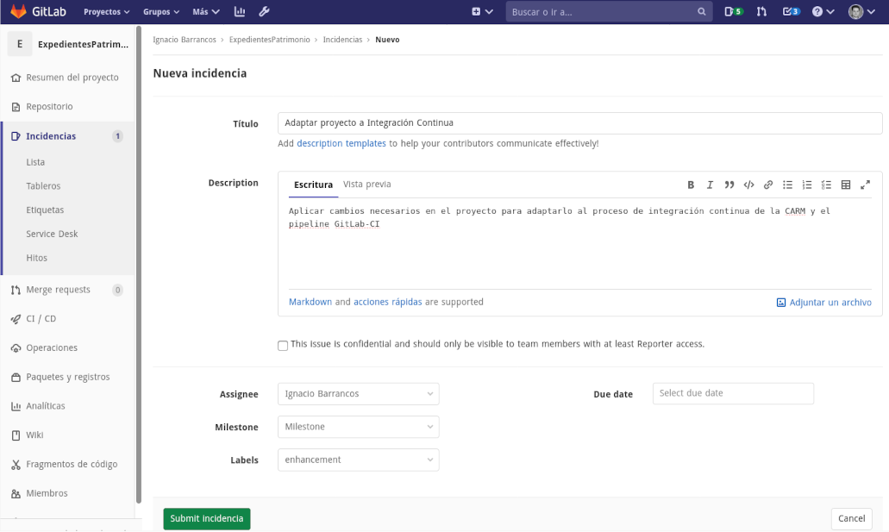


### Preparar el proyecto

Lo primero es identificar aquellos ficheros que aún no son UTF8:

```bash
find aplicacion/ -type f  -exec file -i {} \; \
  | grep ' charset=iso-8859-1'
```

Estos ficheros hay que revisarlos uno a uno, antes de decidir si convertirlos a UTF8 o no:

* Puede que sean ficheros ```.html``` que declaran correctamente su charset mediante ```<meta charset="ISO-8859-1">```
* O ficheros ```.xml``` que declaran correctamente su charset en el prólogo ```<?xml version="1.0" charset="ISO-8859-1">```
* O ```.jsp``` que declaran correctamente el charset ```<%@ ... pageEncoding="UTF-8"%>```

En general, habrá que convertir estos ficheros si declaran un Charset y sin embargo el comando ```file -i``` nos indica que tienen otro charset distinto. La conversión a UTF8 puede realizarse con el siguiente comando:

```bash
iconv -f iso8859-1 -t utf8 FICHERO_NO_UTF8 > /tmp/a
mv /tmp/a FICHERO_NO_UTF8 
```

Forzar que todos los ficheros tengan retorno de carro de estilo Unix, mediante:

```bash
find aplicacion -type f -exec dos2unix {} \;
```


Ahora se deberá añadir el fichero ```pom.xml``` desde la plantilla [```templates/seed/pom.xml```](templates/seed/pom.xml) a la raíz del proyecto **(el ```pom.xml``` padre del proyecto)**, y personalizarlo:

1. Para sustituir las ocurrencias de ```XX-LO-QUE-SEA-XX``` por lo que corresponda a nuestro proyecto
2. Centralizar en él la configuración de propiedades y plugins definidas en el resto de ```pom.xml``` que hay bajo el directorio ```aplicacion/```
3. Vincular el resto de ```pom.xml``` que cuelgan de ```aplicacion/```, a este nuevo ```pom.xml``` como padre

Revisa otros proyectos ya migrados, para averiguar cómo realizar estas sustituciones. 

Después, se copiará el directorio [```templates/seed/.mvn``` ](templates/seed/.mvn) tal cual  a la raíz del proyecto *(junto al ```pom.xml``` padre)*, con la plantilla de estilo Java de Google, que usaremos para formatear el código fuente. 

Cuando acabe, la ejecución del siguiente comando no debería dar ningún error:

```bash
mvn install
```

Ahora, **formatea todo el código fuente** del proyecto mediante:

```bash
mvn net.revelc.code.formatter:formatter-maven-plugin:format
```

Por último,  **copia los ficheros  [```templates/seed/.gitattributes```](templates/seed/.gitattributes) y  [```templates/seed/.gitignore```](templates/seed/.gitignore) a la raíz del proyecto**  y añádelos al proyecto:

```bash
git add -f .gitattributes .gitignore
```

Todos estos pasos conviene realizarlos en diferentes commits para que quede más legible lo que persiguen estos cambios.

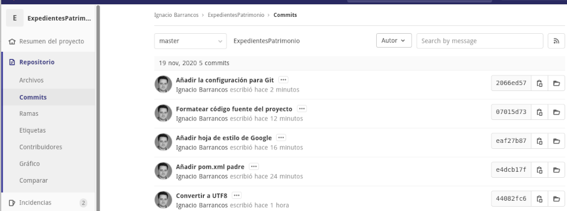


### Integrar con el Pipeline-CI
En este punto estamos en condiciones de **mover el repositorio desde nuestra cuenta de usuario personal a su grupo definitivo en GitLab**:  Si no se tienen permisos en el grupo destino al que llevar el repositorio, habrá que solicitarlo a un administrador.

Esto se consigue accediendo a  la **Configuración General** del repositorio, y dentro del grupo de opciones **Avanzado**, en la opción **Transferir proyecto** elegir el Grupo destino del repositorio y pulsar el botón *Transfer project*.

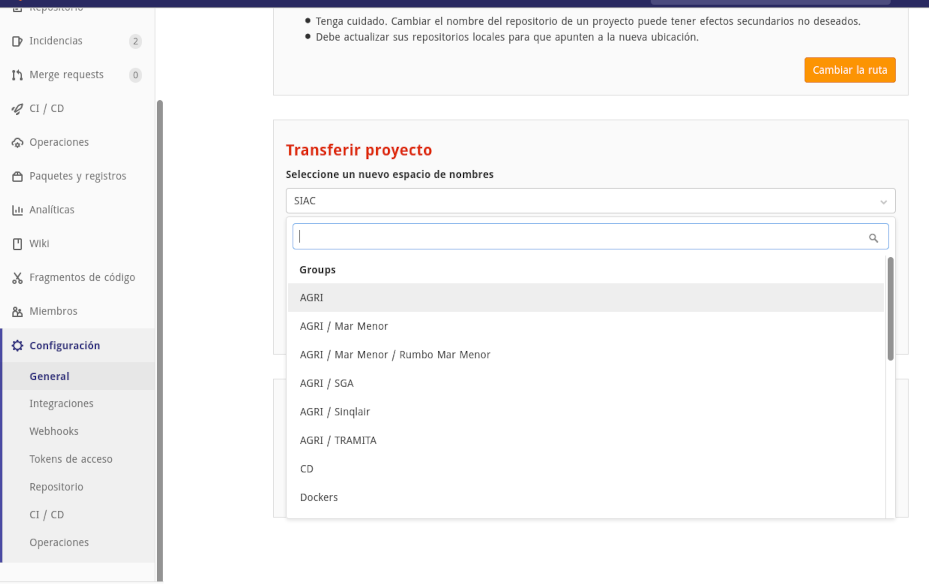

Una vez en su grupo definitivo, volver a clonar el proyecto al equipo, para modificar el ```pom.xml```  padre *(de la raíz del proyecto)* y **configurar y descomentar los tag ```<scm>``` e ```<issueManagement>```**  con la URL definitiva del proyecto.

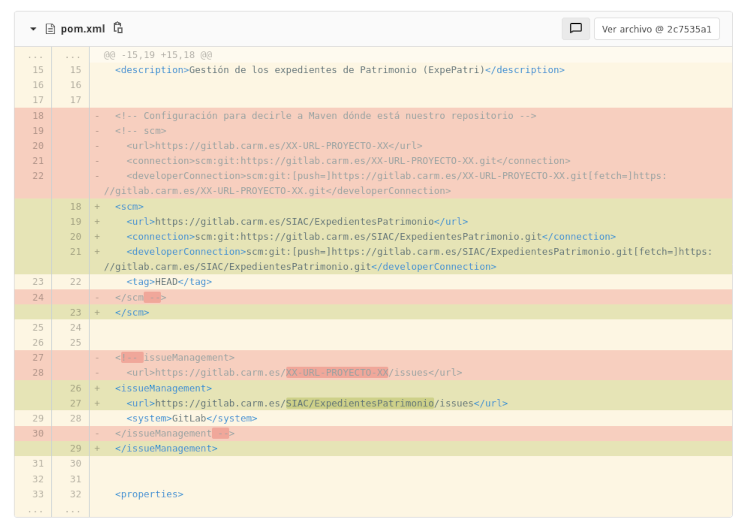

Y ya por último, **copie el fichero [```templates/seed/.gitlab-ci.yml```](templates/seed/.gitlab-ci.yml)** a la raíz del proyecto para configurarlo con el pipeline GitLab-CI básico:

```bash
git add -f .gitlab-ci.yml 
```

Así, cada vez que se haga un *push* al repositorio lanzará la ejecución del pipeline:

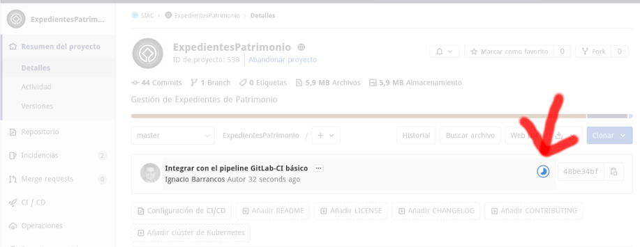

Este pipeline verifica que el proyecto aplique  todas las recomendaciones técnicas sugeridas en [la Guía de desarrollo para Java](../java/README.md) y en ese caso, generará y publicará los artefactos de la aplicación en el [Nexus de la CARM](https://nexus.carm.es),  desde donde podrán desplegarse en los servidores,

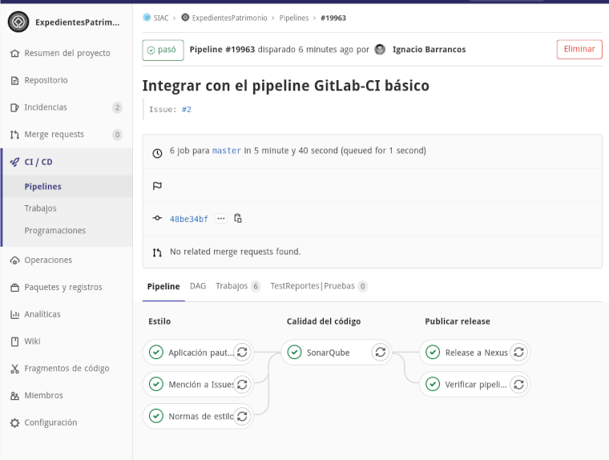

...además de generar y publicar un informe acerca de la calidad del código del proyecto en [SonarQube](https://sonarqube.carm.es/)

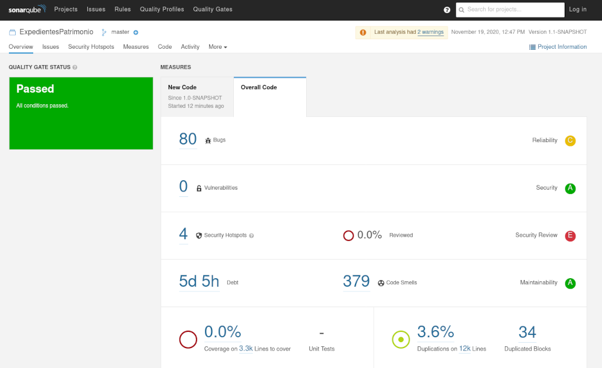


### Configuración para OnFlow
En caso de que en el proyecto confluyan varios desarrolladores trabajando conjuntamente, habrá que configurar el repositorio para soportar el flujo de trabajo **OneFlow con la variante master+develop**. 

Esto consiste en **añadir una nueva rama ```develop``` al repositorio a partir de ```master```**:

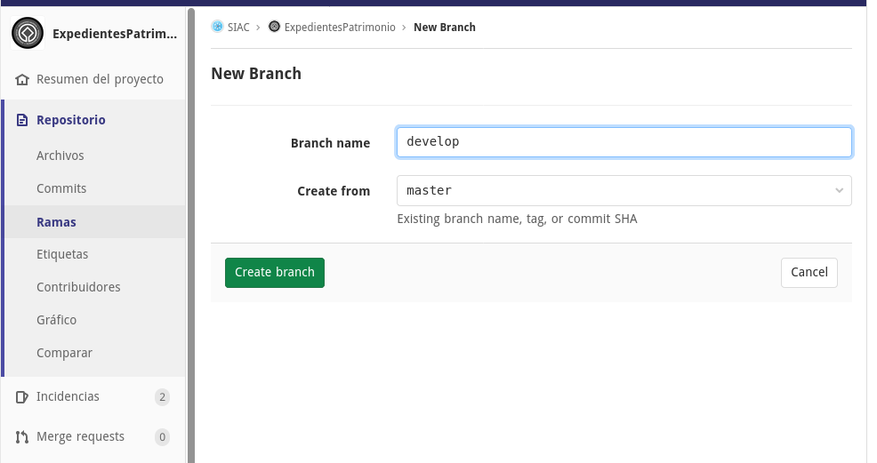

... **configurarla como protegida**, de la misma manera que sucede con ```master``` y **fijarla como la rama por defecto** del proyecto:

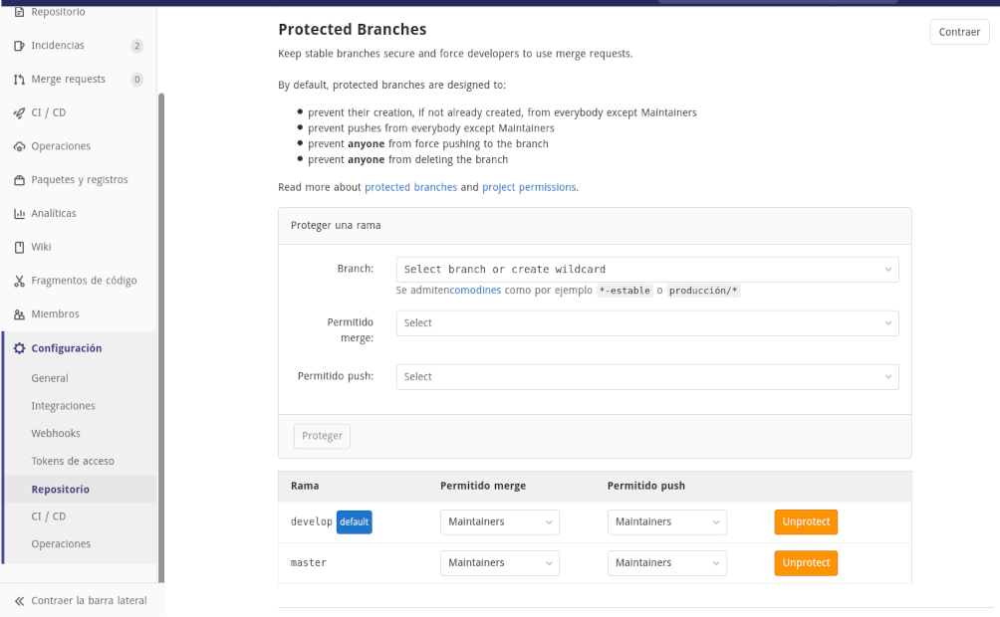


## Despliegue del proyecto

En este paso se debe preparar todo lo necesario para poder desplegar y ejecutar la aplicación en la red de la CARM:

* bien, sobre un **contenedor docker** en cualquier equipo conectado físicamente a la red o través de una VPN, 
* o bien, en los **servidores de la CARM** junto al resto de la infraestructura, a través de Jenkins.

### Despliegue en Tomcat sobre docker (local)
Para aquellas aplicaciones Java que generan un fichero ```.war``` se puede **[usar la plantilla ```templates/docker/```](templates/docker/) y copiarla a nuestra rama ```master```**. Después de copiar el directorio, habrá que revisar y valorar si debe aplicar alguno de los siguientes cambios:

* ```bin/setenv.sh```. Este fichero contiene las opciones con las que se arrancará el servicio de Tomcat. 
* ```hosts/host.aliases```.  En este fichero deberá añadir todas las direcciones IP y los nombres de aquellos servidores a los que necesite conectar a través de la VPN: _servidores de bases de datos, otros endpoints de la red de la CARM, etc_.
* ```conf/server.xml```. En este fichero deberá configurar los Pools de conexiones a las diferentes bases de datos, y otras configuraciones de Tomcat.
* ```conf/context.xml```. Si la aplicación necesitara una configuración especial para el contexto.
* Buscar todas las ocurrencias de ```XXXXXX``` y reemplazarlas por el nombre de nuestra aplicación _(en nuestro ejemplo: ```ExpedientesPatrimonio```)_
* Buscar todas las ocurrencias de ```AAAAAA``` y reemplazarlas por el ```groupID``` de maven de nuestra aplicación  _(en nuestro ejemplo: ```patrimonio.expedientes```, y lo leemos del fichero ```aplicacion/pom.xml```)_ 
* Buscar todas las ocurrencias de ```DDDDDD``` y reemplazarlas por el ```artifactID``` de maven de nuestra aplicación  _(en nuestro ejemplo: ```expepatri```, y lo leemos del fichero ```aplicacion/pom.xml```)_
* Buscar todas las ocurrencias de ```WWWWWW``` y reemplazarlas por el nombre del fichero ```.war``` que genera maven con nuestra aplicación  _(en nuestro ejemplo: ```expepatri.war```, y lo leemos del fichero ```aplicacion/pom.xml```)_ 


Para comprobar que se genera correctamente la imagen docker, habrá que ejecutar los siguientes comandos:

```bash
# Primero generar los Wars de la aplicación
mvn clean install

# Obtener la versión
VRS=$( mvn help:evaluate -Dexpression=project.version | grep -v '\[' | grep '^[0-9]*.*' )

# Ahora generar la imagen docker
cd docker
mvn clean \
    -DskipTests \
    -Ddistribution.version=$VRS \
    -Prelease install docker:build 

cd -
```

Una vez se genere la imagen docker en nuestro equipo, al ejecutar ```docker image ls``` deberá aparecer en primer lugar:

```
REPOSITORY                                       TAG                 IMAGE ID            CREATED             SIZE
app-expepatri                                    1.1-SNAPSHOT        0cbc537b84d1        9 seconds ago       130MB
registry-gitlab.carm.es/dockers/srv/tomcat-8.5   latest              870af59d8813        8 months ago        103MB
hello-world                                      latest              bf756fb1ae65        11 months ago       13.3kB
```


Luego se podrá  **ejecutar desde el equipo**, mediante el comando:

```
docker run  -p 8080:8080 --name test app-expepatri:$VRS
```

Con este comando se está indicando:

* ```run```: Ejecutar la imagen
* ```-p 8080:8080```: Mapear el puerto 8080 de nuestro equipo al 8080 que escucha el Tomcat del contenedor, por lo que la aplicación podrá usarse en [http://localhost:8080/expepatri/](http://localhost:8080/expepatri/)
* ```--name test```: Al contenedor le llamaremos ```test```
* El último argumento es el nombre de la imagen docker que se quiere ejecutar, que coincidirá con el nombre de la imagen que generamos con maven.

Para detener la ejecución del contenedor bastará con ejecutar:

```
docker stop test
```

Y para volverla a iniciarla:

```
docker start test
```

Si reutilizamos el nombre del contenedor ```test``` para distintas imágenes, tendremos que ejecutar antes de cada ```docker run ...```:

```
docker rm test
```


### Tareas de despliegue Jenkins
Para poder desplegar la aplicación con Jenkins en los servidores de la CARM, deberá **crear un nuevo ticket en GLPI** con las siguientes características:

* **Categoría**: ```Alojamiento de aplicaciones >  Java, tomcat, jboss, node js, oas y weblogic```
* **Título**: Escribar un motivo similar a: _```[JENKINS] Crear tareas de despliegue y configuración APLICACION_XXXXX```_
* **Descripción**: Detalle su solicitud, indicando claramente la ruta en NEXUS de la CARM en la que encontrar los ```-SNAPSHOTS``` de y ```RELEASES``` de la aplicación.


## Para finalizar

**PENDIENTE** de acabar

- [ ] Explicar que hay solicitar se configure el repo svn en modo sólo lectura
- [ ] Explicar que se deben cerrar los issues que queden abiertos...
