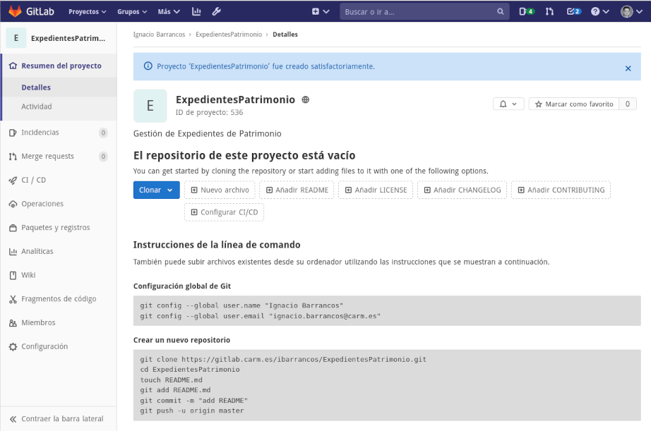
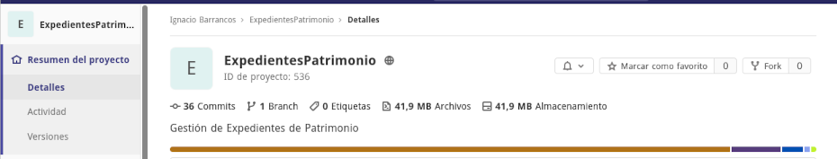
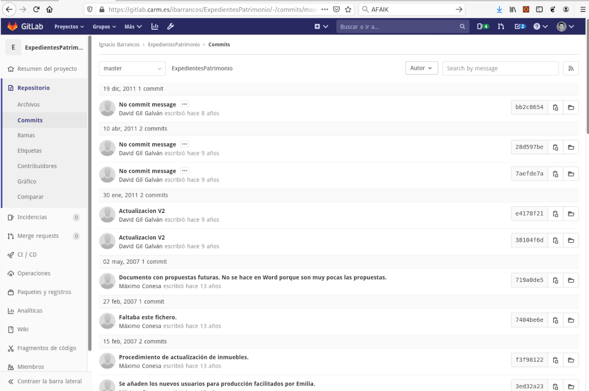

# Migración de Subversion a GitLab

En este documento se describe el proceso para **migrar un repositorio Subversion a GitLab**.   Para ilustrar el proceso describiremos todos los pasos que se realizaron para migrar el repositorio (https://vcs.carm.es/svn/expepatri/)[https://vcs.carm.es/websvn/wsvn.php/grupo_PLATAFORMAS_JAVATO.expepatri/] *(Expedientes de Patrimonio)*


El proceso que llamamos de migracion, consiste además de coger un repositorio X en Subversion y llevarlo a GitLab, **realizar toda esta serie de tareas adicionales** que permiten adecuar el proyecto al proceso de integración continua y despliegue de la CARM: 

1. **Conservar la mayor cantidad de historia** de los fuentes de la aplicación
2. Minimizar el tamaño del repositorio en GitLab y **evitar subir ficheros binarios** *(.jar, .doc, .war, ...etc)*, para lo que será necesario:
	* **Mavenizar** el proyecto
	* Convertir **documentación a Markdown** 
3. **Formatear el código** fuente y convertir los fuentes de charset y CRLF
4. Escribir un **README.md** que describa de que va el proyecto
5. Añadir el **pipeline GitLab-CI** para que el proyecto se construya automáticamente con cada commit
6. Añadir al proyecto la **configuración de cada entorno**, e identificar los secretos compartidos 
7. Gestionar la migración de la **tarea de despliegue desde  Jenkins**
8. Conseguir que la aplicación se ejecute en **un docker**.
9. Gestionar la **baja del repositorio** Subversion


## Antes de empezar

Antes de ponerse manos a la obra, **convendría que curiosearas el repositorio Subversion** y navegaras por él para **hacerte una idea de**:

1. dónde está el código fuente,
2. cuántos desarrolladores participaron del desarrollo 
3. si hay muchos commits o pocos
4. si sigue los estándares habituales (```trunk/tags/branches```) o por el contrario se organiza de otra forma
5. si hay ramas en desarrollo activas
6. cuándo se realizó el último commit


El primer paso de la migración consiste en llevar el directorio donde está el código fuente de la aplicación y toda su historia de Subversion *(svn)* a  GitLab *(git)*. Es por ello que deberíamos invertir tiempo en conocer la historia del proyecto para **localizar nuestro objetivo**:

> Identificar **el directorio con código fuente de la aplicación** que se ejecuta en nuestros servidores, con **el máximo de historia**

Los proyectos deberían tener el código fuente de una única aplicación bajo el directorio ```trunk/``` , pero esto no siempre se cumple:

* Habrá repositorios que no tengan la estructura básica: ```tags/branches/trunk```
* Repositorios con más de una aplicación,
* En el directorio ```tags/``` deberíamos poder encontrar las versiones que se instalaron en los servidores, siendo la más reciente la que actualmente hay desplegada, pero les faltará toda la historia a cada uno de estos tags, o quizás el directorio esté vacío
* Las ramas suelen tener historia, pero suele ser corta.
* Puede que la versión desplegada en los servidores desde hace años sea la de una rama
* Puede que el repositorio provenga de una migración desde CVS e incluya cantidad de ficheros binarios

También es recomendable que **preguntes a la gente por el proyecto** *(a sistemas, a los desarrolladores que la mantuvieron,...)*, que **investigues la historia** no escrita (en commits) del proyecto, **conoce su reputaciónhttps://vcs.carm.es/svn/expepatri/)**, descubre quién sabe de él, a quién puedes preguntar las dudas... *investiga como si fueras un detective que hace arqueología del código*. El resultado de todas estas investigaciones te permitirá:

1. Identificar mejor el directorio donde están los fuentes y el grueso de la historia (tu principal objetivo)
2. Tener material para **poder escribir el README.md** del raíz del proyecto en GitLab.


En el ejemplo que nos ocupa y que sirve de hilo conductor para el relato de este documento, descubrimos que:

* El repositorio origen está en https://vcs.carm.es/svn/expepatri/ 
* El código fuente de la aplicación está en el directorio ```/trunk/ExpedientesPatrimonio/``` **(<<< nuestro objetivo!)**
* Se trata de una aplicación antigua que permite llevar la gestión de *Expedientes de patrimonio* y que aún hoy día usan en la *Dirección general de Patrimonio*
* Antonio Bravo sabe manejarse con la aplicación.
* La aplicación se ejecuta en Tomcat 5.5 con Java 5.
* No se hace un cambio en el código desde casi 9 años
* Se migró a Subversion desde CVS hace casi 14 años, y probablemente se perdió toda la historia de los fuentes en la migración, porque sólo se existen 39 commits en el repositorio
* No está mavenizado e incluye todas las librerías *.jar* del proyecto 
* La documentación está en formato *.doc* siguiendo el esquema de métrica: Muchas plantillas vacías *(.dot)* y pocos documentos desarrollados


### Requisitos y herramientas

Para poder realizar todo este trabajo necesitarás tener instalado en tu equipo:

1. Un cliente Subversion
2. Un cliente Git
3. Las utilidades git-svn, que permiten realizar la conversión entre repositorios
4. Maven 3.5 o superior
5. Java SDK 1.7 o superior

Para poder ilustrar cada uno de los comandos que habrá que ir ejecutando, vamos a **suponer que todo el proceso se realiza sobre un equipo Linux con Debian 10**, que si siempre podrás instalar en una máquina virtual en tu equipo o usar a [través de WSL](https://docs.microsoft.com/es-es/windows/wsl/install-win10).


Por tanto, para preparar tu equipo a poder realizar este proceso, tendrás que ejecutar:

```bash
sudo apt-get update
sudo apt-get install -y subversion git maven git-svn
```

## La migración del repositorio

Una vez tenemos claro qué debemos migrar comenzaremos con el proceso...


### Extraer los autores de los commits
Para conservar la historia del código fuente necesitaremos identificar todos los autores registrados en Subversion y convertirlos al formato que requiere GitLab. 

Aplicado al ejemplo de ```expepatri```, el primer paso será ejecutar el comando que nos **extrae todos los autores** y volcarlos a un fichero de texto mediante:

```bash
svn log -q -r 1:HEAD https://vcs.carm.es/svn/expepatri/ \
 | grep '^r' | awk -F'|' '!x[$2]++{print$2}' \
 | sort -u > ~/autores-expepatri.txt
```

El fichero ```~/autores-expepatri.txt``` tendrá un pinta similar a:

```txt
48476252A 
mcm50j 
root 
(sin autor) 
```

Ahora, este fichero habrá que convertirlo a otro   ```~/autores-expepatri-transformado.txt``` con **líneas clave=valor**, que nos servirá para indicarle al proceso qué usuario Subversion se corresponde con qué usuario GitLab, similar al siguiente:

```txt
48476252A = David Gil Galván <dgilg@indra.es>
mcm50j = Máximo Conesa <maximo.conesa@carm.es>
root = jenkins <jenkins@carm.es>
(sin autor) = gitlab-ci <github@listas.carm.es>
```

Lo más práctico y rápido será que **pida a los responsables de IDECRI que le faciliten este nuevo fichero**, apartir de ```~/autores-expepatri.txt``` que deberá facilitarles.


### Crear el repositorio GitLab	
Cree un **nuevo repositorio personal en GitLab** al que se llevar todos los fuentes migrados.  Al crearlo en el área personal, tendrá total libertad para trabajar con el repositorio sin depender de otras personas y todos los permisos.


Esto nos servirá para obtener la URL inicial en la que importar el proyecto:

> https://gitlab.carm.es/ibarrancos/ExpedientesPatrimonio

El repositorio de momento **quedará vacío, sin archivos**.




### Migrar los fuentes con la historia
Este es el momento en el que llevamos el directorio que habíamos localizado con los fuentes de la aplicación a Git, arrastrando su historia. 

Para el ejemplo de ```expepatri```  teníamos que:

1. El directorio que había que llevarse a Git era ```trunk/ExpedientesPatrimonio/```
2. La conversión de los autores la teníamos en ```~/autores-expepatri-transformado.txt```
3. La URL de Git a la que llevar la aplicación era ```https://gitlab.carm.es/ibarrancos/ExpedientesPatrimonio```

Antes de comenzar el proceso, crearemos un directorio temporal que usaremos para la descarga y carga de fuentes:

```bash
rm  -fr ~/Migracion-svn2git
mkdir ~/Migracion-svn2git
```

Ahora, descargaremos los fuentes desde Subversion:

```bash
cd  ~/Migracion-svn2git
git svn clone https://vcs.carm.es/svn/expepatri/trunk/ExpedientesPatrimonio/ \
    --no-minimize-url \
    --no-metadata \
    -A ~/autores-expepatri-transformado.txt \
    descargados
```

Y después de unos minutos, tendremos en el directorio ```~/Migracion-svn2git/descargados``` todo preparado para subir a GitLab.


### Eliminar binarios
Antes de hacer una primera subida a GitLab, convendrá borrar todo **rastro de los ficheros binarios que no deberían formar parte del respositorio**: Para localizarlos y saber en qué directorios mirar, podría ejecutar los comandos:

```bash
cd ~/Migracion-svn2git/descargados
du -sh * .git
```

Este comando nos indicará qué directorios ocupan más tamaño:

```txt
128K   02. EVS
4,6M   03. ASI
4,7M   04. DSI
51M    05. CSI
52K    06. IAS
92K    07. MSI
364K   08. GESTIÓN PROYECTO
172K   09. CALIDAD
168K   10. GESTIÓN CONFIGURACIÓN
51M    .git
```

Podemos intuir que el directorio ```05. CSI```  con ```51MB``` es candidato a tener ficheros binarios.  Que el directorio ```.git``` ocupe ```51MB``` antes de subir nada a GitLab, nos permite hacernos una idea de que el repositorio ocupará entorno a los 50MB. 



También podremos **hacernos una idea de la variedad de extensiones que hay que en el repositorio y lo que ocupan**, ejecutando el comando:

```bash
cd ~/Migracion-svn2git/descargados
find * -name '?*.*' -type f -print0 |
  perl -0ne '
    if (@s = stat$_){
      ($ext = $_) =~ s/.*\.//s;
      $s{$ext} += $s[12];
      $n{$ext}++;
    }
    END {
      for (sort{$s{$a} <=> $s{$b}} keys %s) {
        printf "%15d %4d %s\n",  $s{$_}<<9, $n{$_}, $_;
      }
    }'
```

El resultado estará en bytes y mostrará además de cada extensión, el número de archivos que hay de cada extensión:

```txt
      4096    1 MF
      4096    1 mex
      4096    1 properties_desarrollo
      4096    1 properties_pruebas
      4096    1 bat
      4096    1 ctl
      8192    1 dat
      8192    2 prefs
     12288    1 vm
     12288    2 tag
     12288    3 jpg
     12288    1 ftl
     16384    4 txt
     28672    7 sql
     28672    1 css
     32768    7 properties
     32768    2 dtd
     49152    3 jrxml
     65536   16 gif
     77824    3 jasper
    122880   28 jsp
    139264   14 tld
    225280   30 xml
    454656  106 class
    524288  105 java
   1380352   19 dot
  14647296   12 doc
  44978176   94 jar
```

Ya podemos identificar que en el repositorio encontramos:

* 106 ficheros ```.class```  (que no deberíamos subir) que ocupan 400KB  (cuando sólo hay 105 ficheros ```.java```)
* 94 ficheros  ```.jar```  (que no deberíamos subir) que ocupan 44MB
* 19 ficheros ```.dot```  (que no deberíamos subir) que ocupan 1,3MB

En general, todas aquellas **extensiones que estén enumeradas en el fichero [.gitignore](https://gitlab.carm.es/SIAC/tramel/-/blob/master/.gitignore) de otro proyecto integrado en CI-CARM debería evitar añadirlas** al repositorio: Identifique los directorios que contienen el despilfarro de archivos y elimínelos junto a su historia, antes de entregar a GitLab.

En nuestro ejemplo, decidimos excluir:

1. El directorio ```05. CSI/02. Fuentes/web/WEB-INF/classes``` que tenía todos los ficheros ```.class``` resultado de compilaciones del proyecto
2. El directorio ```05. CSI/02. Fuentes/web/WEB-INF/lib``` que tenía todos los ficheros ```.jar```  con las dependencias
3. y todos los ficheros ```.dot``` *(plantillas del Word)*.


Para eliminar sin dejar rastro el directorio ```05. CSI/02. Fuentes/web/WEB-INF/classes```, ejecutaremos:

```bash
git filter-branch \
    --force \
    --index-filter \
    'git rm -r --cached --ignore-unmatch "05. CSI/02. Fuentes/web/WEB-INF/classes"' \
    --prune-empty --tag-name-filter cat -- --all
```

Y para el resto...

```bash
git filter-branch --force --index-filter 'git rm -r --cached --ignore-unmatch "05. CSI/02. Fuentes/web/WEB-INF/lib"' --prune-empty --tag-name-filter cat -- --all

git filter-branch --force --index-filter 'git rm -r --cached --ignore-unmatch "02. EVS/Plantilla EVS (1.0).dot"' --prune-empty --tag-name-filter cat -- --all
git filter-branch --force --index-filter 'git rm -r --cached --ignore-unmatch "03. ASI/Plantilla ASI (1.0).dot"' --prune-empty --tag-name-filter cat -- --all
git filter-branch --force --index-filter 'git rm -r --cached --ignore-unmatch "03. ASI/Plantilla ASI (1.1).dot"' --prune-empty --tag-name-filter cat -- --all
git filter-branch --force --index-filter 'git rm -r --cached --ignore-unmatch "04. DSI/Plantilla DSI (1.0).dot"' --prune-empty --tag-name-filter cat -- --all
git filter-branch --force --index-filter 'git rm -r --cached --ignore-unmatch "05. CSI/Plantilla Manual Usuario (1.0).dot"' --prune-empty --tag-name-filter cat -- --all
git filter-branch --force --index-filter 'git rm -r --cached --ignore-unmatch "05. CSI/Plantilla Manual Tecnico proyecto (1.0).dot"' --prune-empty --tag-name-filter cat -- --all
git filter-branch --force --index-filter 'git rm -r --cached --ignore-unmatch "05. CSI/Plantilla CSI (1.0).dot"' --prune-empty --tag-name-filter cat -- --all
git filter-branch --force --index-filter 'git rm -r --cached --ignore-unmatch "06. IAS/Plantilla IAS (1.0).dot"' --prune-empty --tag-name-filter cat -- --all
git filter-branch --force --index-filter 'git rm -r --cached --ignore-unmatch "07. MSI/Plantilla MSI (1.0).dot"' --prune-empty --tag-name-filter cat -- --all
git filter-branch --force --index-filter 'git rm -r --cached --ignore-unmatch "08. GESTIÓN PROYECTO/Plantilla acta reunión proyecto anomesdia (1.1).dot"' --prune-empty --tag-name-filter cat -- --all
git filter-branch --force --index-filter 'git rm -r --cached --ignore-unmatch "08. GESTIÓN PROYECTO/Plantilla convocatoria reunión proyecto anomesdia (1.0).dot"' --prune-empty --tag-name-filter cat -- --all
git filter-branch --force --index-filter 'git rm -r --cached --ignore-unmatch "08. GESTIÓN PROYECTO/Plantilla seguimiento proyecto anomesdia (1.0).dot"' --prune-empty --tag-name-filter cat -- --all
git filter-branch --force --index-filter 'git rm -r --cached --ignore-unmatch "08. GESTIÓN PROYECTO/Plantilla acta reunión proyecto anomesdia (1.0).dot"' --prune-empty --tag-name-filter cat -- --all
git filter-branch --force --index-filter 'git rm -r --cached --ignore-unmatch "08. GESTIÓN PROYECTO/Plantilla cierre proyecto (1.0).dot"' --prune-empty --tag-name-filter cat -- --all
git filter-branch --force --index-filter 'git rm -r --cached --ignore-unmatch "08. GESTIÓN PROYECTO/Plantilla GP (1.0).dot"' --prune-empty --tag-name-filter cat -- --all
git filter-branch --force --index-filter 'git rm -r --cached --ignore-unmatch "09. CALIDAD/Plantilla Aceptaciones calidad proyecto (1.0).dot"' --prune-empty --tag-name-filter cat -- --all
git filter-branch --force --index-filter 'git rm -r --cached --ignore-unmatch "09. CALIDAD/Plantilla aseguramiento calidad proyecto (1.0).dot"' --prune-empty --tag-name-filter cat -- --all
git filter-branch --force --index-filter 'git rm -r --cached --ignore-unmatch "10. GESTIÓN CONFIGURACIÓN/Plantilla Gestion Configuracion Javato (1.0).dot"' --prune-empty --tag-name-filter cat -- --all
git filter-branch --force --index-filter 'git rm -r --cached --ignore-unmatch "10. GESTIÓN CONFIGURACIÓN/Plantilla Gestion Configuracion proyecto (1.0).dot"' --prune-empty --tag-name-filter cat -- --all
```

Ahora, si volvemos a ejecutar el comando anterior que mostraba la *variedad de extensiones que hay que en el repositorio y lo que ocupan*, veremos cómo han desaparecido ya algunas de ellas...

La reducción y optimización del tamaño del repositorio es muy importante porque para los procesos de integración continua exigen continuamente descargar el repositorio completo, y nunca será igual de rápido hacerlo con repositorios de 50 o 100 MB que hacerlo con uno de 5MB.


### Subir a GitLab
Una vez están preparados los fuentes y se han limpiado los directorios con binarios, ya estaremos en disposición de subir el repositorio a GitLab, mediante los comandos:

```bash
cd ~/Migracion-svn2git/descargados
git remote add origin https://gitlab.carm.es/ibarrancos/ExpedientesPatrimonio.git
git push origin master
```

A partir de este momento ya tendremos el repositorio migrado a GitLab:


y si pinchamos en el enlace *Commits* podremos verificar cómo se conserva la historia de todos los cambios realizados en el repositorio:




## Mavenización del proyecto

https://gitlab.carm.es/arp43b/perfil/-/issues/1

https://www.adictosaltrabajo.com/2016/11/15/mavenizacion-de-proyectos-legacy/

## Conversión de la documentación

Pasar a markdown... crear rama...


## Preparación del proyecto

Formatear los fuentes, cambiar los ISO a UTF8, dos2unix, etc 
Ficheros .gitignore, etc...

## Configuración

A rama...

## Automatización 

Gitlab-CI y Jenkins

## Docker

## Para finalizar

